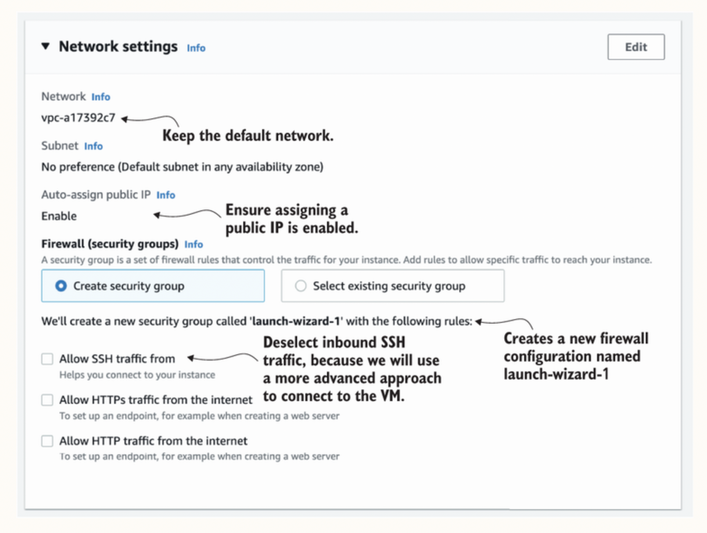

# Index
1. What is Elastic Cloud Compute ?
2. How to launch and manage a virtual machine on AWS ?
3. How to connect to a virtual machine to install or configure applications ?
4. How to monitor a virtual machine ?
5. Different pricing options of the Elastic Compute Cloud (EC2) 
------------------------------------------------------------------------------------------------------------------------------------------------------------------------------------------------------------------------------------------------------------------------------------------------------
# I. What is Elastic Cloud Compute ?
 - With a virtual machine, you get access to a slice of a physical machine located in a data center
 - On AWS, virtual machines are offered by the service called Elastic Compute Cloud (EC2)

# What is Virtualization ?

 
 - The physical machine is called the host machine, and the VMs running on it are called guests
 - A virtual machine (VM) runs on a physical machine isolated from other virtual machines by the hypervisor
 - A hypervisor is responsible for isolating the guests from each other and for scheduling requests to the hardware by providing a virtual hardware platform to the guest system
 - Types of Virtualization Softwares or Hypervisors:
    a. Type 1 hypervisors: also known as bare-metal hypervisors
        - They run directly on the host's hardware to control the hardware and manage guest operating systems
        - Ex. VMware ESXi, Microsoft Hyper-V, Xen (Citrix Hypervisor)
    b. Type 2 hypervisors: also known as hosted hypervisors
        - They run on top of a conventional operating system (like Windows, macOS, or Linux)
        - They rely on the host OS for device support and resource management
        - Ex. VMware Workstation, Oracle VM VirtualBox, Parallels Desktop (for macOS)

  - AWS uses a virtualization called Nitro
  - Nitro combines a KVM-based hypervisor with customized hardware (ASICs), aiming to provide a performance that is indistinguishable from bare metal machines.
  - The current generations of VMs on AWS use hardware-assisted virtualization
  - The technology is called a hardware virtual machine (HVM)
  - A virtual machine run by an AMI based on HVM uses a fully virtualized set of hardware and can take advantage of extensions that provide fast access to the underlying hardware

------------------------------------------------------------------------------------------------------------------------------------------------------------------------------------------------------------------------------------------------------------------------------------------------------
# II. How to launch and manage a virtual machine on AWS ?
 - Amazon EC2 service allows us to create virtual machines, or instances, that run on the AWS Cloud
 - Free tier limits:
    a. In our first year of opening an AWS account, we get 750 hours per month of t2.micro instance usage (or t3.micro where t2.micro isn't available) when used with free tier AMIs
    b. 750 hours per month of public IPv4 address usage
    c. 30 GiB of EBS storage
    d. 2 million I/Os,
    e. 1 GB of snapshots, and
    f. 100 GB of bandwidth to the internet

Open: AWS Management Console -> Search: EC2 -> Launch Instance 
## -> Name: my-vm

## -> Application & OS images: Amazon Linux
Note: In AWS, the OS comes bundled with preinstalled software for your virtual machine; this bundle is called an Amazon Machine Image (AMI) 
      The AMI is a special type of virtual appliance for use with the EC2 service  i.e. a virtual appliance is an image of a virtual machine containing an OS and preconfigured software
      An AMI is a template that contains the software configuration (operating system, application server, and applications) required to launch your instance
      An AMI technically consists of a read-only filesystem including the OS, additional software, and configuration. 
      AMIs are offered by:
       a. AWS                    Ex. Amazon Linux AMI
       b. Third-party providers  Ex. Microsoft's Microsoft Windows 2025 Datacenter edition 
       c. By the community       Ex. Ubuntu 
       d. Marketplace 

Note: A default username is "ec2-user"

## -> Instance type: t2.micro
Note: AWS provides various categories of instance families and instance types    
      Computer hardware is getting faster and more specialized & hence AWS releases new instance types and families from time to time
      The different versions are called generations
Note: Instance families are optimized for different kinds of use cases:
       a. T family—Cheap, moderate baseline performance with the ability to burst to higher performance for short periods of time
       b. M family—General purpose, with a balanced ration of CPU and memory
       c. C family—Computing optimized, high CPU performance
       d. R family—Memory optimized, with more memory than CPU power compared to the M family
       e. X family—Extensive capacity with a focus on memory, up to 1952 GB memory and 128 virtual cores
       f. D family—Storage optimized, offering huge HDD capacity
       g. I family—Storage optimized, offering huge SSD capacity
       h. P, G, and CG family—Accelerated computing based on GPUs (graphics processing units)
       i. F family—Accelerated computing based on FPGAs (field-programmable gate arrays)
       etc..
       (for full list: https://aws.amazon.com/ec2/instance-types/)

Example: Instance type t2.micro tells you the following:
           a. Instance family is t (group of small, cheap virtual machines with low-baseline CPU performance but the ability to burst significantly over baseline CPU performance for a short time)
           b. Generation 2 of this instance family
           c. Size is micro (very small)

Note: ARM Processors are the future
       a. For mobiles, desktops & laptops: Apple switching from Intel processors to ARM processors like A1, M1, M2 etc.- these custom-built ARM processors achieve higher performance with lower energy consumption
       b. For servers in the data center : AWS also offers machines based on custom-built ARM processors called Graviton which offer similar performance at lower costs when compared to EC2 instances with Intel processors 
                                           Check out the following Graviton instance types offered by AWS: but these are not yet part of the Free Tier at that time
                                             1. T4g—Burstable and cost-effective instance types
                                             2. M6g, M6gd—General-purpose instance types
                                             3. C6g, C6gd, C6gn, C7g—Compute-optimized instance types
                                             4. R6g, R6gd, X2gd—Memory-optimized instance types
                                             5. Im4gn, Is4gen—Instance types providing built-in storage
                                             6. G5g—A special instance type optimized for Android game streaming

## ->  Key pair (login): Proceed without a key pair
Note: To authenticate into a Linux machine:
       1. Username & password
       2. Username and a public/private key pair: AWS creates a key pair
           a. Private key : .pem file(for Linux/macOS) or .ppk (for PuTTY/Windows) to be downloaded to our local computer. Store the private key securely as AWS will not store it again
           b. Public key  : AWS keeps it and installs it on EC2 instances

## -> Network & Firewall Settings
Network: vpc-0279afde14f801c84 -> Subnet: No preference (Default subnet in any availability zone) -> Auto-assign public IP: Enable

-> Choose: Create security group 
-> Default security group will be created : launch-wizard-1
-> Deselect: Allow SSH Traffic option
   i.e. with these setup, the firewall does not allow any incoming connections at all

## -> Storage
Note: We need to attach some storage to our virtual machine for the root filesystem as t2.micro doesn't come with any storage by default
-> Choose: 8 GB of type gp2 (it consists of network-attached SSDs)
Note: Free tier eligible customers can get up to 30 GB of EBS General Purpose (SSD) or Magnetic storage

## -> 

LinkChecker that checks a website for broken links. Checking for links resulting in “404 Not Found” errors improves the usability and SEO score of your website

------------------------------------------------------------------------------------------------------------------------------------------------------------------------------------------------------------------------------------------------------------------------------------------------------
