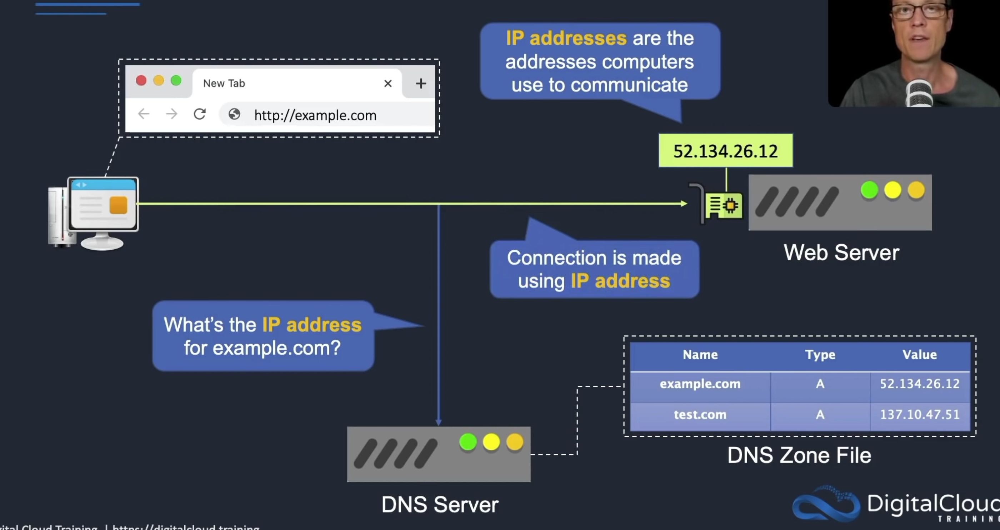
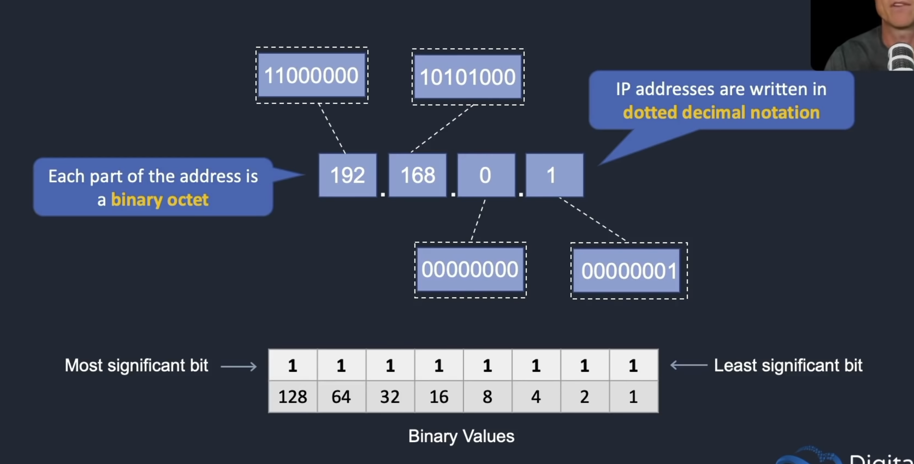
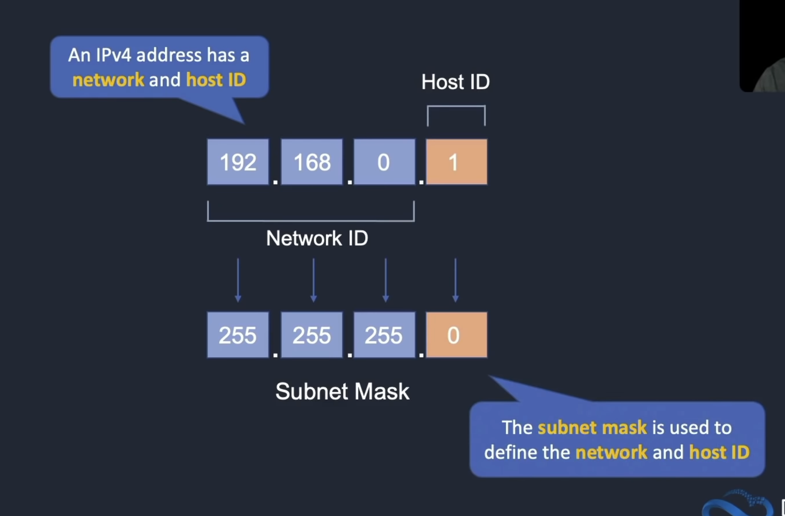
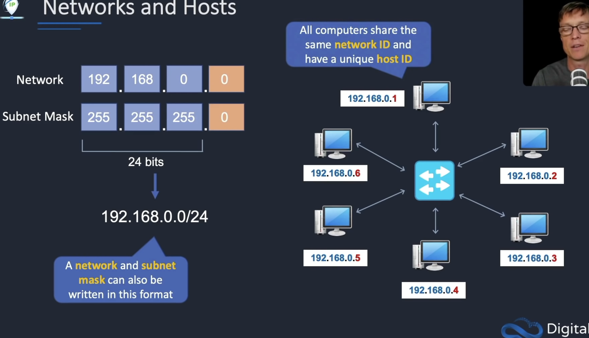

# Index
1. What is Networking ?
2. How a Client connects with a Web server ?
3. What is a Network Interface, MAC Address & IP Address ?
4. Types of IP Addresses
5. Structure of an IPv4 Address
6. Subnetting
------------------------------------------------------------------------------------------------------------------------------------------------------------------------------------------------------------------------------------------------------------------------------------------------------
# I. What is Networking ?
 - Amazon’s private global network that hosts all the VPCs has terabytes of networking capacity available
 - AWS also owns and operates all the fiber connections connecting their data centers, AZs, regions, and edge location equipment together

## Terms related to networking
1. Virtual Private Cloud 
2. Subnets
3. Public and Private IP addresses
4. Route tables

## What is Network Interface, MAC Address & IP Address
 - Every computer needs a Network Interface Card(NIC) to connect over a network
 - IP addresses are used by computers to communicate with each other
 - 

How to define our own IP Address ranges for a VPC
------------------------------------------------------------------------------------------------------------------------------------------------------------------------------------------------------------------------------------------------------------------------------------------------------
# II. How a Client connects with a Web server ?

------------------------------------------------------------------------------------------------------------------------------------------------------------------------------------------------------------------------------------------------------------------------------------------------------
# V. Structure of an IPv4 Address
 - Dotted decimal notation (4 binary octets separated by dots)
 - Each section between dots is a binary octet

## What is the Network & host portions of an IP Address ?
 - Every IP Address has a network ID & a host ID
 - Network ID will be the same for every computer on that network
 - And the Host ID will be unique for every computer on that network
 
 
 - Subnet mask is used to identify the Network ID & Host ID in an IP Address
 

# Subnetting
 - Variable length subnet masks

