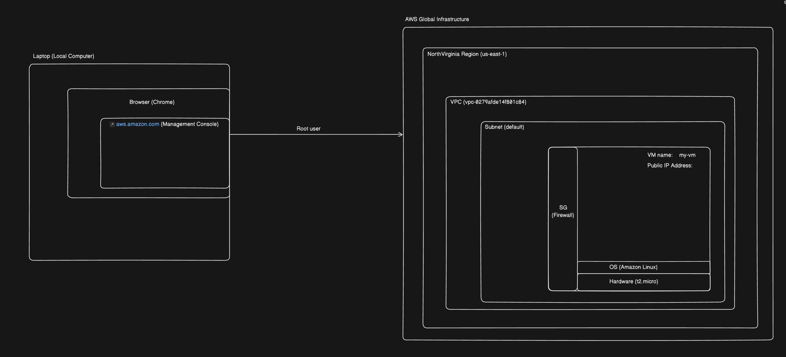

# Index
1. What is Networking ?
2. Shared security model 
3. What is a VPC in AWS ?
4. What is a Subnet in AWS ?
5. Listing AWS services that are either hosted or associated with VPC
6. Create a basic VPC 
------------------------------------------------------------------------------------------------------------------------------------------------------------------------------------------------------------------------------------------------------------------------------------------------------
# I. What is Networking ?
 - Amazon’s private global network that hosts all the VPCs has terabytes of networking capacity available
 - AWS also owns and operates all the fiber connections connecting their data centers, AZs, regions, and edge location equipment together

## Terms related to networking
1. Virtual Private Cloud 
2. Subnets
3. Public and Private IP addresses
4. Route tables

------------------------------------------------------------------------------------------------------------------------------------------------------------------------------------------------------------------------------------------------------------------------------------------------------
# II. Shared security model 
 - Security responsibilities are shared between:
    a. AWS Cloud Provider - responsible for building and securing its cloud infrastructure i.e. Security of the Cloud 
    b. AWS Customer - responsible to design acceptable security provisions for your applications and data hosted within the AWS cloud i.e. Security in the Cloud
------------------------------------------------------------------------------------------------------------------------------------------------------------------------------------------------------------------------------------------------------------------------------------------------------
# III. What is a VPC in AWS ?
 - The networking layer at AWS used for hosting our workloads
 - Each VPC runs on top of the physical AWS network infrastructure
 - Each VPC is a logically isolated “data center” where your computer instances and various AWS services reside
 - The official name of a VPC is an EC2-VPC
 - EC2 instances are usually hosted within a VPC
 - And within each VPC, our compute instances (EC2) are hosted on subnets that we create in selected availability zones (AZs) within the AWS region we chose to operate within
      
Note: Older style of networking in AWS - another networking option available at AWS called EC2-Classic - and not available for new customers since December 2013 
      EC2-Classic networking was a flat network design that was shared with all other EC2-Classic AWS customers
      EC2-Classic feature set available is quite minimal compared to the expansive options available with a VPC
      However, a company may have EC2-Classic networking if it began working with Amazon before 2013

## How is VPC a managed service ?
 - Although the VPC is a managed service, AWS customers make most of the choices and decisions on their own after AWS carries out the initial creation of the VPC
 - We generally work with networking services using the VPC console
    a. When we create a VPC, AWS’s job is securing our VPC as a private isolated software data center linked to our AWS account
    b. Within the VPC “toolbox” are many configurable options, including route tables, public and private subnets, VPN connections, gateways, and private endpoints
       A VPC toolbox is a large toolbox containing a variety of tools and attachments that you can mesh or cobble together any way they suit our needs
    c. There are multiple security choices available at every network level allowing you to fully protect your EC2 instances: security groups and network access control lists (ACLs)
    d. A VPC also has multiple connectivity options, allowing you to connect your VPC :
        1. To the Internet
        2. To our own private data center
        3. To other VPCs within our region or outside our region
        4. To other AWS accounts holders’ VPCs

## How EC2 VMs are running ?
  - The standard hypervisor AWS used was a customized version of XEN for a number of years
  - But now, AWS uses a virtualization called Nitro
  - Nitro combines a KVM-based hypervisor with customized hardware (ASICs), aiming to provide a performance that is indistinguishable from bare metal machines
    Nitro systems are also matched with a customized Nitro security chipset that monitors the firmware and hardware at boot, supports enhanced networking, and has NVMe block storage specifically designed for access to high-speed local storage over a PCI interface
    with transparent encryption provided on the fly by hardware processes
  - The current generations of VMs on AWS use hardware-assisted virtualization
  - The technology is called a hardware virtual machine (HVM)
  - A virtual machine run by an AMI based on HVM uses a fully virtualized set of hardware and can take advantage of extensions that provide fast access to the underlying hardware

## What is VPC tenancy ?
 - Two types:
    a. Multitenancy(shared hardware) - other AWS customers will also be sharing the underlying bare-metal server hardware and hypervisor along with you
    b. Single-tenancy hardware (dedicated hardware) - you being the only tenant, or customer

## Various VPC configurations 
1. VPC with a Single Public Subnet
2. VPC with Public & Private Subnets
3. VPC with Public & Private Subnets and Hardware VPN Access
   
4. VPC with a Private Subnet Only & Hardware VPN Access
   
------------------------------------------------------------------------------------------------------------------------------------------------------------------------------------------------------------------------------------------------------------------------------------------------------
# IV. What is a Subnet in AWS ?
 - You have packets that need to be sent from a specific EC2 instance, on a specific subnet, from a specific VPC, to a specific destination or location
 - At the subnet is where routing decisions are performed for the EC2 instances on each subnet
 - For example, instances may need access to the Internet, access to the head office, or access to data records stored somewhere on the AWS network

------------------------------------------------------------------------------------------------------------------------------------------------------------------------------------------------------------------------------------------------------------------------------------------------------ 
# V. Listing AWS services that are either hosted or associated with VPC 
1. Services that can be hosted within a VPC
    a. EC2 instances
    b. Elastic Beanstalk
    c. Amazon Redshift
    d. ElastiCache
    e. Amazon EMR
    f. Amazon RDS
    g. Amazon Workspaces

2. Services that can be associated/linked to a VPC
    a. Trusted Advisor
    b. AWS Config
    c. VPN connections
    d. Auto Scaling
    e. Elastic load balancing
    f. S3
    g. DynamoDB
   
4. Services that will have relationships with the services and components hosted inside a VPC, but the services themselves are not actually installed in the VPC
    a. 

------------------------------------------------------------------------------------------------------------------------------------------------------------------------------------------------------------------------------------------------------------------------------------------------------
# IV. Create a basic VPC 
1. Using the Management Console, click Services, and under Networking and Content Delivery, select VPC
Note: Select a Region in which we want to create our VPC

Open VPC dashboard  -> Button: Create VPC
-> Resources to create: VPC only
-> Name: web-vpc
-> IPv4 CIDR block: 192.168.0.0/16 (allows us to create subnets within the VPC that could total approximately 65,530 possible hosts)
-> (Optional) Tenancy: Default(shared) or Dedicated

------------------------------------------------------------------------------------------------------------------------------------------------------------------------------------------------------------------------------------------------------------------------------------------------------
