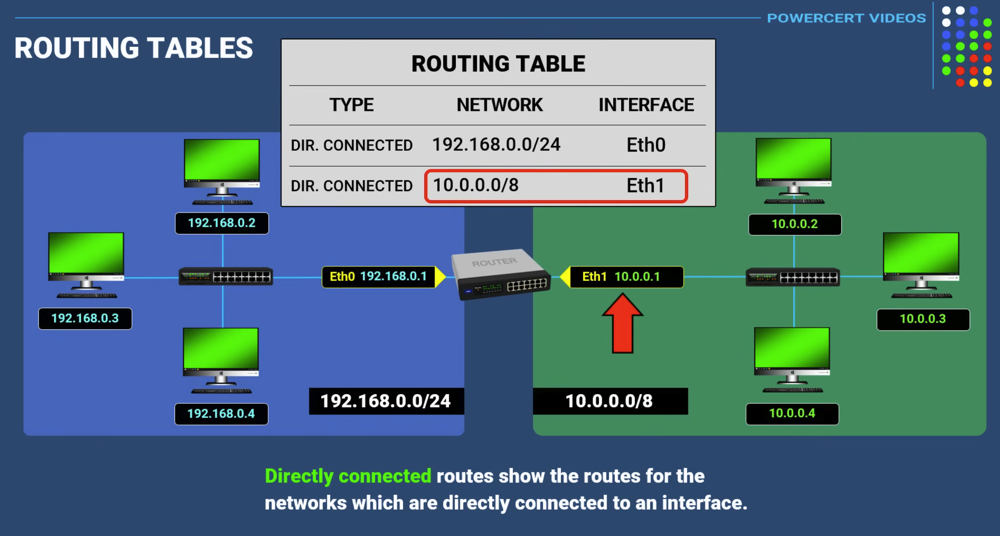

# Index
1. Shared security model
2. List of various AWS VPC Components & Networking Services
3. What is a VPC in AWS ?
4. The default VPC 
5. What is a Subnet in AWS ?
6. What are benefits of Availability Zones ?
7. VPC Router
8. What are Routing tables ?
9. Listing AWS services that are either hosted or associated with VPC
10. CIDR Blocks 
11. Create a basic VPC (Covers CIDR, Subnet masking etc)
12. Creating a Client VPN
13. Site-to-Site VPN

------------------------------------------------------------------------------------------------------------------------------------------------------------------------------------------------------------------------------------------------------------------------------------------------------
# I. Shared security model 
 - Security responsibilities are shared between:
    a. AWS Cloud Provider - responsible for building and securing its cloud infrastructure i.e. Security of the Cloud 
    b. AWS Customer - responsible to design acceptable security provisions for your applications and data hosted within the AWS cloud i.e. Security in the Cloud
------------------------------------------------------------------------------------------------------------------------------------------------------------------------------------------------------------------------------------------------------------------------------------------------------
# II. List of various AWS VPC Components & Networking Services
1. (VPC) Virtual Private Cloud
2. Subnet
3. CIDR BLock
4. Network ID & Host ID
5. (IGW) Internet Gateway   - VPC side of a connection to the public Internet for IPv4 & allows both sides traffic
6. Egress only Internet Gateway - allows traffic outbound only & uses IPv6
7. Router                   - Used to interconnect subnets & direct traffic between Internet Gateways, Virtual private gateways, NAT gateways and subnets
8. Peering Connection       - Direct connection between two VPCs & have private routing between them 
9. VPC Endpoints            - Allow us to connect using Private IP addresses to public AWS services
10. NAT Instance            - Enables Internet access for EC2 instances in private subnets (managed by you)
11. NAT Gateway             - Enables Internet access for EC2 instances in private subnets (managed by AWS)   
12. Virtual Private Gateway - Amazon VPC side of a Virtual Private Network connection
13. Customer Gateway        - Customer side of a VPN Connection
14. AWS Direct Connect      - High speed private network connection from customer to AWS (avoids Public Internet)
15. Security Group          - Instance level firewall (NIC level)
16. Network ACL             - Subnet level firewall
17. Elastic IPs
18. Public IPs
19. Private IPs
20. Subnet mask
    

## Listing AWS services that are either hosted or associated with VPC 
1. Services that can be hosted within a VPC
    a. EC2 instances
    b. Elastic Beanstalk
    c. Amazon Redshift
    d. ElastiCache
    e. Amazon EMR
    f. Amazon RDS
    g. Amazon Workspaces

2. Services that can be associated/linked to a VPC
    a. Trusted Advisor
    b. AWS Config
    c. VPN connections
    d. Auto Scaling
    e. Elastic load balancing
    f. S3
    g. DynamoDB
   
4. Services that will have relationships with the services and components hosted inside a VPC, but the services themselves are not actually installed in the VPC
    a.
   
------------------------------------------------------------------------------------------------------------------------------------------------------------------------------------------------------------------------------------------------------------------------------------------------------
# III. What is a VPC in AWS ?

 - VPC stands for Virtual Private Cloud
 - Within an AWS Region, a VPC is a logically isolated portion of the cloud into which we can deploy our own resources like AWS EC2 instances
   Note: A VPC cannot span across multiple regions but can span across multiple AZs;
         A Subnet is always within an Availability Zone
   Example: In a region with 3 AZs, we can have 1 VPC with three Subnets i.e. one in each AZ
 - The networking layer at AWS used for hosting our workloads i.e. its like having our own data center inside AWS
 - Each VPC runs on top of the physical AWS network infrastructure
 - Each VPC is a logically isolated “data center” where your computer instances and various AWS services reside
 - The official name of a VPC is an EC2-VPC
 - Each VPC has a CIDR block like CIDR 10.0.0.0/16
 - EC2 instances are usually hosted within a VPC
 - And within each VPC, our compute instances (EC2) are hosted on subnets that we create in selected availability zones (AZs) within the AWS region we chose to operate within
      
Note: Older style of networking in AWS - another networking option available at AWS called EC2-Classic - and not available for new customers since December 2013 
      EC2-Classic networking was a flat network design that was shared with all other EC2-Classic AWS customers
      EC2-Classic feature set available is quite minimal compared to the expansive options available with a VPC
      However, a company may have EC2-Classic networking if it began working with Amazon before 2013

## How is VPC a managed service ?
 - Although the VPC is a managed service, AWS customers make most of the choices and decisions on their own after AWS carries out the initial creation of the VPC
 - We generally work with networking services using the VPC console
    a. When we create a VPC, AWS’s job is securing our VPC as a private isolated software data center linked to our AWS account
    b. Within the VPC “toolbox” are many configurable options, including route tables, public and private subnets, VPN connections, gateways, and private endpoints
       A VPC toolbox is a large toolbox containing a variety of tools and attachments that you can mesh or cobble together any way they suit our needs
    c. There are multiple security choices available at every network level allowing you to fully protect your EC2 instances: security groups and network access control lists (ACLs)
    d. A VPC also has multiple connectivity options, allowing you to connect your VPC :
        1. To the Internet
        2. To our own private data center
        3. To other VPCs within our region or outside our region
        4. To other AWS accounts holders’ VPCs

## How EC2 VMs are running ?
  - The standard hypervisor AWS used was a customized version of XEN for a number of years
  - But now, AWS uses a virtualization called Nitro
  - Nitro combines a KVM-based hypervisor with customized hardware (ASICs), aiming to provide a performance that is indistinguishable from bare metal machines
    Nitro systems are also matched with a customized Nitro security chipset that monitors the firmware and hardware at boot, supports enhanced networking, and has NVMe block storage specifically designed for access to high-speed local storage over a PCI interface
    with transparent encryption provided on the fly by hardware processes
  - The current generations of VMs on AWS use hardware-assisted virtualization
  - The technology is called a hardware virtual machine (HVM)
  - A virtual machine run by an AMI based on HVM uses a fully virtualized set of hardware and can take advantage of extensions that provide fast access to the underlying hardware

## What is VPC tenancy ?
 - Two types:
    a. Multitenancy(shared hardware) - other AWS customers will also be sharing the underlying bare-metal server hardware and hypervisor along with you
    b. Single-tenancy hardware (dedicated hardware) - you being the only tenant, or customer

## Various VPC configurations 
1. VPC that is completely empty with just the required primary IPv4 CIDR block and the local main routing table
    a. No use
2. VPC with a Single Public Subnet
    a. For a simple test environment
    b. For a Public facing SaaS application
    c. For a transit network when designing with multiple VPCs for controlling incoming traffic flow
       
3. VPC with Public & Private Subnets
    a. For a multi-tier application
    b. Public subnets would be utilized for network address translation (NAT) servers or additional public-facing services such as load-balancing service
    c. Private subnets could be created and used for hosting, Web/application servers, and database servers
 
4. VPC with Public & Private Subnets and Hardware VPN Access(Private VPN connection)
   
5. VPC with a Private Subnet Only & Hardware VPN Access

## How many VPCs do we typically need ?
 - Hard and soft limits defined by AWS for every AWS service
 - Hard and soft limits are per AWS account, per region
 - For example, for VPC:
    a. Soft limit is 5 VPCs per AWS Account, per region
       i.e with 20 regions available at AWS, a single AWS account can create 100 VPCs, 5 per region
       Note: We can request AWS to increase the soft limit
    b. Hard limit is 1000
   
----------------------------------------------------------------------------------------------------------------------------------------------------------------------------------------------------------------------------------------------------------------------------------------------------
# IV. The default VPC 
 - The default VPC is created/available within each AWS region with a public subnets in each AZ of that region
 - AWS provides a pre-built default networking VPC environment to enable us to start working quickly with AWS. But, it’s a really good idea to understand and control all your networking options when operating in the cloud.
 - It is created with an IPv4 CIDR block of 172.30.0.0/16, which provides up to 65,531 private IP v4 addresses
 - In addition:
    1. An Internet gateway has been created and attached to the default VPC with a route table entry that sends all IP traffic intended for the Internet to the attached Internet gateway
    2. A default security group and default network ACL are also associated with the default VPC
    3. For each default VPC, subnets have been created for each AZ in the region where it’s located
 - In real-world production AWS Account, it is recommended to delete the default VPC from every AWS region in our AWS account
 - The default VPC can be deleted
 - If we want to bring it back, AWS provides a script to re-create it
 - We also can’t assign an existing VPC to become a default VPC

## What we need to do ?  
 - All that’s left for you to do is to add instances
 - Instances placed on the default public subnet within the default VPC will have Internet connectivity
   hence, they receive both a public and a private IPv4 address and public and private DNS host names
 - The default VPC’s infrastructure is set up for public Internet access
 - However, the customer still makes the final decision for allowing public Internet access to a VPC by associating a public IP address with an EC2 instance during its creation

----------------------------------------------------------------------------------------------------------------------------------------------------------------------------------------------------------------------------------------------------------------------------------------------------
# V. What is a Subnet in AWS ?

 - You have packets that need to be sent from a specific EC2 instance, on a specific subnet, from a specific VPC, to a specific destination or location
 - A segment of a VPC's IP Address range where you can place groups of isolated resources
 - At the subnet is where routing decisions are performed for the EC2 instances on each subnet
 - For example, instances may need access to the Internet, access to the head office, or access to data records stored somewhere on the AWS network
 - A subnet is always assigned to on availability zone, so it can't span across multiple availability zones
 - We can have multiple subnets in the same AZ
   
----------------------------------------------------------------------------------------------------------------------------------------------------------------------------------------------------------------------------------------------------------------------------------------------------
# VI. What are benefits of Availability Zones ?

 - Generally, AWS regions will have three or more Availability zones
 - AZs have been designed with isolation from other AZs, hence a failure in one availability zone will not affect the other AZs within the VPC and region
 - Within each VPC, the number of availability zones that are available depend on the region the VPC is created in
 - Examples:
    1. Creating a VPC in the N. Virginia region will give us the option of selecting up to six AZs that can be used within a single VPC to design a resilient network
    2. Creating a VPC in the Canadian region, we would have just two AZs to work with
 - Subnets are created in each AZ
 - Next, instances are placed on the appropriate subnets
 - Utilizing AZs allows us to do the following:
    a. Design for resiliency and failover with multiple AZs in a single VPC
    b. Load-balance instances hosted on subnets in different AZs
    c. Auto Scale instances hosted on subnets in different AZs
    d. Deploy RDS primary and slave database servers hosted on subnets in different AZs

------------------------------------------------------------------------------------------------------------------------------------------------------------------------------------------------------------------------------------------------------------------------------------------------------ 
# VII. VPC Router 
 - We don't see it directly but it exists
 - We interact with it by configuring route tables
 - A VPC router takes care of routing within the VPC and outside of the VPC

------------------------------------------------------------------------------------------------------------------------------------------------------------------------------------------------------------------------------------------------------------------------------------------------------
# VIII. What are Routing tables ?
 - Internet is a network of routers
 - A router does data routing using Routing table
 - A Routing table is a file that contains a set of rules that show information on what path a data packet takes to its destination

 - For computers from two different networks to communicate, we need to configure the router and a routing table

## How are Routing tables populated/configured ?
 - They are populated with three types of routes:
    a. Directly connected routes - automtically populated when they are directly connected to an interface
    b. Static routes - manually configured by a network administrator
    c. Dynamic routes - entered automatically by neighbouring routers using one or more dynamic routing protocols like RIP, OSPF, BGP, IS-IS & EIGRP 

## What is an IP Address Group ?
 - A network has an Address Group
 - Ex. 192.168.0.0  or  10.0.0.0

## Example 1: Two directly connected networks connected through a Router 
 
 
 
 - Network 1 has the IP Address group of: 192.168.0.0
 - Network 2 has the IP Address group of: 10.0.0.0
 - Router has two interfaces connected to the two different networks :  Eth0 (configured with 192.168.0.1) & Eth1 (configured with 10.0.0.1)
 - SOLUTION: Routing table with just automatically populated directly connected routes
   

## Example 2: Three networks connected using two routers (basically an Internet)

 - Network 1 has the IP Address group of: 192.168.0.0
 - Network 2 has the IP Address group of: 10.0.0.0
 - Network 3 has the IP Address group of: 174.16.0.0
 - Network 4 has the IP Address group of: 125.0.0.0
 - Router 1 has three interfaces connected to the two different networks :  Eth0 (configured with 192.168.0.1) & Eth1 (configured with 10.0.0.1)
 - Router 2 has two interfaces connected to the two different networks :  Eth0 (configured with 192.168.0.1) & Eth1 (configured with 10.0.0.1)
 - SOLUTION: Routing table with just automatically populated directly connected routes + Manually configured Static routes by Network Admin
   

 
 
 
 

------------------------------------------------------------------------------------------------------------------------------------------------------------------------------------------------------------------------------------------------------------------------------------------------------
# IX. (IGW) Internet Gateway
 - A virtual device that we need to access Internet:
    a. Egress traffic - sending data out to Internet
    b. Ingress traffic - receiving data from the Internet
 - It is attached to a VPC i.e One IGW per VPC 

------------------------------------------------------------------------------------------------------------------------------------------------------------------------------------------------------------------------------------------------------------------------------------------------------
# X. CIDR Blocks 

## Popular Useful CIDR block planners
1. IPv4 Subnet Planner 

## What is an IP Address Group ?
 - A network has an Address Group
 - Ex. 192.168.0.0  or  10.0.0.0

## What is CIDR block ?
 - CIDR stands for Classless Interdomain Routing
 - When we create a VPC, we must specify a range of IPv4 addresses for the VPC in the form of a CIDR block Ex. 10.0.0.0/16
 - VPC supports IPv6 CIDR blocks also but is optional
 - CIDR block size can be between /16 & /28 subnet masks
 - Types of CIDR blocks:
    a. (Mandatory) IPv4 CIDR block
       i. (Required) Primary IPv4 CIDR block
      ii. (Optional) Secondary IPv4 CIDR block - upto 4 allowed
    b. (Optional) IPv6 CIDR block   
 - The primary IPv4 CIDR block that you choose for your VPC will determine the number and size of IPv4 addresses that can be assigned to the subnets created within the VPC
 - CIDR blocks must not overlap with any existing CIDR blocks associated within a VPC or with another VPC connected with a peering connection
 - VPC Peering requires non-overlapping CIDR blocks i.e. this is across all VPCs in all regions/accounts we want to connect
 - The initial CIDR block that was added when you created the VPC can’t be changed i.e. we cannot increase or decrease the size of an existing CIDR block 
   However, you have the option of adding additional secondary CIDR blocks to an existing VPC
 - VPCs can also operate in a dual stack mode communicating over both IPv4 and IPv6 protocols
 - The subnet CIDR block for IPv6 is fixed at /64
 - During or after VPC creation, you can choose to associate an IPv6 CIDR block to your VPC and subnets
 - Note that the first four IP addresses 0, 1, 2, and 3) and the last IP address (255) in each subnet’s CIDR block are reserved for Amazon’s use

 - AWS recommends us to use CIDR blocks from the RFC 1918 ranges: private IP ranges
   

## What is a Network mask ?
  - Network mask you choose will determine the number of possible hosts that can be contained on subnets within your single VPC
  - Amazon supports netmask sizes from /16 to /28

## Example 1: VPC with a CIDR block: 10.0.0.0/16
 
 

------------------------------------------------------------------------------------------------------------------------------------------------------------------------------------------------------------------------------------------------------------------------------------------------------
# XI. Create a basic VPC 
 - Multiple ways to create:
1. Using the Management Console
Note: Select a Region in which we want to create our VPC

AWS Management Console -> Click: Services -> Networking and Content Delivery -> Select: VPC -> Open VPC dashboard  -> Button: Create VPC
-> Resources to create: VPC only
-> Name: web-vpc

-> Primary IPv4 CIDR block: 192.168.0.0/16 (allows us to create subnets within the VPC that could total approximately 65,530 possible hosts)
Note: Size of an existing CIDR block cannot be increased or decreased i.e. it is locked after creation

-> (Optional) Tenancy: Default(shared) or Dedicated

2. Creating a VPC using the CLI

------------------------------------------------------------------------------------------------------------------------------------------------------------------------------------------------------------------------------------------------------------------------------------------------------
