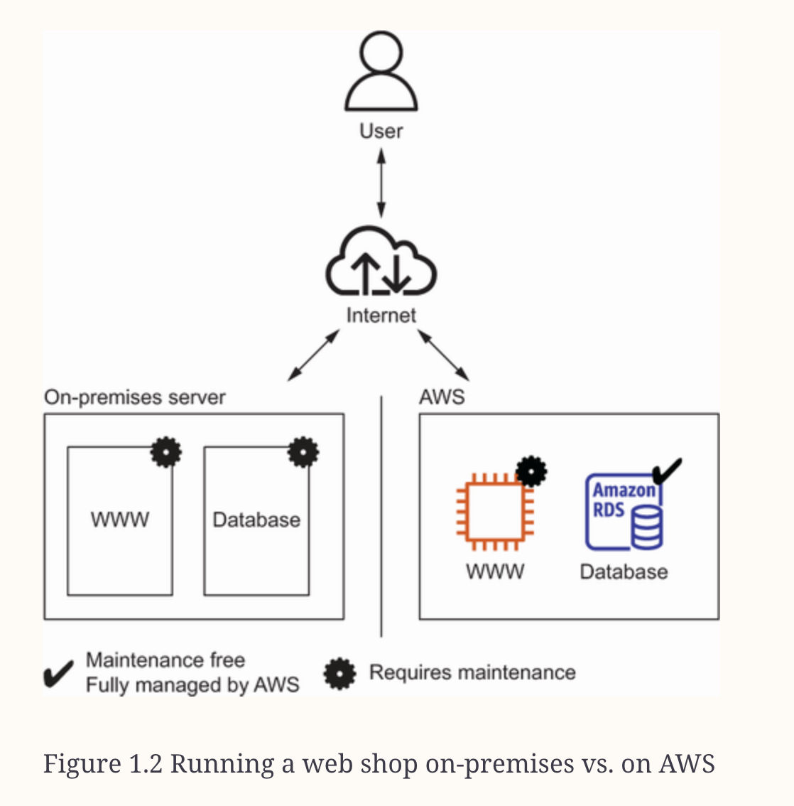
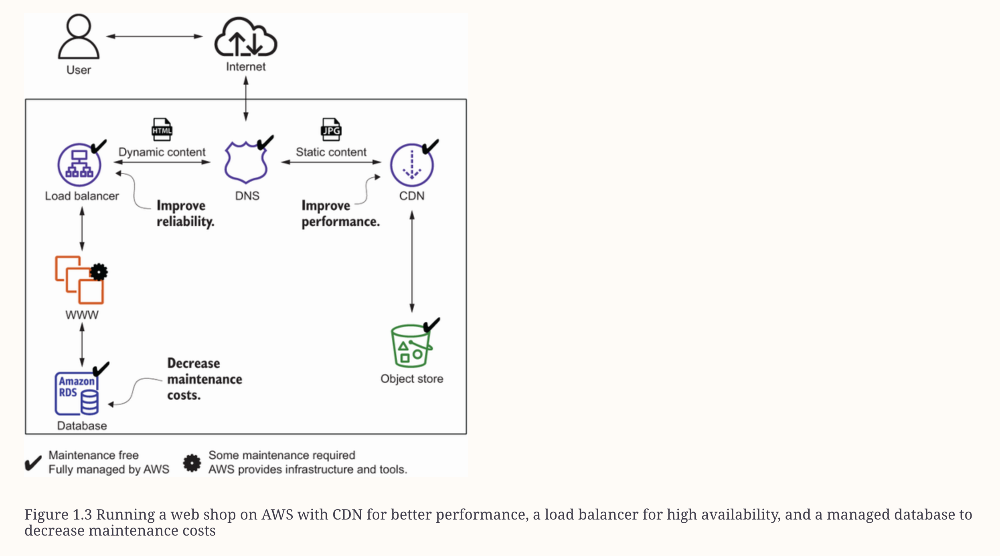

# Index
1. What is AWS ?
3. 
------------------------------------------------------------------------------------------------------------------------------------------------------------------------------------------------------------------------------------------------------------------------------------------------------
# I. What is AWS ?
 - Amazon Web Services (AWS) is a platform of web services that offers solutions for computing, storing, and networking etc.
 - It provides various layers of abstraction
   1. Low level of abstraction   : we can attach volumes to a virtual machine
   2. High level of abstraction  : store and retrieve data via a REST API  
 - We can run all sorts of application on AWS by using one or a combination of services

## Relevance of AWS today 
 - The research firm Gartner has yet again classified AWS as a leader in their Magic Quadrant for Cloud Infrastructure & Platform Services in 2022
 - Gartner’s Magic Quadrant groups vendors into four quadrants—niche players, challengers, visionaries, and leaders

------------------------------------------------------------------------------------------------------------------------------------------------------------------------------------------------------------------------------------------------------------------------------------------------------
# II. Use cases for adopting AWS
#### 1. E-commerce website

 - Migrating the Web application from On-prem to AWS Platform: just plain simple lift-and-shift

 - Improvising the architecture on AWS

#### 2. 
------------------------------------------------------------------------------------------------------------------------------------------------------------------------------------------------------------------------------------------------------------------------------------------------------
