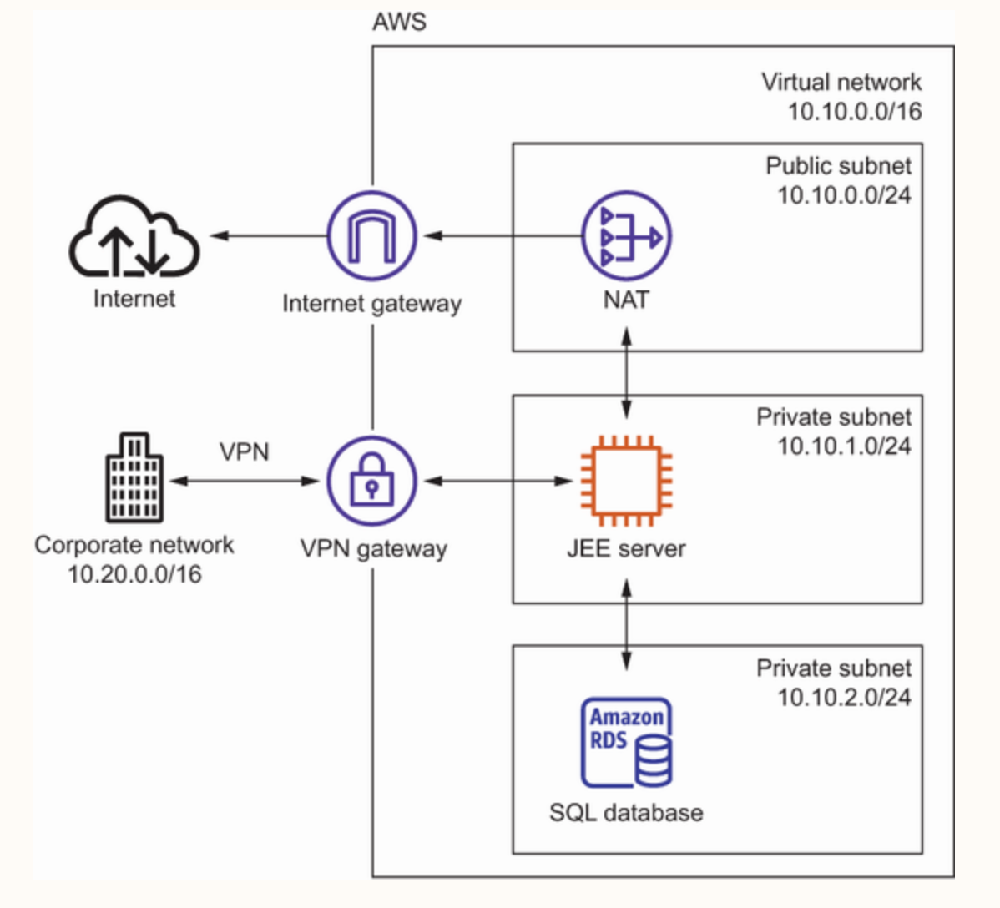
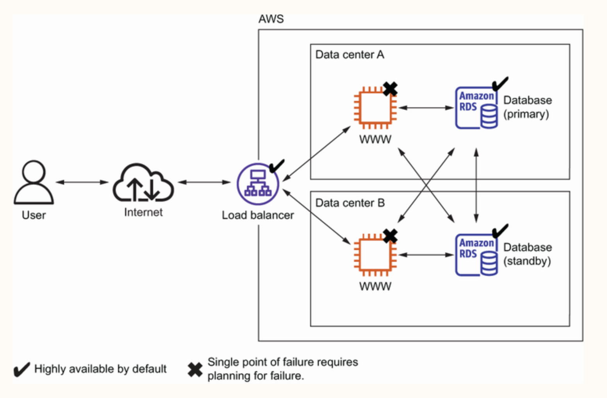

# Index
1. F
2. F
-----------------------------------------------------------------------------------------------------------------------------------------------------------------------------------------------------------------------------------------------------------------------------------------------------
# I. An Enterprise intertal portal
 - A Web application for employees of an organization
 - On-prem local data center is connected to AWS private network using VPN connection
 - Technique to connect the local data center with a private network running remotely on AWS to enable clients to access the Java EE server

-----------------------------------------------------------------------------------------------------------------------------------------------------------------------------------------------------------------------------------------------------------------------------------------------------
# Strategy 1: Building a highly available system to prevent outages from ruining the business
 - All services on AWS are either highly available or can be used in a highly available way

 - High availability in backend service:
    a. We can use virtual machines acting as web servers which aren’t highly available by default, but we can launch multiple virtual machines in different data centers to achieve high availability
    b. A load balancer checks the health of the web servers and forwards requests to healthy machines
 - High availability in database layer:
    a. The database service is offered with replication and fail-over handling i.e. in case the primary database instance fails, the standby database is promoted as the new primary database automatically
   
-----------------------------------------------------------------------------------------------------------------------------------------------------------------------------------------------------------------------------------------------------------------------------------------------------
# Strategy 2: Setting up a dedicated network connection to reduce network costs and increase network throughput in the future

-----------------------------------------------------------------------------------------------------------------------------------------------------------------------------------------------------------------------------------------------------------------------------------------------------
