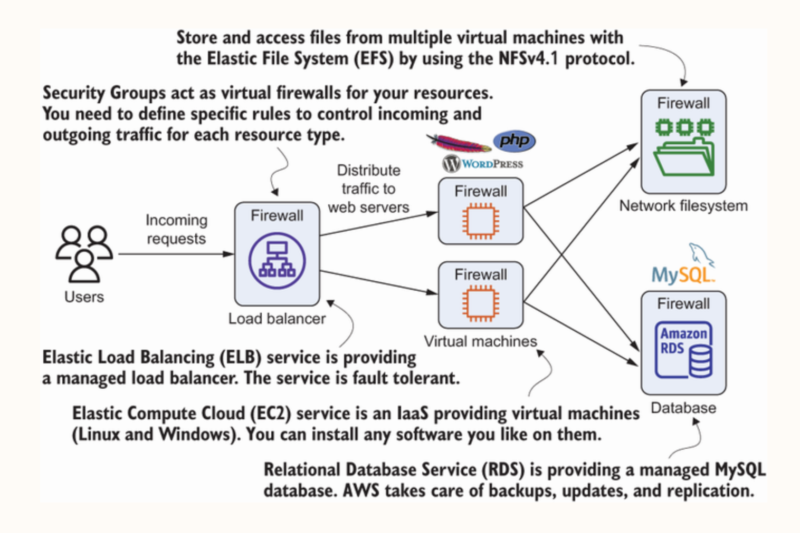

# Index
1. What is Wordpress ?
2. Architecture of a typical simple website developed using Wordpress
3. Migration strategies to AWS Cloud
4. Deploying & deleting using AWS CloudFormation
5. Deploying manually 
-----------------------------------------------------------------------------------------------------------------------------------------------------------------------------------------------------------------------------------------------------------------------------------------------------
# I. What is Wordpress ?
 - WordPress is a content management system (CMS)
 - It allows us to create and manage websites easily without needing to write much code
 - It started as a blogging platform in 2003 but has since evolved into a full-featured system used for everything from personal blogs to large corporate websites and online stores
 - Key features:
    a. Easy-to-use Admin dashboard for managing posts, pages, media, and settings
    b. Thousands of themes and plugins to customize functionality and appearance
    c. Strong community support and frequent updates
    d. SEO-friendly out of the box
 - There are two main versions:
    a. WordPress.org: Free, open-source software you can install on your own web server. Gives you full control over customization, plugins, and themes
    b. WordPress.com: A hosted service with a more managed experience—great for beginners but with more limitations unless you pay for premium plans
-----------------------------------------------------------------------------------------------------------------------------------------------------------------------------------------------------------------------------------------------------------------------------------------------------
# II. Architecture of a typical simple website developed using Wordpress

 - WordPress is built using a mix of widely-used web technologies
1. Programming Languages
    a. PHP: The primary server-side language WordPress is written in.
    b. JavaScript: Used for interactivity in the admin interface and themes. Modern WordPress also uses:
    c. React (in the block editor, aka Gutenberg)
    d. HTML/CSS: For structure and styling of front-end themes and admin UI.

2. Database
    a. MySQL or MariaDB: Stores all site content, user information, settings, etc.

3. Web Server
   Typically runs on:
    a. Apache (most common)
    b. Nginx (lighter alternative)
   Compatible with most other web servers.

4. CMS Architecture
    a. Themes: Control the look and layout of the site.
    b. Plugins: Extend functionality (e.g., SEO, e-commerce, security).
    c. REST API: Enables communication with other apps and services.

5. Admin Interface
    a. Built with a mix of PHP, JavaScript (including React), and AJAX for dynamic features.

6. Hosting Environment
    a. Runs on a LAMP stack (Linux, Apache, MySQL, PHP), but works with many other configurations like LEMP (Nginx instead of Apache)
-----------------------------------------------------------------------------------------------------------------------------------------------------------------------------------------------------------------------------------------------------------------------------------------------------
# III. Migration strategies to AWS Cloud 
1. Lift & Shift strategy
    - Simple & quick: using EC2 instances & DB server
    - Not cost-effective & not performant

2. Optimal utilization of features that AWS has to offer
    - Using various services of AWS      
       a. Elastic Compute Cloud (EC2)                   - IaaS service to create a Linux virtual machine with an optimized distribution called Amazon Linux to install Apache, PHP, and WordPress
       b. Elastic Load Balancing (ELB)                  - IaaS service using a type of Application Load Balancer (ALB), which operates on layer 7 (HTTP and HTTPS) & distributes traffic to a bunch of virtual machines and is highly available by default
       c. Relational Database Service (RDS) for MySQL   - PaaS service using which we choose the database type & size (storage, CPU, RAM), and RDS takes over operating tasks like creating backups and installing patches and updates
       d. Elastic File System (EFS)                     - PaaS service to provides a scalable, highly available, and durable network filesystem using the NFSv4.1 protocol
       e. Security groups                               - IaaS service a firewall service to control incoming and outgoing traffic to your virtual machine, your database, or your load balancer
       f. AWS CloudFormation                            - an IaC service 

-----------------------------------------------------------------------------------------------------------------------------------------------------------------------------------------------------------------------------------------------------------------------------------------------------
# IV. Deploying & deleting using AWS CloudFormation
 - AWS CloudFormation is a tool provided by AWS for free
 - Creating a cloud infrastructure for WordPress and any other application can be fully automated.

In AWS management console -> Search: CloudFormation -> Create Stack 
-> Select: Choose an existing template -> Template source: Amazon S3 URL
-> Amazon S3 URL: https://s3.amazonaws.com/awsinaction-code3/chapter02/template.yaml
                  [Please find the content of the YAML file in the bottom of this notes]
-> Next
-> Stack name: Wp-blog-app -> WordpressAdminPassword: Admin12wp
-> Add Tag: Purpose: Learning 
-> Next
-> Create Stack
-> After completion: Click on URL to open the Wordpress Website

(Optional) Deleting a deployment
In AWS management console -> Search: CloudFormation -> Select the Stack name: Wp-blog-app -> Delete 

-----------------------------------------------------------------------------------------------------------------------------------------------------------------------------------------------------------------------------------------------------------------------------------------------------
# V. Deploying manually 

-----------------------------------------------------------------------------------------------------------------------------------------------------------------------------------------------------------------------------------------------------------------------------------------------------
# template.yaml

---
AWSTemplateFormatVersion: '2010-09-09'
Description: 'AWS in Action: chapter 2 (Wordpress)'
Parameters:
  WordpressAdminPassword:
    Description: 'The password for the Wordpress administrator.'
    Type: String
    AllowedPattern: '[A-Za-z0-9]{8,30}'
    ConstraintDescription: 'WordpressAdminPassword must match [A-Za-z0-9]{8,30}'
Mappings:
  RegionMap:
    'eu-north-1':
      AMI: 'ami-05bc2576a72f22c39'
    'ap-south-1':
      AMI: 'ami-0002bdad91f793433'
    'eu-west-3':
      AMI: 'ami-0c73cd1c5347436f3'
    'eu-west-2':
      AMI: 'ami-029ed17b4ea379178'
    'eu-west-1':
      AMI: 'ami-04632f3cef5083854'
    'ap-northeast-3':
      AMI: 'ami-0ae88850834d2c589'
    'ap-northeast-2':
      AMI: 'ami-0263588f2531a56bd'
    'ap-northeast-1':
      AMI: 'ami-0abaa5b0faf689830'
    'sa-east-1':
      AMI: 'ami-053a035b046dbb704'
    'ca-central-1':
      AMI: 'ami-0173297cea9ba27b0'
    'ap-southeast-1':
      AMI: 'ami-0d1d4b8d5a0cd293f'
    'ap-southeast-2':
      AMI: 'ami-0f4484f62c4fd8767'
    'eu-central-1':
      AMI: 'ami-099ccc441b2ef41ec'
    'us-east-1':
      AMI: 'ami-061ac2e015473fbe2'
    'us-east-2':
      AMI: 'ami-056b1936002ca8ede'
    'us-west-1':
      AMI: 'ami-028f2b5ee08012131'
    'us-west-2':
      AMI: 'ami-0e21d4d9303512b8e'
Resources:
  VPC:
    Type: 'AWS::EC2::VPC'
    Properties:
      CidrBlock: '172.31.0.0/16'
      EnableDnsHostnames: true
  InternetGateway:
    Type: 'AWS::EC2::InternetGateway'
    Properties: {}
  VPCGatewayAttachment:
    Type: 'AWS::EC2::VPCGatewayAttachment'
    Properties:
      VpcId: !Ref VPC
      InternetGatewayId: !Ref InternetGateway
  SubnetA:
    Type: 'AWS::EC2::Subnet'
    Properties:
      AvailabilityZone: !Select [0, !GetAZs '']
      CidrBlock: '172.31.38.0/24'
      VpcId: !Ref VPC
  SubnetB:
    Type: 'AWS::EC2::Subnet'
    Properties:
      AvailabilityZone: !Select [1, !GetAZs '']
      CidrBlock: '172.31.37.0/24'
      VpcId: !Ref VPC
  RouteTable:
    Type: 'AWS::EC2::RouteTable'
    Properties:
      VpcId: !Ref VPC
  RouteTableAssociationA:
    Type: 'AWS::EC2::SubnetRouteTableAssociation'
    Properties:
      SubnetId: !Ref SubnetA
      RouteTableId: !Ref RouteTable
  RouteTableAssociationB:
    Type: 'AWS::EC2::SubnetRouteTableAssociation'
    Properties:
      SubnetId: !Ref SubnetB
      RouteTableId: !Ref RouteTable
  RoutePublicNATToInternet:
    Type: 'AWS::EC2::Route'
    Properties:
      RouteTableId: !Ref RouteTable
      DestinationCidrBlock: '0.0.0.0/0'
      GatewayId: !Ref InternetGateway
    DependsOn: VPCGatewayAttachment
  NetworkAcl:
    Type: 'AWS::EC2::NetworkAcl'
    Properties:
      VpcId: !Ref VPC
  SubnetNetworkAclAssociationA:
    Type: 'AWS::EC2::SubnetNetworkAclAssociation'
    Properties:
      SubnetId: !Ref SubnetA
      NetworkAclId: !Ref NetworkAcl
  SubnetNetworkAclAssociationB:
    Type: 'AWS::EC2::SubnetNetworkAclAssociation'
    Properties:
      SubnetId: !Ref SubnetB
      NetworkAclId: !Ref NetworkAcl
  NetworkAclEntryIngress:
    Type: 'AWS::EC2::NetworkAclEntry'
    Properties:
      NetworkAclId: !Ref NetworkAcl
      RuleNumber: 100
      Protocol: -1
      RuleAction: allow
      Egress: false
      CidrBlock: '0.0.0.0/0'
  NetworkAclEntryEgress:
    Type: 'AWS::EC2::NetworkAclEntry'
    Properties:
      NetworkAclId: !Ref NetworkAcl
      RuleNumber: 100
      Protocol: -1
      RuleAction: allow
      Egress: true
      CidrBlock: '0.0.0.0/0'
  LoadBalancer:
    Type: 'AWS::ElasticLoadBalancingV2::LoadBalancer'
    Properties:
      Subnets:
      - Ref: SubnetA
      - Ref: SubnetB
      SecurityGroups:
      - !Ref LoadBalancerSecurityGroup
      Scheme: 'internet-facing'
    DependsOn: VPCGatewayAttachment
  LoadBalancerListener:
    Type: 'AWS::ElasticLoadBalancingV2::Listener'
    Properties:
      DefaultActions:
      - Type: forward
        TargetGroupArn: !Ref LoadBalancerTargetGroup
      LoadBalancerArn: !Ref LoadBalancer
      Port: 80
      Protocol: HTTP
  LoadBalancerTargetGroup:
    Type: 'AWS::ElasticLoadBalancingV2::TargetGroup'
    Properties:
      HealthCheckIntervalSeconds: 5
      HealthCheckPath: '/'
      HealthCheckPort: 80
      HealthCheckProtocol: HTTP
      HealthCheckTimeoutSeconds: 3
      HealthyThresholdCount: 2
      UnhealthyThresholdCount: 2
      Matcher:
        HttpCode: '200,302'
      Port: 80
      Protocol: HTTP
      VpcId: !Ref VPC
  LoadBalancerSecurityGroup:
    Type: 'AWS::EC2::SecurityGroup'
    Properties:
      GroupDescription: 'awsinaction-elb-sg'
      VpcId: !Ref VPC
      SecurityGroupIngress:
      - CidrIp: '0.0.0.0/0'
        FromPort: 80
        IpProtocol: tcp
        ToPort: 80
  WebServerSecurityGroup:
    Type: 'AWS::EC2::SecurityGroup'
    Properties:
      GroupDescription: 'awsinaction-sg'
      VpcId: !Ref VPC
      SecurityGroupIngress:
      - FromPort: 80
        IpProtocol: tcp
        SourceSecurityGroupId: !Ref LoadBalancerSecurityGroup
        ToPort: 80
  DatabaseSecurityGroup:
    Type: 'AWS::EC2::SecurityGroup'
    Properties:
      GroupDescription: 'awsinaction-db-sg'
      VpcId: !Ref VPC
      SecurityGroupIngress:
      - IpProtocol: tcp
        FromPort: 3306
        ToPort: 3306
        SourceSecurityGroupId: !Ref WebServerSecurityGroup
  Database:
    Type: 'AWS::RDS::DBInstance'
    DeletionPolicy: Delete # For AWS::RDS::DBInstance resources that don't specify the DBClusterIdentifier property, the default policy is Snapshot which can cause unwanted costs. However, for production setups, we highly recommend to stay with the default to avoid data loss.
    Properties:
      AllocatedStorage: 5
      BackupRetentionPeriod: 0
      DBInstanceClass: 'db.t3.micro'
      DBName: wordpress
      Engine: MySQL
      MasterUsername: wordpress
      MasterUserPassword: wordpress
      VPCSecurityGroups:
      - !Sub ${DatabaseSecurityGroup.GroupId}
      DBSubnetGroupName: !Ref DBSubnetGroup
    DependsOn: VPCGatewayAttachment
  DBSubnetGroup:
    Type: 'AWS::RDS::DBSubnetGroup'
    Properties:
      DBSubnetGroupDescription: DB subnet group
      SubnetIds:
      - Ref: SubnetA
      - Ref: SubnetB
  EFSFileSystem:
    Type: 'AWS::EFS::FileSystem'
    Properties:
      FileSystemTags:
      - Key: Name
        Value: 'wordpress-efs'
  EFSMountTargetA:
    Type: 'AWS::EFS::MountTarget'
    Properties:
      FileSystemId: !Ref EFSFileSystem
      SubnetId: !Ref SubnetA
      SecurityGroups:
      - !Ref EFSSecurityGroup
  EFSMountTargetB:
    Type: 'AWS::EFS::MountTarget'
    Properties:
      FileSystemId: !Ref EFSFileSystem
      SubnetId: !Ref SubnetB
      SecurityGroups:
      - !Ref EFSSecurityGroup
  EFSSecurityGroup:
    Type: 'AWS::EC2::SecurityGroup'
    Properties:
      GroupDescription: 'Allowing access to EFS'
      VpcId: !Ref VPC
      SecurityGroupIngress:
      - IpProtocol: tcp
        FromPort: 2049
        ToPort: 2049
        SourceSecurityGroupId: !Ref WebServerSecurityGroup
  InstanceProfile:
    Type: 'AWS::IAM::InstanceProfile'
    Properties:
      Roles:
      - !Ref InstanceRole
  InstanceRole:
    Type: 'AWS::IAM::Role'
    Properties:
      AssumeRolePolicyDocument:
        Version: '2012-10-17'
        Statement:
        - Effect: Allow
          Principal:
            Service: 'ec2.amazonaws.com'
          Action: 'sts:AssumeRole'
      Policies:
      - PolicyName: ssm
        PolicyDocument:
          Version: '2012-10-17'
          Statement:
          - Effect: Allow
            Action:
            - 'ssmmessages:*' # SSM Agent by https://docs.aws.amazon.com/systems-manager/latest/userguide/systems-manager-setting-up-messageAPIs.html
            - 'ssm:UpdateInstanceInformation' # SSM agent by https://docs.aws.amazon.com/systems-manager/latest/userguide/systems-manager-setting-up-messageAPIs.html
            - 'ec2messages:*' # SSM Session Manager by https://docs.aws.amazon.com/systems-manager/latest/userguide/systems-manager-setting-up-messageAPIs.html
            Resource: '*'
  LaunchTemplate:
    Type: 'AWS::EC2::LaunchTemplate'
    Metadata:
      'AWS::CloudFormation::Init':
        configSets:
          default: [mount, extras, config]
        mount:
          packages:
            yum:
              'amazon-efs-utils': []
          commands:
            'a_mount':
              command: !Sub 'pip3 install botocore && mkdir /var/www && echo "${EFSFileSystem}:/ /var/www efs tls,_netdev 0 0" >> /etc/fstab && while ! (echo > /dev/tcp/${EFSFileSystem}.efs.${AWS::Region}.amazonaws.com/2049) >/dev/null 2>&1; do sleep 5; done && mount -a -t efs'
              test: '[ ! -d /var/www ]'
        extras:
          commands:
            'a_enable_php':
              command: 'amazon-linux-extras enable php7.4 && yum -y clean metadata'
              test: "! grep -Fxq '[amzn2extra-php7.4]' /etc/yum.repos.d/amzn2-extras.repo"
        config:
          packages:
            yum:
              php: []
              php-gd: []
              php-opcache: []
              php-mysqlnd: []
              php-mbstring: []
              php-xmlrpc: []
              mariadb: []
              httpd: []
          files:
            '/root/php.sh':
              content: |
                #!/bin/bash -ex
                sed -i 's/max_execution_time = 30/max_execution_time = 300/' /etc/php.ini
                sed -i 's/max_input_time = 60/max_input_time = 300/' /etc/php.ini
                sed -i 's/; max_input_vars = 1000/max_input_vars = 10000/' /etc/php.ini
                sed -i 's/memory_limit = 128M/memory_limit = 512M/' /etc/php.ini
                sed -i 's/post_max_size = 8M/post_max_size = 200M/' /etc/php.ini
                sed -i 's/upload_max_filesize = 2M/upload_max_filesize = 200M/' /etc/php.ini
                sed -i 's/max_file_uploads = 20/max_file_uploads = 200/' /etc/php.ini

                sed -i 's/opcache.memory_consumption=128/opcache.memory_consumption=256/g' /etc/php.d/10-opcache.ini
                sed -i 's/opcache.interned_strings_buffer=8/opcache.interned_strings_buffer=16/g' /etc/php.d/10-opcache.ini
                sed -i 's/opcache.max_accelerated_files=4000/opcache.max_accelerated_files=10000/g' /etc/php.d/10-opcache.ini
                sed -i 's/;opcache.max_wasted_percentage=5/opcache.max_wasted_percentage=10/g' /etc/php.d/10-opcache.ini
                sed -i 's/;opcache.validate_timestamps=1/opcache.validate_timestamps=1/g' /etc/php.d/10-opcache.ini
                sed -i 's/;opcache.revalidate_freq=2/opcache.revalidate_freq=60/g' /etc/php.d/10-opcache.ini
                sed -i 's/;opcache.fast_shutdown=0/opcache.fast_shutdown=0/g' /etc/php.d/10-opcache.ini
              mode: '000500'
              owner: root
              group: root
            '/etc/httpd/conf.d/wordpress.conf':
              content: |
                <Directory "/var/www/html">
                Options Indexes FollowSymLinks
                AllowOverride All
                Require all granted
                </Directory>
              mode: '000500'
              owner: root
              group: root
            '/root/wordpress.sh':
              content: !Sub
              - |
                  #!/bin/bash -ex
                  # ensure than only one machine installs wp
                  if mkdir /var/www/lock; then
                    cd /var/www/html
                    wget --quiet --timeout=60 --output-document=wp-cli.phar https://github.com/wp-cli/wp-cli/releases/download/v2.5.0/wp-cli-2.5.0.phar
                    if ! php wp-cli.phar core is-installed --allow-root; then
                      php wp-cli.phar core download --allow-root --version=5.8.2
                      php wp-cli.phar core config --dbname='wordpress' --dbuser='wordpress' --dbpass='wordpress' --dbhost='${DBHost}' --allow-root
                      php wp-cli.phar core install --url='http://${DomainName}' --title='AWS in Action' --admin_user='admin' --admin_password='${WordpressAdminPassword}' --admin_email='test@example.com' --skip-email --allow-root
                    fi
                    chown -R apache:apache /var/www/html
                    chmod u+wrx /var/www/html/wp-content/*
                    rm -f wp-cli.phar
                  fi
              - WordpressAdminPassword: !Ref WordpressAdminPassword
                DBHost: !GetAtt 'Database.Endpoint.Address'
                DomainName: !GetAtt 'LoadBalancer.DNSName'
              mode: '000500'
              owner: root
              group: root
          commands:
            01_php:
              command: '/root/php.sh'
              cwd: '/var/www/html'
            02_wordpress:
              command: '/root/wordpress.sh'
              cwd: '/var/www/html'
          services:
            sysvinit:
              httpd:
                enabled: true
                ensureRunning: true
              amazon-ssm-agent:
                enabled: true
                ensureRunning: true
    Properties:
      LaunchTemplateData:
        IamInstanceProfile:
          Name: !Ref InstanceProfile
        ImageId: !FindInMap [RegionMap, !Ref 'AWS::Region', AMI]
        Monitoring:
          Enabled: false
        InstanceType: 't3.micro'
        NetworkInterfaces:
        - AssociatePublicIpAddress: true
          DeviceIndex: 0
          Groups:
          - !Ref WebServerSecurityGroup
        UserData:
          'Fn::Base64': !Sub |
            #!/bin/bash -ex
            trap '/opt/aws/bin/cfn-signal -e 1 --stack ${AWS::StackName} --resource AutoScalingGroup --region ${AWS::Region}' ERR
            /opt/aws/bin/cfn-init -v --stack ${AWS::StackName} --resource LaunchTemplate --region ${AWS::Region}
            /opt/aws/bin/cfn-signal -e 0 --stack ${AWS::StackName} --resource AutoScalingGroup --region ${AWS::Region}
  AutoScalingGroup:
    Type: 'AWS::AutoScaling::AutoScalingGroup'
    DependsOn:
    - EFSMountTargetA
    - EFSMountTargetB
    Properties:
      TargetGroupARNs:
      - !Ref LoadBalancerTargetGroup
      LaunchTemplate:
        LaunchTemplateId: !Ref LaunchTemplate
        Version: !GetAtt 'LaunchTemplate.LatestVersionNumber'
      MinSize: 2
      MaxSize: 4
      HealthCheckGracePeriod: 300
      HealthCheckType: ELB
      VPCZoneIdentifier:
      - !Ref SubnetA
      - !Ref SubnetB
      Tags:
      - PropagateAtLaunch: true
        Value: wordpress
        Key: Name
    CreationPolicy:
      ResourceSignal:
        Timeout: PT10M
    UpdatePolicy:
      AutoScalingRollingUpdate:
        PauseTime: PT10M
        WaitOnResourceSignals: true
Outputs:
  URL:
    Value: !Sub 'http://${LoadBalancer.DNSName}'
    Description: 'Wordpress URL'

-----------------------------------------------------------------------------------------------------------------------------------------------------------------------------------------------------------------------------------------------------------------------------------------------------

