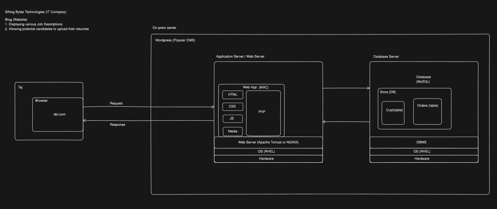

# Index
1. F
2. F
-----------------------------------------------------------------------------------------------------------------------------------------------------------------------------------------------------------------------------------------------------------------------------------------------------
# I. What is Wordpress ?
 - WordPress is a content management system (CMS)
 - It allows us to create and manage websites easily without needing to write much code
 - It started as a blogging platform in 2003 but has since evolved into a full-featured system used for everything from personal blogs to large corporate websites and online stores
 - Key features:
    a. Easy-to-use Admin dashboard for managing posts, pages, media, and settings
    b. Thousands of themes and plugins to customize functionality and appearance
    c. Strong community support and frequent updates
    d. SEO-friendly out of the box
 - There are two main versions:
    a. WordPress.org: Free, open-source software you can install on your own web server. Gives you full control over customization, plugins, and themes
    b. WordPress.com: A hosted service with a more managed experience—great for beginners but with more limitations unless you pay for premium plans
-----------------------------------------------------------------------------------------------------------------------------------------------------------------------------------------------------------------------------------------------------------------------------------------------------
# II. Architecture of a typical simple website developed using Wordpress

 - WordPress is built using a mix of widely-used web technologies
1. Programming Languages
    a. PHP: The primary server-side language WordPress is written in.
    b. JavaScript: Used for interactivity in the admin interface and themes. Modern WordPress also uses:
    c. React (in the block editor, aka Gutenberg)
    d. HTML/CSS: For structure and styling of front-end themes and admin UI.

2. Database
    a. MySQL or MariaDB: Stores all site content, user information, settings, etc.

3. Web Server
   Typically runs on:
    a. Apache (most common)
    b. Nginx (lighter alternative)
   Compatible with most other web servers.

4. CMS Architecture
    a. Themes: Control the look and layout of the site.
    b. Plugins: Extend functionality (e.g., SEO, e-commerce, security).
    c. REST API: Enables communication with other apps and services.

5. Admin Interface
    a. Built with a mix of PHP, JavaScript (including React), and AJAX for dynamic features.

6. Hosting Environment
    a. Runs on a LAMP stack (Linux, Apache, MySQL, PHP), but works with many other configurations like LEMP (Nginx instead of Apache)
-----------------------------------------------------------------------------------------------------------------------------------------------------------------------------------------------------------------------------------------------------------------------------------------------------
# III. 

