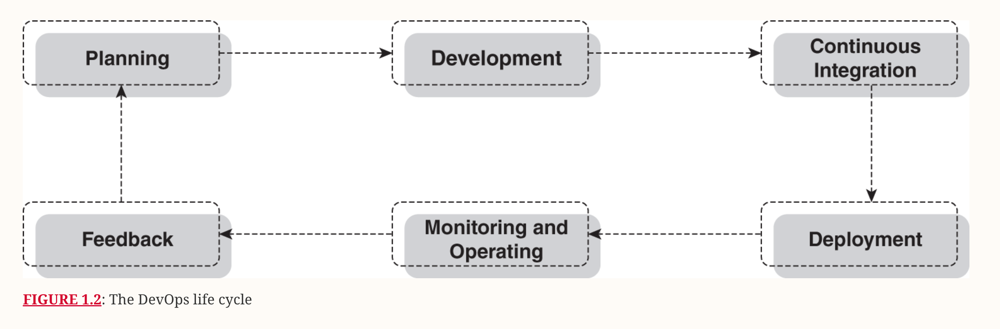

# Index
1. What is DevOps ?
2. Evolution of DevOps
3. What is Azure DevOps Services ?
4. What is Azure DevOps Server ?
-------------------------------------------------------------------------------------------------------------------------------------------------------------------------------------------------------------------------------------------------------------------------------------------------------
# I. What is DevOps ?
 - DevOps is a culture or a set of practices bridging the gap between two formerly siloed units, software developers (Dev) and IT operations staff (Ops), throughout the entire product development life cycle.
 - DevOps aims to automate the software delivery process from development to production by bringing together the teams responsible for development and operations
 - DevOps strategy: adoption of the DevOps culture, tools, and applications
    1. Empowering teams to deliver high-quality software to customers/clients quickly(speed) and effectively while lowering the likelihood of mistakes and downtime
    2. By using a set of tools & techniques
    3. Boost productivity & accountability of engineers
    4. Improve collaboration between different teams
    5. Enables developers to pivot when needed, and allows them  to respond to compliance and security changes
    6. Boost customer satisfaction by delivering features faster with shorter release cycles called sprints
    7. Allows for faster feedback & engagement to attract new customers and delight existing ones
    8. Allows for easier rollbacks       

-------------------------------------------------------------------------------------------------------------------------------------------------------------------------------------------------------------------------------------------------------------------------------------------------------
# II. Evolution of DevOps
Phase I: Waterfall methodology of software development
 - This methodology illustrates software development processes in a sequential manner i.e. each step must be completed before the next step starts
 - With this model, no version of the application gets deployed until late in the cycle, which means months of working without seeing tangible results
 - If requirements also change halfway through the project, the entire plan is destabilized, and the team might have to end the project and start again
   

Phase II: Agile methodology of software development (2000)
 - Agile methodology became the standard for project management and software development
 - Features of Agile methodology:
    1. Iterative and more flexible for long-term innovative projects
    2. Involves a continuous loop of planning, implementation, testing, and feedback in short cycles
    3. Organizations could now deliver value quickly to their customer
 - Even in this model some of the prior problems existed:
    a. Software developers only wanted to write code for software, and the IT/Ops professionals deployed the code when it was time
    b. This made the product feature release timeline really long i.e. a software development team would work on a feature for months before handing it over to the IT/Ops team for deployment
    c. And the IT/Ops team would also take some time to deploy the large feature that was introduced to the application
    d. This created room for software bugs, slow deployments, and unstable applications
    e. Over time, releasing software of poor standards would affect the experience of any customer using the application
 
 
Phase III: DevOps to supplement Agile (2007)
 - DevOps brings in automation to Agile methodology : enables us to automate processes and iterate faster
 - DevOps lifecycle:
    1. Planning & Analysis              - identifying business requirements and then itemizing and strategizing for the different features of the application & create a product roadmap  Ex. Microsoft Word, Excel
    2. Designing                        - HLD & LLD, Wireframes  Ex. Pen & Paper, Microsoft Powerpoint, Figma, Sketch 
    3. Development(Implementation)      - developers write the source code, testers write test cases to test the source code  Ex. VSCode, GitHub or Azure Repos
    4. Continuous integration           - involves testing the source code, merging the code to the larger repository, and creating build artifacts or executables  Ex. Jenkins(CI Server), Azure Pipelines
    5. Deployment (Manual or Automate)  - build & deployed in production, application source code deployment, application infrastructure code (terrafrom code) deployment, teams set up approvals and access policies
                                          Ex. CI Pipeline (Continouous Integration & Delivery), CI/CD Pipeline  (Continuous Integration & Continuous Deployment)
    6. Monitoring and operating         - monitor user behavior, application performance, and other metrics to spot performance bottlenecks in real time and come up with solutions
                                          Observability data is obtained from logs, metrics, and traces and Customer forms
                                          Ex. Google Analytics for User monitoring, JMetrics for server monitoring etc.
    8. Feedback                         - communicating with customers to learn about their experiences using the software application, output of the feedback process can be feature requests or application improvements.
  
  

Phase IV: DevSecOps for security
 - DevOps tools can integrate security audits into the product release life cycle to make sure that organizations are releasing high-quality and secure applications to their users
 - Integrating security into the building, releasing, and other continuous processes in DevOps is a practice called DevSecOps
   Ex. Trivy File Scan, OWASP

Phase V: Advent of Cloud Computing Platforms providing PaaS & SaaS
 - DevOps engineers can quickly & efficiently setup tools & pipelines using cloud services
 - Cloud computing makes the adoption of DevOps simpler today by accelerating each step of the software development life cycle
 - Different DevOps tools are offered as software-as-a-service (SaaS) platforms that can be integrated with our organization's software development toolkit to improve quality and drive productivity
   
-------------------------------------------------------------------------------------------------------------------------------------------------------------------------------------------------------------------------------------------------------------------------------------------------------
# II. What is Azure DevOps Services ?
 - Azure DevOps is a collection of tools and services offered by Microsoft to aid software development teams in application's :
   1. Planning             : Azure Boards for agile planning and tracking
   2. Collaboration        : Azure Repos for source code management and reviews
   3. Development          : 
   4. Testing              : Azure Test Plans
   5. Artifact management  : Azure Artifacts for managing and sharing packages
   6. Deployment           : Azure Pipelines for continuous integration and deployment
- These tools can also be integrated with other services to offer an end-to-end solution:
   1. Other Azure services like
   2. Third party services like GitHub, Jenkins etc.

-------------------------------------------------------------------------------------------------------------------------------------------------------------------------------------------------------------------------------------------------------------------------------------------------------
# III. What is Azure DevOps Server ?

-------------------------------------------------------------------------------------------------------------------------------------------------------------------------------------------------------------------------------------------------------------------------------------------------------  Software as a service (SaaS): A cloud service model where the cloud provider runs and manages the application together with its infrastructure. Here, a lot is abstracted from the customer, who cares only about what they use.
DevOps engineering: The implementation of DevOps practices in software development teams.
DevSecOps: The integration of security into every stage of the DevOps process.
Site reliability engineering: A set of practices that merges software engineering with application monitoring to make sure that deployed applications always maintain high availability.
