# Index
1. Setting up Account
2. What is Azure DevOps Organization(s) ?
3. What is Azure DevOps Project(s) ?
4. What are Groups/Security Groups ?
5. What are Teams ?
6. What is Access Level ?
7. Walkthrough of the key features of the Project Dashboard
-------------------------------------------------------------------------------------------------------------------------------------------------------------------------------------------------------------------------------------------------------------------------------------------------------
# I. Setting up an account
1. Create an Email account
    a. Either use our own existing email account    Ex. venu.kokaz@gmail.com
    b. Or create a new Microsoft's Outlook or Hotmail email account  Ex. siftingbytes@outlook.com
   
2. Create a Microsoft Account: siftingbytes@outlook.com/Venukoka@2505  
3. Create your Azure free subscription: use Phone number & Credit/Debit card

4. Add an organization in the website: https://aex.dev.azure.com/
Name: org-sbt -> Region (Be careful as it cannot be changed later): South India

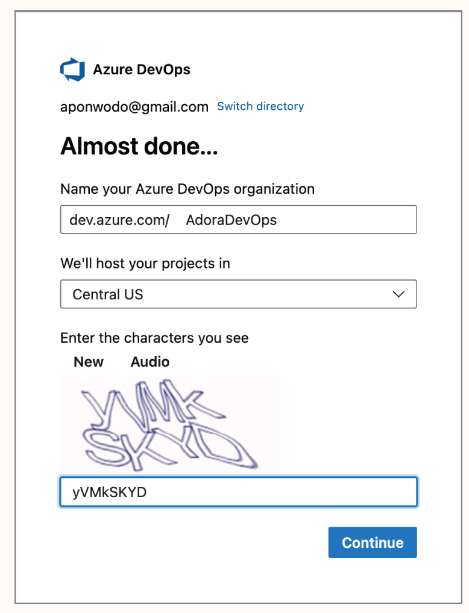

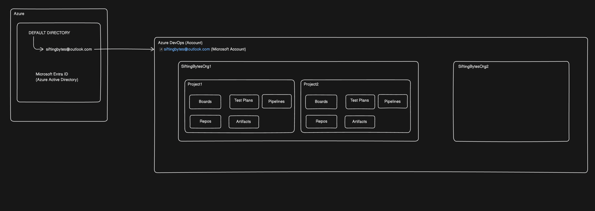

Note: A new unique URL will be created: dev.azure.com/org-sbt
Note: (VSTS) Visual Studio Team Services was renamed to Azure DevOps in 2018 - So, old URL also still works: org-sbt.visualstudio.com which redirects to dev.azure.com/org-sbt

Organizational Settings:
Enable using New URL: dev.azure.com/org-sbt
Old URL: org-sbt.visualstudio.com
-> Privacy URL: Optional URL pointing to data privacy information which might be a legal requirement in few organizations
-> Description: Optional information can be updated about the organization
-> Time zone: Optional but will be used to timestamp all the future activities  

5. How to plan organizations & projects in Azure DevOps - depends on the business use case
   
#### Use case 1: Creating a simple structure for a small company called Sifting Bytes Technologies with a single business unit Academy
 - Create an Organization by going to:  https://aex.dev.azure.com
   Name: org-sbt

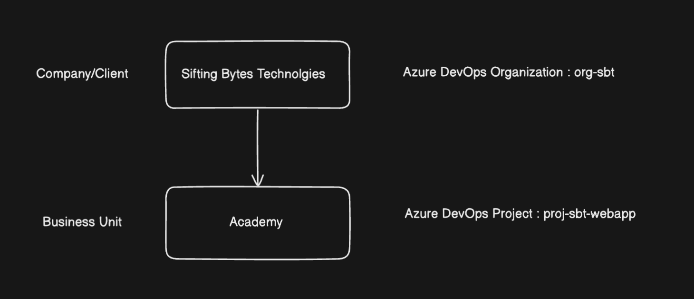
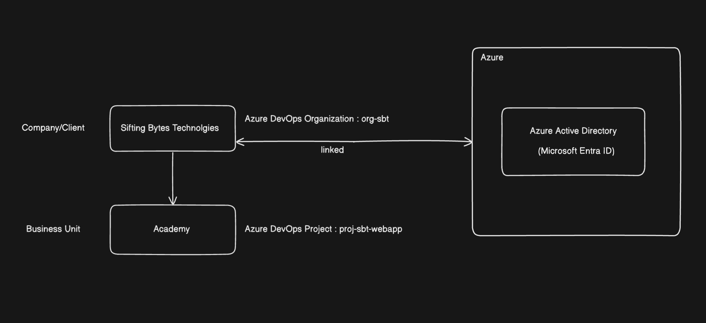

 - Lets say we have a company called Sifting Bytes Technologies that offer online corportate trainings only
 - They need an Online Web application/platform which connects students & trainers
 - Azure DevOps organizations give you access to the Azure DevOps toolchain like Azure Boards, Azure Repos etc.
    a. Azure Boards     - To schedule and track your tasks and issues
    b. Azure Repos      - To work with software developers to build applications with source control management tools
    c. Azure Pipelines  - To set up continuous integration and deployment
    d. Azure Artifacts  - To cCreate, organize, and share packages
    e. Azure Test Plans - To test applications end to end 

 - Create a Project: proj-sbt-webapp

#### Use case 2: Creating a more elaborate structure for a large company Sifting Bytes Technologies with multiple business units like Academy, Software services & E-commerce
 - Lets take an example of a company called Sifting Bytes Technologies
 - We can multiple projects in in each organization
 - Projects focus on different things
 - They all exist under the organization, which is connected to a single Azure Active Directory tenant
 - This company has three business units:
    a. Academy            - offering corporate trainings
    b. Software Services  - offering various software services to companies
    c. E-commerce         - offering B2C platform to sell office & sports related products
   

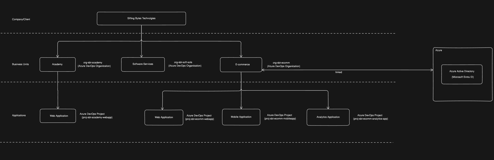

6. Create a project in the Organization
Note: On successful creation of the organization, Azure DevOps routes you to a page where you can create projects in your new organization

Project Name: ProjectSbtWebApp -> Visibility: Private (we need to give access to users manually) -> Create Project -> Dashboard with all the possible actions we can perform in the project -> This is the starting point for everything we do

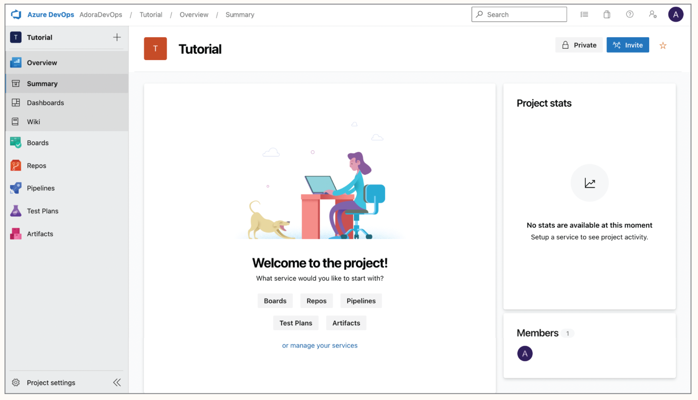

Note: We can also add a new project to an existing organization from the organization dashboard
Note: Projects can also be deleted & deleted projects can also be restored within 28 days 
Note: To configure Organization to add Public projects -> Select organization: org-sbt -> Goto: Organizational Settings -> Security: Policies -> Security Policies: Allow public projects -> Save

7. On creation of a Project, automatically a team will be created with the same name
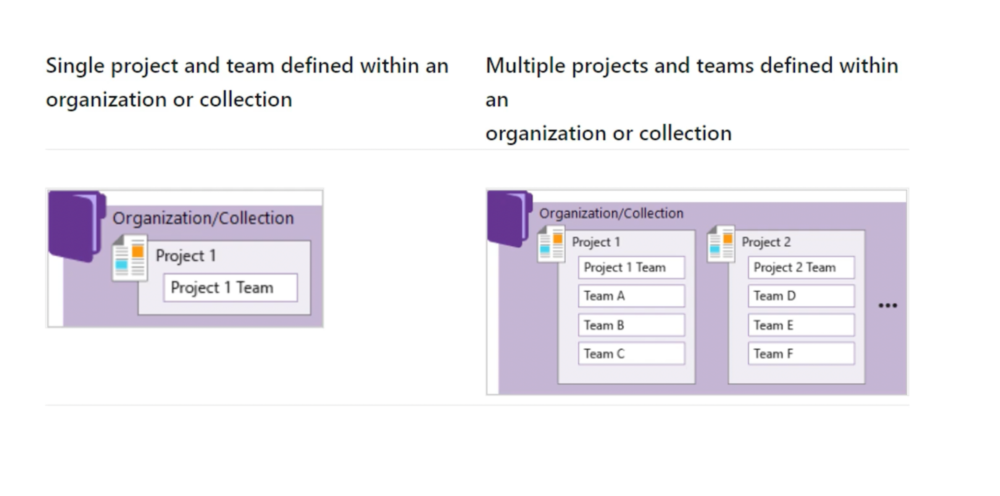

7. (Optional) Generate Demo organizations & projects using

-------------------------------------------------------------------------------------------------------------------------------------------------------------------------------------------------------------------------------------------------------------------------------------------------------
# II.  What is Azure DevOps Organization(s) ?
 - What is an Organization in Azure DevOps?  
 - An Azure DevOps organization is a tool for organizing and joining related projects
 - We can plan and track our work here and collaborate with others when developing applications
 - From the organization level, we can also integrate with other services, set permissions accordingly, and set up continuous integration and deployment
 - Azure DevOps organizations give you access to the Azure DevOps toolchain like Azure Boards, Azure Repos etc. 
 - Different Azure DevOps organizations can have varying security and structural models
 - Each organization is connected to a single Azure Active Directory tenant i.e. it means that team members working on any of these projects all have access to that tenant
 - We can have one or more than one organizations for our company i.e. how we structure/plan our organization depends on our use case
 - For example, our company Flipkart:
    a. Company-wide organization                                 Ex. Single organization called org-flipkart-ecomm   
    b. It can be for specific business units in your company     Ex. Multiple organizations like org-web-app, org-analytics-business

#### How can we structure/plan an Azure DevOps organization for a Company/Client 
 - Lets take an example of a company called Sifting Bytes Technologies
 - This company has three business units:
    a. Academy            - offering corporate trainings
    b. Software Services  - offering various software services to companies
    c. E-commerce         - offering B2C platform to sell office & sports related products 

Use case 1: Single Organization in Azure DevOps
 - We have a single Azure DevOps organization called: org-sbt
 - We can have multiple projects called:
     a. proj-sbt-academy
     b. proj-sbt-soft-sols
     c. proj-sbt-ecomm

Use case 2: Multiple Organizations in Azure DevOps
 - We can have multiple Azure DevOps organizations:
    a. org-sbt-academy
    b. org-sbt-soft-sols
    c. org-sbt-ecomm
 - We can multiple projects in in each organization
 - Projects focus on different things
 - They all exist under the organization, which is connected to a single Azure Active Directory tenant
 - Lets say, the organization org-sbt-ecomm can have multiple projects: team members working on any of these projects all have access to that tenant  
    a. proj-web-app
    b. proj-mob-app
    c. proj-customer-analytics-app

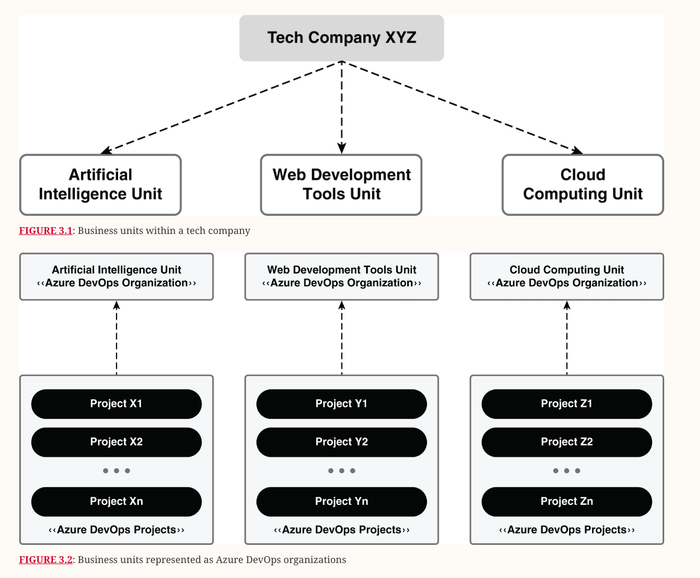
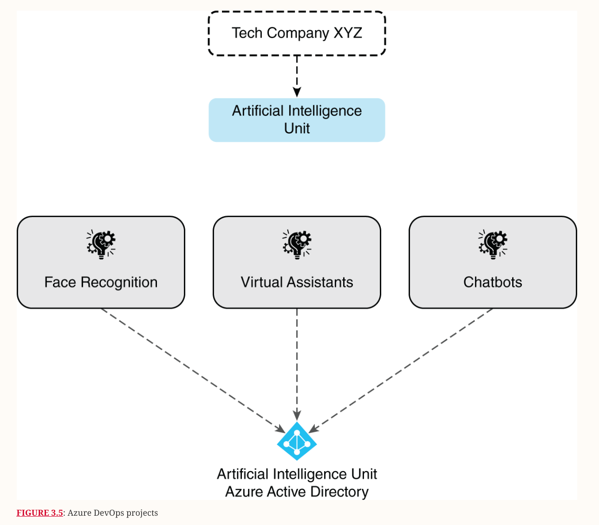

-------------------------------------------------------------------------------------------------------------------------------------------------------------------------------------------------------------------------------------------------------------------------------------------------------
# III. What is Azure DevOps Project(s) ?
 - What is a Project in Azure DevOps ?
 - A project is a fundamental container where data is stored when added to Azure DevOps
 - A Project provides us all the main services of Azure DevOps:
    a. Repo - a repository for source code
    b. Boards - a place for users to plan, track progress, and collaborate on building software solutions
    c. Pipeline
    d. Test plan
    e. Artifacts
 - Each organization can have many projects
 - When we create our project, a team of the same name is automatically created which is sufficient for small teams
 - However, for enterprise-level organizations, it may be necessary to scale up, to create more teams and projects
 - These additions can be created within the single account or collection

#### Use case 1 : When to go for a Single Project in an organization ?
 - A single project places all work at one level across the organization
 - In a single project, teams can share source repositories, build definitions, release definitions, reports, and package sources
 - You may have a large product or service managed by multiple teams
 - These teams are closely interdependent throughout the product life cycle
 - You create a project and divide your work using team and area paths
 - This setting allows your teams to see each other's work, thus aligning the organization
 - Your team uses the same taxonomy to track work items, making communication and alignment easier
 - Having a single project is good for transparency, but it has its drawbacks
 - As it is hard to find what you're looking for with multiple searches and boards
 - Depending on the product architecture, this issue may spread to other areas such as releases, builds, and repositories.

#### Use case 2: When to go for multiple projects in an organization ?
 - Having multiple projects shifts the managerial burden and gives the team more autonomy to manage projects as they see fit. It also provides access to asset and security controls within projects.
 - You may use multiple projects if your organization satisfies one or more of these requirements:
    a. You want to restrict or control access to information in the projects within your organization.
    b. Your organization likes to use custom techniques for tracking work items and tasks for its distinctive business units.
    c. Your organization wants to support respective business units with their own managed policies.
    d. Your organization may want to add custom tests or extensions before making changes to a project you're working on.

 - Type of projects:
    a. Private Projects - this require that you add and manage user access i.e. Users must sign in to gain access to a project, even if it's read-only access
                          All users added to a project have access to the project and organization information.
                          Private projects are mostly used for non public software development.
    b. Public Projects - doesn't require users to sign in to gain read-only access to many of the services i.e. Public projects are visible to everyone & no login is required to get access of public project
                         Public projects provide support to share code with others and to support continuous integration/continuous deployment (CI/CD) of open-source software
                         We can create unlimited number of public project under one or more organization

       Note: To configure Organization to add Public projects -> Select organization: org-sbt -> Goto: Organizational Settings -> Security: Policies -> Security Policies: Allow public projects -> Save

-------------------------------------------------------------------------------------------------------------------------------------------------------------------------------------------------------------------------------------------------------------------------------------------------------
# IV. What are Groups/Security groups ?
 - A group is a class of users with specific permissions i.e. a security group
 - Every group can have other groups as members & it can be a member of other group thereby inheriting permissions

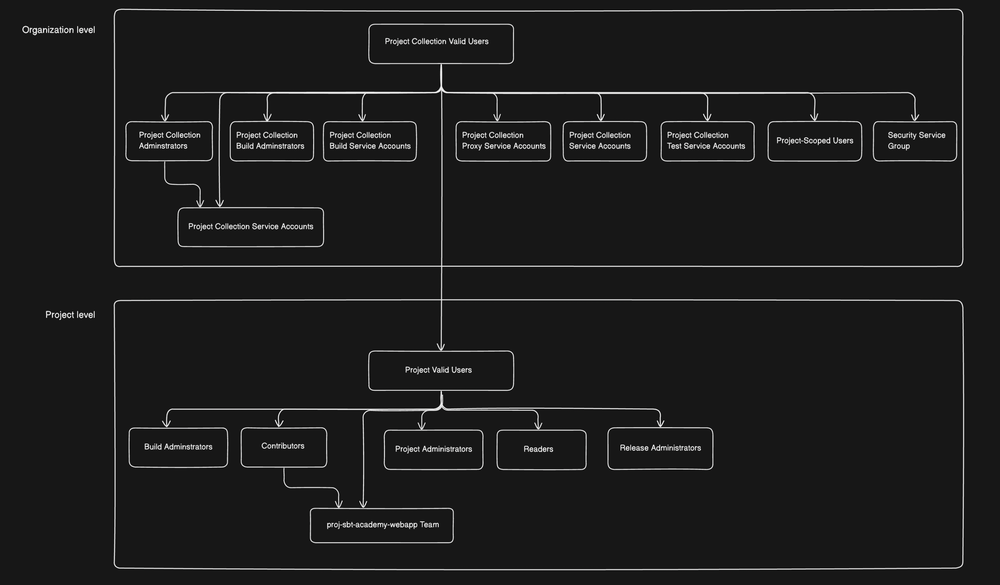

 - Two types of groups at Organization level:
    a. Pre-defined groups
    b. User defined groups

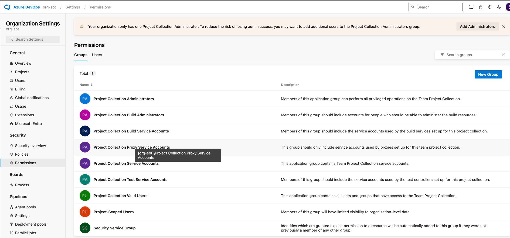

 - Two types of groups at Project level:
    a. Pre-defined groups
    b. User defined groups

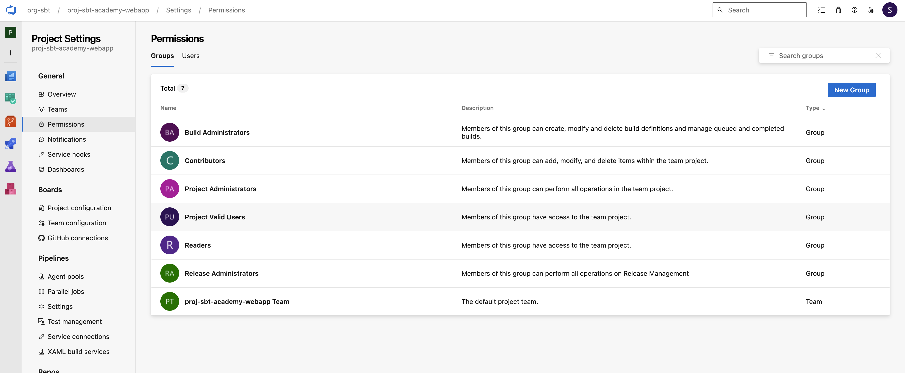

 - We can create security groups (with various permissions) directly both:
     a. On Organization level 
     b. Project level
-------------------------------------------------------------------------------------------------------------------------------------------------------------------------------------------------------------------------------------------------------------------------------------------------------
# V. What are Teams ?
 - A team is basically a group of users
 - On creation of a Project, automatically a default team will be created with the same name i.e. every project should have atleast 1 default team
 - We can add/delete/manage new teams if needed
 - We can also delete the default team but we need to assign some another team as the default team before hand 
   

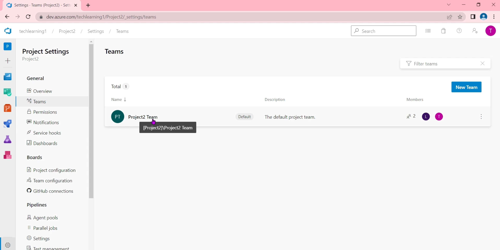

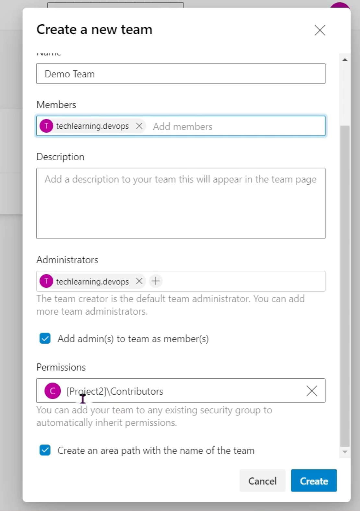

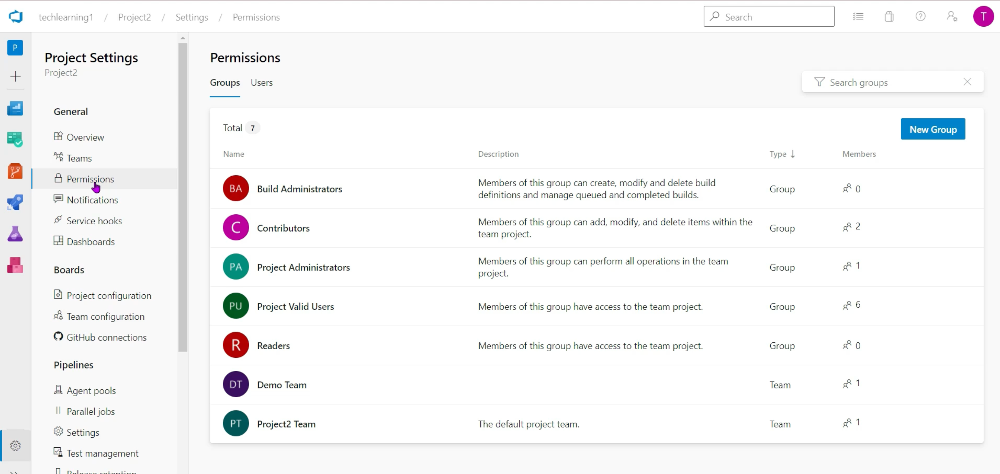

#### How to add a member to the team of a project ?
Goto: Project2 -> Overview: Summary -> Invite -> Users: venu.koka12@gmail.com -> Add to team: Project2 Team -> Add 
-> An invitation gets delivered to the Email of the User -> 

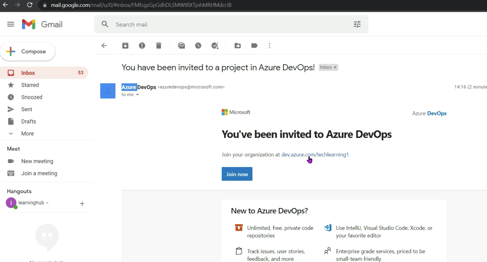   

-> In the Email invitation: Join now -> Sign in: venu.koka12@gmail.com -> Next -> Password: -> Sign in -> Continue 

-------------------------------------------------------------------------------------------------------------------------------------------------------------------------------------------------------------------------------------------------------------------------------------------------------
# VI. What is Access Level ?
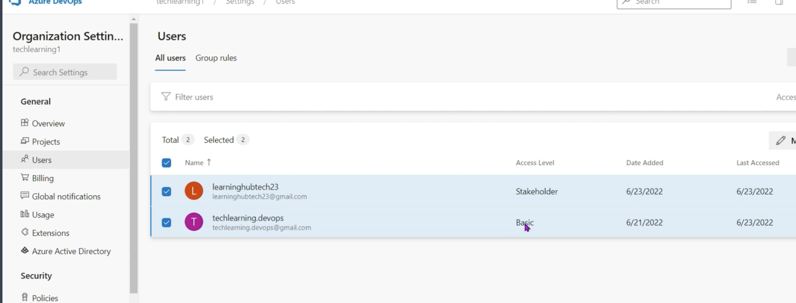

 - Access levels enable administrators to provide their user base access to the features they need and only pay for those features
 - We can assign users/groups of users to one of the following access levels: each access level provides different features
    a. Basic
    b. Basic + Test Plans
    c. Stakeholder - can be assigned to unlimited users for free, provides partial access to private projects & mostly full access to public projects
    d. Visual Studio Subscriber
    
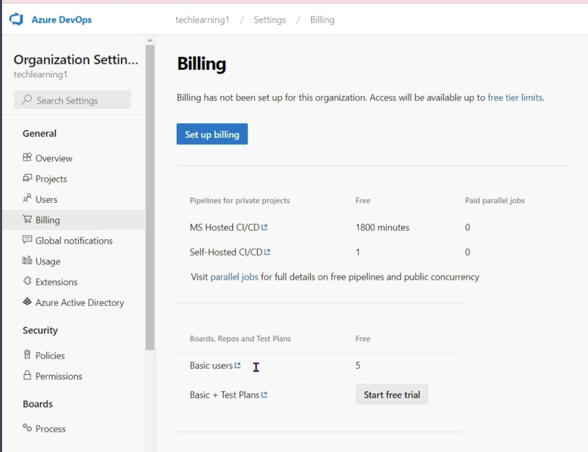   

 - Default access level for new users is stakeholder
 - A free Azure DevOps account can have:
    a. Stakeholder access level        - any number of users allowed
    b. Basic access level              - only 5
    c. Basic + Test Plans access level - disabled by default(we need to Start free trial to enable this access level)
   
-------------------------------------------------------------------------------------------------------------------------------------------------------------------------------------------------------------------------------------------------------------------------------------------------------
# VII. Walkthrough of the key features of the Project Dashboard

1. Azure Boards
    a. Software development teams can use the interactive and configurable tools in Azure Boards for managing their software projects\
    b. It delivers various features, including support for agile and scrum, customizable dashboards, and reporting
    c. As your business grows, you can scale these tools.

3. Azure Repos:
    a. It is a collection of version control and source code management tools
    b. Version control tools are applications that help you track changes you make in your code in real time. As you update your code, you tell the version control tool to take a snapshot of your files. The version control tool saves that snapshot, and you can retrieve it later when needed.

5. Azure Pipelines: To instantly build and test code to make them available to others. It combines CI and CD to test, build, and deploy your code to any target or destination.

6. Azure Test Plans: A test management platform with all the abilities required for different testing styles and gathering feedback from stakeholders (including planned manual testing, user acceptance testing, and exploratory testing)

7. Azure Artifacts
    a. It allows software developers to share their code effectively and handle all their packaged code from one place
    b. Developers can publish packages to their feeds and share them within the same team, across multiple product teams or organizations, and even publicly

8. Visual Studio Marketplace
    a. To download extensions for Azure DevOps
    b. Created by Microsoft, in collaboration with the tech community
    c. They are add-ons that customize and advance your team's venture with Azure DevOps
    d. They can expand different parts of the DevOps toolchain, from managing work items to code integration and testing, pipeline builds and software releases, and team synergy
      
-------------------------------------------------------------------------------------------------------------------------------------------------------------------------------------------------------------------------------------------------------------------------------------------------------
