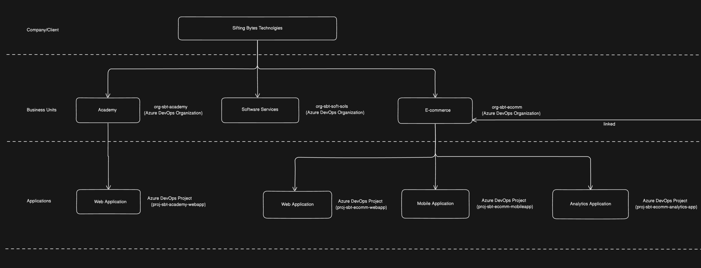

# Index
1. Setting up Account
2. What is Azure DevOps Organization(s) ?
3. What is Azure DevOps Project(s) ?
4. Walkthrough of the key features of the Project Dashboard
-------------------------------------------------------------------------------------------------------------------------------------------------------------------------------------------------------------------------------------------------------------------------------------------------------
# I. Setting up an account
1. Create an Email account
    a. Either use our own existing email account    Ex. eswarmuthyam24@gmail.com
    b. Or create a new Microsoft's Outlook or Hotmail email account  Ex. eswarmuthyam24@outlook.com
   
2. Create a Microsoft Account: eswarmuthyam24@gmail.com/Microsoft4$5account   
3. Create your Azure free subscription: use Phone number & Credit/Debit card

4. Add an organization in the website: https://aex.dev.azure.com/

5. How to plan organizations & projects in Azure DevOps - depends on the business use case
   
#### Use case 1: Creating a simple structure for a small company called Sifting Bytes Technolgies with a single business unit Academy
 - Create an Organization by going to:  https://aex.dev.azure.com
   Name: org-sbt

 - Lets say we have a company called Sifting Bytes Technologies that offer online corportate trainings only
 - They need an Online Web application/platform which connects students & trainers
 - Azure DevOps organizations give you access to the Azure DevOps toolchain like Azure Boards, Azure Repos etc.
    a. Azure Boards     - To schedule and track your tasks and issues
    b. Azure Repos      - To work with software developers to build applications with source control management tools
    c. Azure Pipelines  - To set up continuous integration and deployment
    d. Azure Artifacts  - To cCreate, organize, and share packages
    e. Azure Test Plans - To test applications end to end 

 -  Create a Project: proj-sbt-webapp

#### Use case 2: Creating a more elaborate structure for a large company Sifting Bytes Technologies with multiple business units like Academy, Software services & E-commerce
 - Lets take an example of a company called Sifting Bytes Technologies
 - This company has three business units:
    a. Academy            - offering corporate trainings
    b. Software Services  - offering various software services to companies
    c. E-commerce         - offering B2C platform to sell office & sports related products
   

-------------------------------------------------------------------------------------------------------------------------------------------------------------------------------------------------------------------------------------------------------------------------------------------------------
# II.  What is Azure DevOps Organization(s) ?
 - What is an Organization in Azure DevOps?  
 - An Azure DevOps organization is a tool for organizing and joining related projects
 - Azure DevOps organizations give you access to the Azure DevOps toolchain like Azure Boards, Azure Repos etc.
 - How you structure/plan our organization depends on our use case
 - Different Azure DevOps organizations can have varying security and structural models
 - Each organization is connected to a single Azure Active Directory tenant i.e. it means that team members working on any of these projects all have access to that tenant
 - We can have one or more than one organizations for our company
 - For example, our company Flipkart:
    a. Company-wide organization                                 Ex. Single organization called org-flipkart-ecomm   
    b. It can be for specific business units in your company     Ex. Multiple organizations like org-web-app, org-analytics-business 

#### How can we structure/plan an Azure DevOps organization for a Company/Client 
 - Lets take an example of a company called Sifting Bytes Technologies
 - This company has three business units:
    a. Academy            - offering corporate trainings
    b. Software Services  - offering various software services to companies
    c. E-commerce         - offering B2C platform to sell office & sports related products 

Use case 1: Single Organization in Azure DevOps
 - We have a single Azure DevOps organization called: org-sbt
 - We can have multiple projects called:
     a. proj-sbt-academy
     b. proj-sbt-soft-sols
     c. proj-sbt-ecomm

Use case 2: Multiple Organizations in Azure DevOps
 - We can have multiple Azure DevOps organizations:
    a. org-sbt-academy
    b. org-sbt-soft-sols
    c. org-sbt-ecomm
 - We can multiple projects in in each organization
 - Lets say, the organization org-sbt-ecomm can have multiple projects:
    a. proj-web-app
    b. proj-mob-app
    c. proj-customer-analytics-app
 
-------------------------------------------------------------------------------------------------------------------------------------------------------------------------------------------------------------------------------------------------------------------------------------------------------
# III. What is Azure DevOps Project(s) ?
 - What is a Project in Azure DevOps ?
 - A project is a store for data in Azure DevOps
 - Each organization can have many projects
 - Example 1: Create two projects in the Organization called amazon-ecomm
             
-------------------------------------------------------------------------------------------------------------------------------------------------------------------------------------------------------------------------------------------------------------------------------------------------------
# IV. Walkthrough of the key features of the Project Dashboard
1. Azure Boards
    a. Software development teams can use the interactive and configurable tools in Azure Boards for managing their software projects. It delivers various features, including support for agile and scrum, customizable dashboards, and reporting. As your business grows, you can scale these tools.

2. Azure Repos: Azure Repos is a collection of version control and source code management tools in the Azure DevOps toolset. Version control tools are applications that help you track changes you make in your code in real time. As you update your code, you tell the version control tool to take a snapshot of your files. The version control tool saves that snapshot, and you can retrieve it later when needed.

3. Azure Pipelines: Azure Pipelines instantly builds and tests code to make them available to others. It combines CI and CD to test, build, and deploy your code to any target or destination.

4. Azure Test Plans: Azure Test Plans is a test management platform with all the abilities required for different testing styles and gathering feedback from stakeholders. Some testing styles include planned manual testing, user acceptance testing, and exploratory testing.

5. Azure Artifacts: Azure Artifacts allows software developers to share their code effectively and handle all their packaged code from one place. With Azure Artifacts, developers can publish packages to their feeds and share them within the same team, across multiple product teams or organizations, and even publicly.

6. Visual Studio Marketplace: You can download extensions for Azure DevOps from the Visual Studio Marketplace. These extensions are created by Microsoft, in collaboration with the tech community. They are add-ons that customize and advance your team's venture with Azure DevOps. They can expand different parts of the DevOps toolchain, from managing work items to code integration and testing, pipeline builds and software releases, and team synergy.
-------------------------------------------------------------------------------------------------------------------------------------------------------------------------------------------------------------------------------------------------------------------------------------------------------
