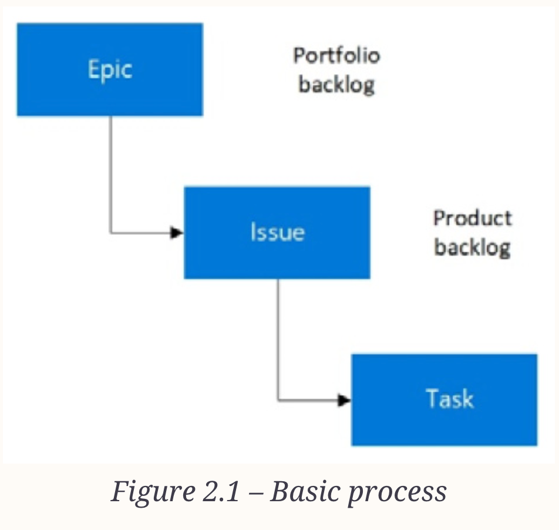

# Index
1. What is Planning ?
2. What is Azure Boards ?
3. What are Processes & Process templates ?
4. How to create and manage the different project activities using Azure Boards ?
------------------------------------------------------------------------------------------------------------------------------------------------------------------------------------------------------------------------------------------------------------------------------------------------------
# I. What is Project Planning ?

------------------------------------------------------------------------------------------------------------------------------------------------------------------------------------------------------------------------------------------------------------------------------------------------------
# II. What are Azure Boards ?
 - Azure Boards is designed to facilitate Agile project management i.e. allowing teams to efficiently plan, execute, and monitor their work throughout the software development lifecycle
 - It is a service within Azure DevOps that provides tools for work tracking, including boards and backlogs
 - This enables the definition, tracking, and organization of work that needs to be completed
 - Teams can :
    a. Outline their tasks to create a visual representation of their workflow and priorities
    b. Design customizable dashboards
    c. Integrated reporting capabilities and tools
    b. Integrating with GitHub - an issue can be raised to suggest innovative ideas or track bugs
       These issues can then be systematically organized and assigned within teams, ensuring clear communication and task management
   

Boards and backlogs for project planning using the agile or scrum methodology
Code build and release pipelines for continuous integration and deployment
Code repositories for version control and management of source code
Repositories for built and sharable artifacts
Continuous test plans for the entire project life cycle

------------------------------------------------------------------------------------------------------------------------------------------------------------------------------------------------------------------------------------------------------------------------------------------------------
# III. What are Processes & Process templates ?
 - At the start of the project, teams must decide which process and process templates need to be used to support the project model that is being used
 - Work Item tracking system 
 - Types of process templates supported by Azure Boards: native support for Scrum and Kanban
    a. Basic
    b. Agile
    c. Scrum
    d. (CMMI) Capability Maturity Model Integration

## 1. Basic 
 - Uses Epics, Issues, and Tasks to track the work
 - These artifacts are created when you create a new basic project:
    a. Portfolio backlog - contains Epics
    b. Product backlog   - contains Issues
    c. Tasks
 - Two types of boards:
    a. Kanban board
    b. Task board

## 2. Agile
 - Choose Agile if your team uses an agile planning process
 - Development and test activities are tracked separately here
 - These artifacts are created when you create a new basic project:
    a. Portfolio backlog - contains Epics & Features
    b. Product backlog   - contains User stories & tasks, bug & tasks
    c. Issues 
 - Agile uses the Kanban board to track User Stories and bugs
 - We can also track them on the task board

## 3. Scrum
 - These artifacts are created when you create a new basic project:
    a. Portfolio backlog - contains Epics
    b. Product backlog   - contains Isses
    c. Tasks
 - We can track artifacts using the Kanban board or break PBIs and bugs down into tasks on the task board

 

## 4. (CMMI) Capability Maturity Model Integration
 - A more formal project method that requires a framework for process improvement and an auditable record of supportable decisions
 - We can track requirements and change requests, risks, assessments and reviews

 

------------------------------------------------------------------------------------------------------------------------------------------------------------------------------------------------------------------------------------------------------------------------------------------------------
# IV. How to create and manage the different project activities using Azure Boards ?
 - The Work Items that are available to you are based on the process that was chosen when the project was created
   Ex. Basic process has Epic, Issue & Task
 - Work Items have three different states:
    1. new
    2. active
    3. closed

------------------------------------------------------------------------------------------------------------------------------------------------------------------------------------------------------------------------------------------------------------------------------------------------------
# Basic Process Template/Methodology/Model
 - Useful for new engineers who are only used to basic stuff like GitHub issues etc.
 - Useful to get things started without any pre-requisite knowledge on methodologies, terms & terminologies
 - Only three work item types/concepts/artifacts: used to track our project work
    a. Epic
    b. Issue 
    c. Task
 - Three simple states: the same state model followed for all the three work items
    a. To Do
    b. Doing
    c. Done

   
1. Create an Organization                : org-sbt
2. Create a Project in this organization : proj-sbt-academy-webapp
Project name: proj-sbt-academy-webapp -> Visibility: Private (Default) -> Version control: Git (Default) -> Work item process: Basic (Default) -> Create Project

Project Dashboard: proj-sbt-academy-webapp
 a. Overview/Summary   - project level statistics 
 b. Dashboard          - we can place widgets
 c. Wiki               - project documentation
 d. Boards
 e. Repos
 f. Pipelines
 g. Test Plans
 h. Artifacts
    
Goto: Boards -> 
 a. Work items  - Epic, Issue, Task
 b. Boards
 c. Backlogs
 d. Sprints
 e. Queries
 f. Delivery Plans
 g. Analytics Views

3. Add a member to the project
Goto Azure portal: portal.azure.com  -> Add users to the DEFAULT DIRECTORY -> These users can be added later as the members of the project

Goto Azure DevOps portal: dev.azure.com -> Select organization: org-sbt -> Select our project: proj-sbt-academy-webapp -> Project settings -> General: Teams -> Select the team: Default team -> Add: nidhi
  
4. Creating a Work Item: Task
Goto Project: proj-sbt-academy-webapp -> Boards -> + New Work Item -> Select: Task
-> Fill up the form
-> Title (name of the task): Create add-to-bag functionality for guest users
-> Assigned (assign task to specific member on our team & this person must be a member of the project): Nidhi (nidhi@siftingbytesoutlook.onmicrosoft.com)
-> Add Tag (to group related work items and find them later): new-feature
-> State: To Do (as this work item is new)
-> Description (more details about the task): XXXX
-> Iteration (we can define which sprint to add to this task):
-> Discussion (team members can post additional comments): 
   

eswarmuthyam@siftingbytesoutlook.onmicrosoft.com 

------------------------------------------------------------------------------------------------------------------------------------------------------------------------------------------------------------------------------------------------------------------------------------------------------
