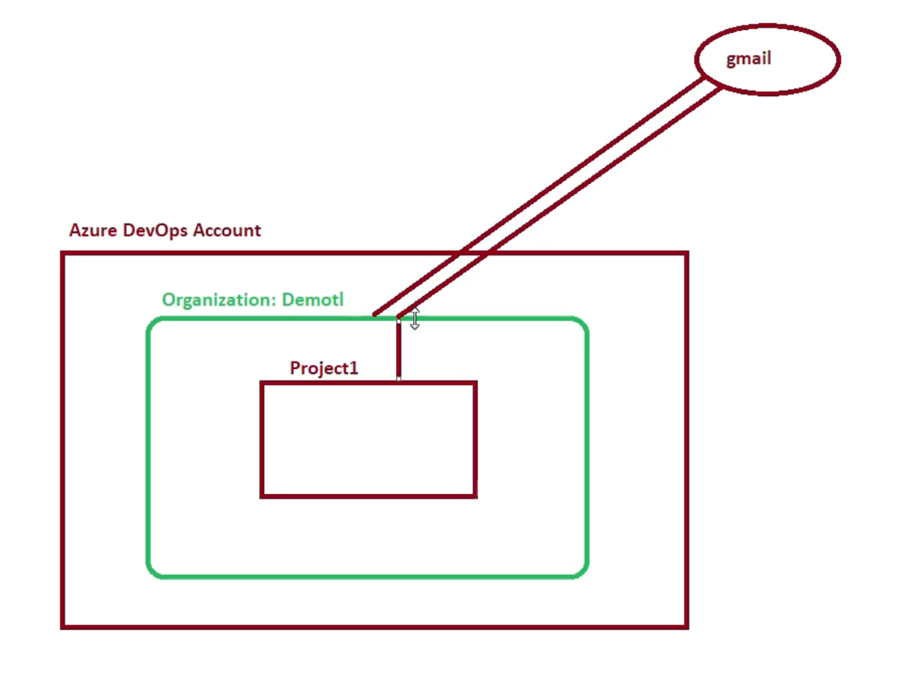
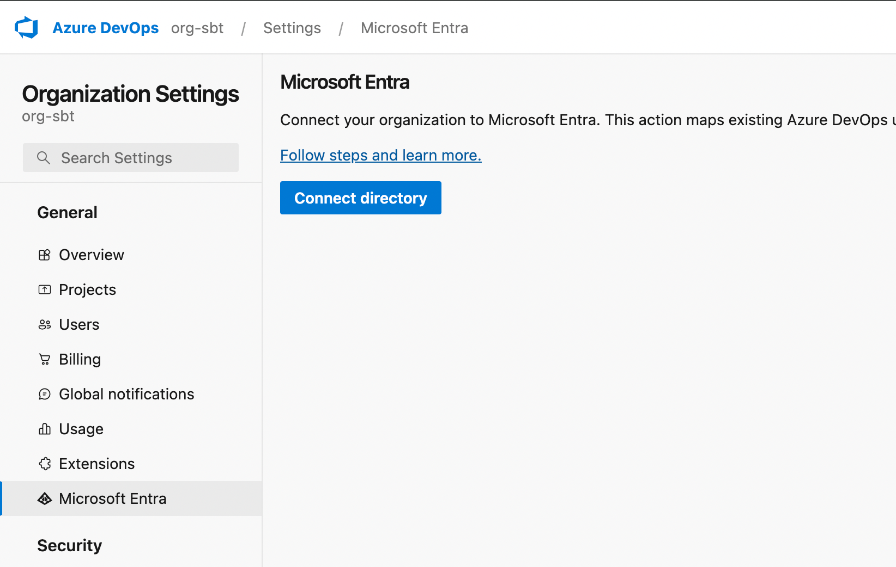
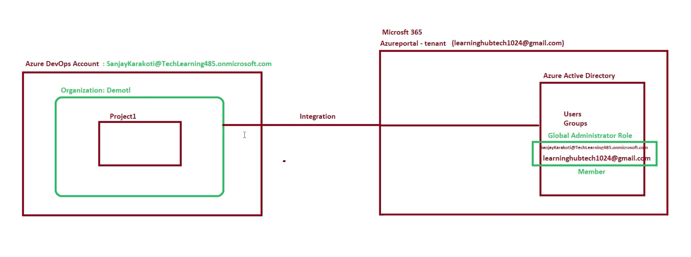
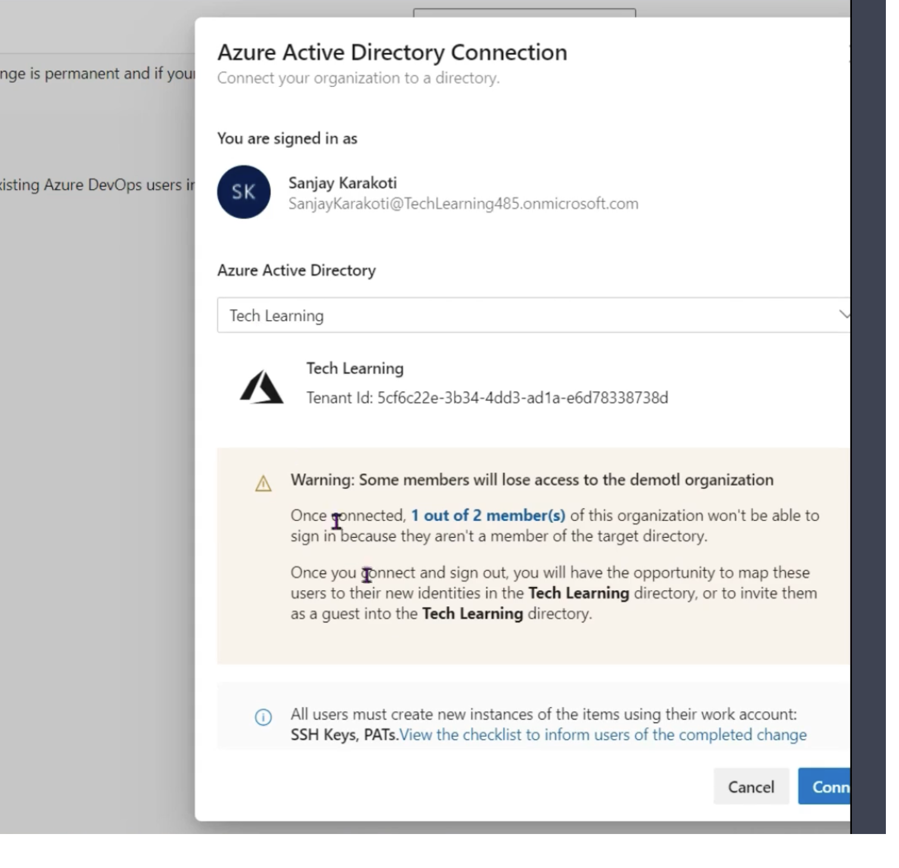
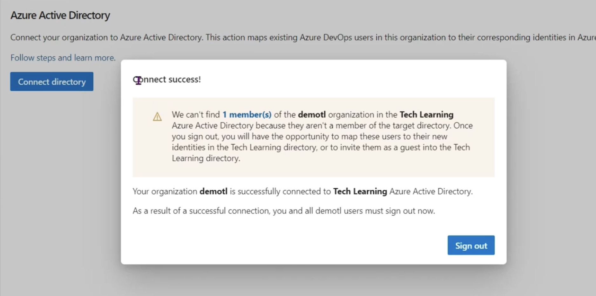
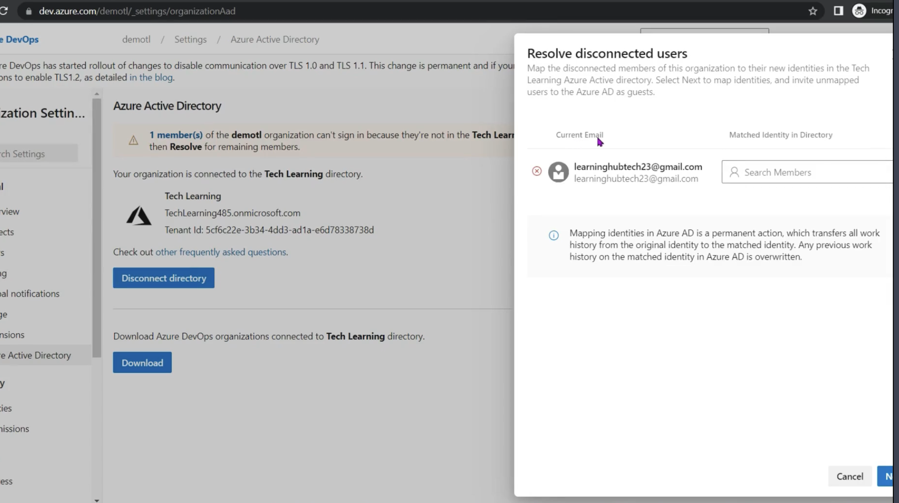
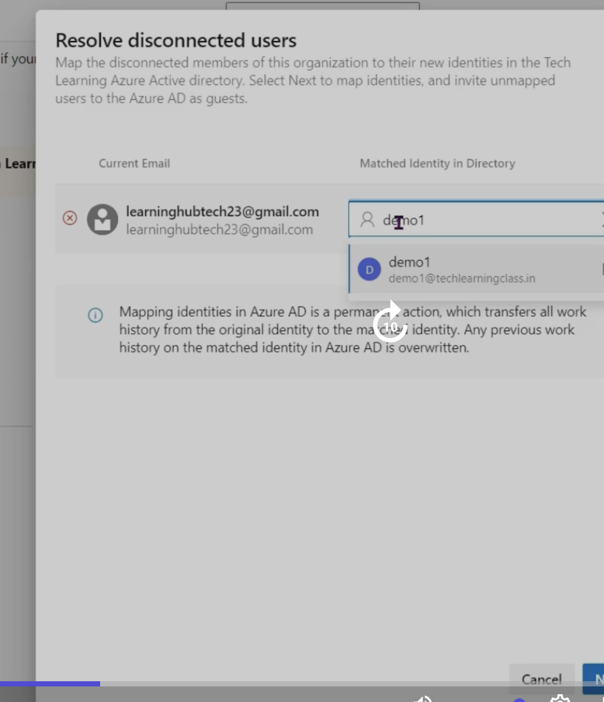
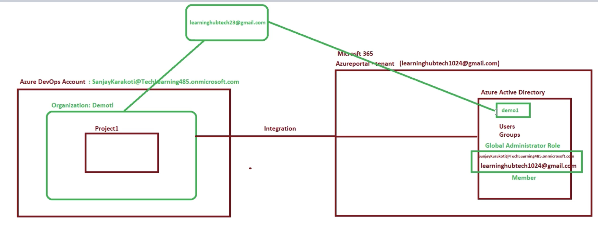
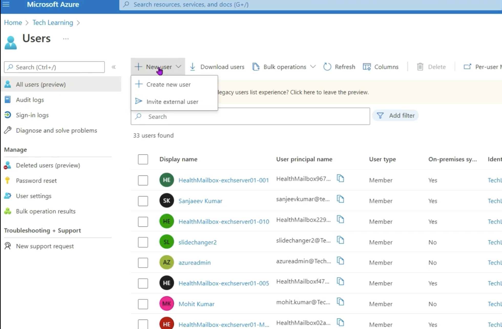
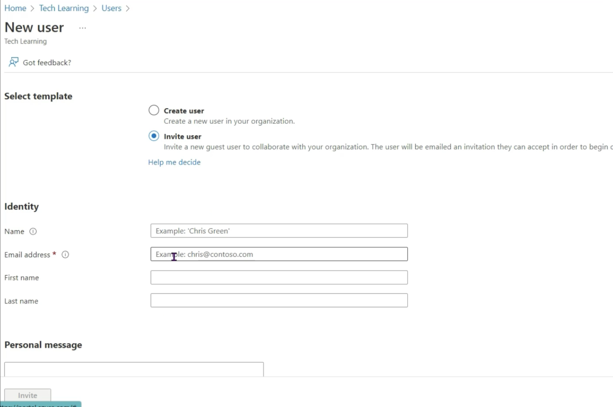

# Index
1. Different types of users
2. Azure DevOps Account can exist without integrating with Microsoft Entra ID
3. Integrating Azure DevOps with Microsoft Entra ID 
--------------------------------------------------------------------------------------------------------------------------------------------------------------------------------------------------------------------------------------------------------------------------------------------------------
# I. Different types of Users
 - Two types of users:
    a. External users - An Azure DevOps Administrator can invite any user(with their personal email like venu.koka12@gmail.com) 

    b. Internal users - Users in Microsoft Entra ID (Azure AD)
       
--------------------------------------------------------------------------------------------------------------------------------------------------------------------------------------------------------------------------------------------------------------------------------------------------------
# II. Azure DevOps Account can exist without integrating with Microsoft Entra ID (ME-ID)
 - We can add external users and run our Azure DevOps organizations
 - No need to connect it with Microsoft Entra ID 

--------------------------------------------------------------------------------------------------------------------------------------------------------------------------------------------------------------------------------------------------------------------------------------------------------
# III. Integrating Azure DevOps with Microsoft Entra ID (ME-ID)
 - So that we can add users existing in Microsoft Entra ID to our Azure DevOps Organization
   

 - Microsoft Entra : name for the product family of identity and network access solutions
   a. Microsoft Entra ID
   b. 

   
## Case 1: When the Azure DevOps Account is already an existing member of Microsoft Entra ID(Azure Active Directory)
1. Create an account in Azure portal or Microsoft 365: siftingbytes@outlook.com

Other conditions to be met are: for the integration to be successful
  a. Rule: The user type of siftingbytes@outlook.com in Microsoft Entra ID should be: "member" (can be verified in Azure Portal -> Microsoft Entra ID)
  b. Rule: The user siftingbytes@outlook.com in Azure DevOps should have: Project Collection Administrators (can be verified in Azure DevOPs -> Organization settings -> Permissions -> Project Collection Administrators -> Users)
  c. Recommendation: Only if number of existing external users are < 100
  
2. Use the same account to create an organization in Azure DevOps: siftingbytes@outlook.com
3. Integrate the Azure DevOps Organization with the Microsoft Entra ID
Select an organization: org-sbt -> Goto: Organizational Settings -> General: Microsoft Entra ID -> Connect Directory -> Microsoft Entra: Default Directory -> Connect -> Logout & Login again

## Case 2: We have existing external users in Azure DevOps & we want to integrate it with Microsoft Entra ID (And ensure existing external users dont lose access after integration)
1. Create an account in Azure portal or Microsoft 365: siftingbytes@outlook.com

Other conditions to be met are: for the integration to be successful
  a. Rule: The user type of siftingbytes@outlook.com in Microsoft Entra ID should be: "member" (can be verified in Azure Portal -> Microsoft Entra ID)
  b. Rule: The user siftingbytes@outlook.com in Azure DevOps should have: Project Collection Administrators (can be verified in Azure DevOPs -> Organization settings -> Permissions -> Project Collection Administrators -> Users)
  c. Recommendation: Only if number of existing external users are < 100
  
2. Use the same account to create an organization in Azure DevOps: siftingbytes@outlook.com
3. Create an Organization: demotl
4. Create a Project in this Organization: Project1
5. Add external users to the Organization (learninghubtech23@gmail.com has no Micrsofot account)
Select Organization: demotl -> Organizational Settings -> General: Users -> Add user -> Users: learninghubtech23@gmail.com -> Access level: Basic -> Add to projects: Project1 -> Azure DevOps Groups: Project Contributors -> Check: Send email invites -> Add

6. Connect Microsoft Entra ID
Select Organization: demotl -> Organizational Settings -> General: Microsoft Entra ID -> Connect directory -> Microsoft Entra ID: Tech Learning ->

-> Sign out 
-> Sign in: siftingbytes@outlook.com -> Select Organization: demotl -> Organizational Settings 
-> General: Microsoft Entra ID -> In Warning message: Resolve

-> Current Email: learninghubtech23@gmail.com -> Matched Identity in Directory: demo1@techlearningclass.in (Already existing Microsoft account in Tech Learning directory or create it now) -> Next -> 

-> Mapping success message will be displayed

Note: Multiple ways to resolve accounts:
      a. learninghubtech23@gmail.com external account can be mapped with any other Microsoft account already existing in Microsoft Entra ID directory (Ex. Tech Learning directory has demo1@techlearningclass.in account)
         Follow the above process

      b. Invite learninghubtech23@gmail.com external account of Azure DevOps as a guest in our Microsoft Entra ID 
         Login into Azure Portal: siftingbytes@outlook.com ->  Search: Microsoft Entra ID -> Default Directory -> Manage: Users -> New user -> Invite external user -> Enter 
      

--------------------------------------------------------------------------------------------------------------------------------------------------------------------------------------------------------------------------------------------------------------------------------------------------------
