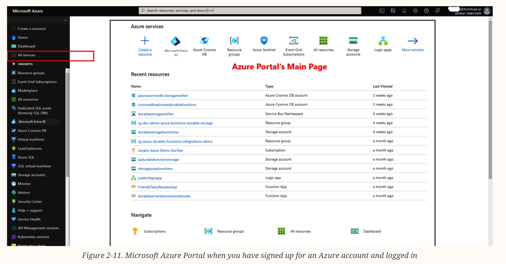

#  Index
1. Create Azure account
2. Explore the Azure Portal’s homepage
-------------------------------------------------------------------------------------------------------------------------------------------------------------------------------------------------------------------------------------------------------------------------------------------------------
# I. Create Azure account
 - Register for a free Azure account on : https://azure.microsoft.com/en-us/free
 - If we already have an account        : https://portal.azure.com

-------------------------------------------------------------------------------------------------------------------------------------------------------------------------------------------------------------------------------------------------------------------------------------------------------
# II. Explore the Azure Portal’s homepage
 - Checklist:
    a. A left navigation bar with the default list of Azure services;
    b. The main page has the dashboard and search bar
    c. On the upper right of the portal, you will be able to access the Cloud Shell, Directories + Subscriptions, Notifications, Settings, Help, and Manage Your Azure Account
    d. Click on All Services on the left panel and explore the different cloud services
    e. Check out the free services available (always free & free for 12 months) 
 

-------------------------------------------------------------------------------------------------------------------------------------------------------------------------------------------------------------------------------------------------------------------------------------------------------
