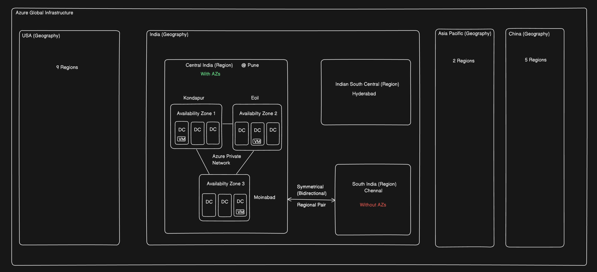
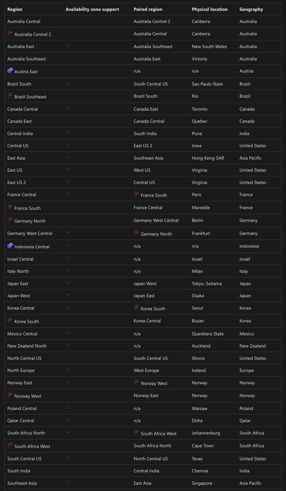
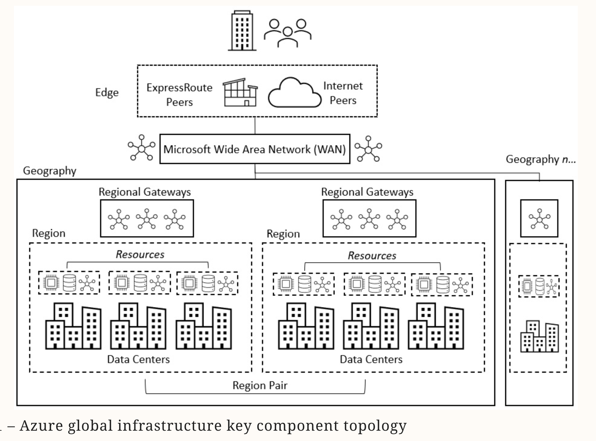
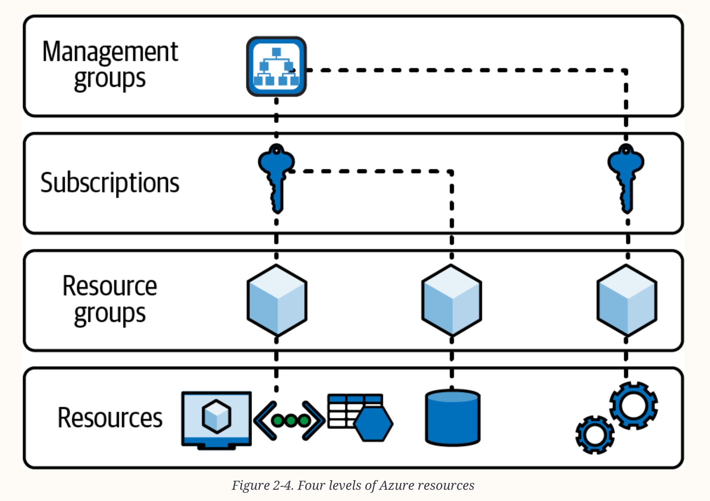
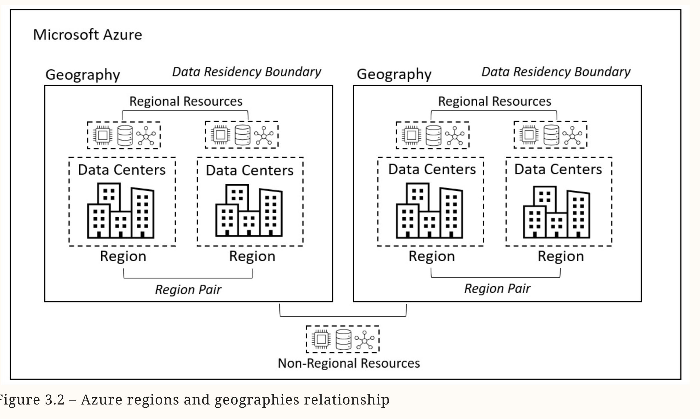
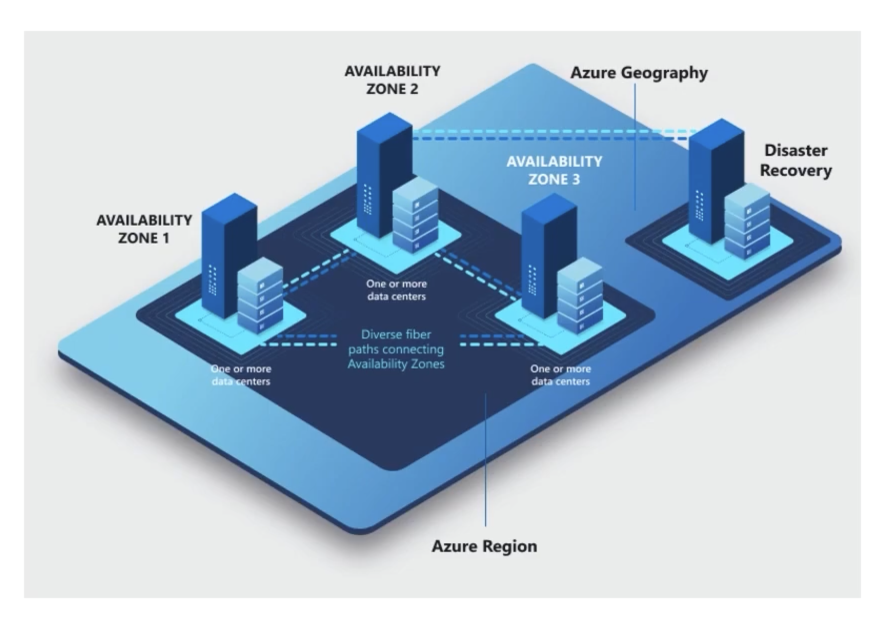

# Index
1. Key concepts of Azure Global Cloud Infrastructure
2. Microsoft Global Network
3. What are Resources in Azure ?
4. What is Availability ?
5. Azure Geographies
6. Azure Regions
7. Azure Availability Zones
8. What are Azure Regional Pairs ?
9. India
10. USA
11. What are Edge locations ?
12. Azure Sovereign Regions

-------------------------------------------------------------------------------------------------------------------------------------------------------------------------------------------------------------------------------------------------------------------------------------------------------
# I. Key concepts of Azure Global Cloud Infrastructure
 - Key concepts:
    1. Resource - a CPU, RAM, disk, GPU, network related etc.    
    2. Physical Server - has a set of resources (scalable if needed)
    3. Virtual Machine (Node) - using Virtualization tools
    4. Rack - contain rack servers or blade servers along with networking components
    5. Data center - a collection of racks
    6. Cluster - a collection of nodes connected to work on a specific task (these can span from one or more data centers)
      
 - Geo-distribution: Azure helps global enterprises by providing geo-distribution features. Geography-specific endpoints enables international enterprises to comply with regional compliance and regulations

-------------------------------------------------------------------------------------------------------------------------------------------------------------------------------------------------------------------------------------------------------------------------------------------------------
# II. Microsoft Global Network
 - It is one of the largest private networks in the world, with global/cross-ocean fiber that is leased or owned by Microsoft
 - This global network connects data centers to regional gateways and edge locations where traffic can enter and leave the Microsoft Wide Area Network (WAN)
   
##  What is ExpressRoute in Microsoft Global Network ?
 - Microsoft also provides ExpressRoute, a service that allows customers to create private network connections to Azure regions from specific peering locations
 - This allows traffic from a customer’s Multiprotocol Label Switching (MPLS) WAN to enter the Microsoft network, bypassing the internet entirely and offering a “low-latency” private connection

## Grouping of Microsoft Data Centers for High Availability
 1. Geographies
 2. Regions (& Region Pairs)
 3. Availability Zones
 4. Data Centers

-------------------------------------------------------------------------------------------------------------------------------------------------------------------------------------------------------------------------------------------------------------------------------------------------------
# III. What are Resources in Azure ?
 - In Azure, a resource is a manageable item that is available through Azure
 - Think of it as any service or component you can create, configure, or manage within your Azure subscription
 - Common Examples of Azure Resources:
     1. Virtual Machines (VMs) – for running applications on virtualized hardware.
     2. Storage Accounts – for storing blobs, files, queues, tables, etc.
     3. Web Apps / App Services – for hosting web applications.
     4. Databases – like Azure SQL Database or Cosmos DB.
     5. Virtual Networks (VNets) – for networking and security.
     6. Azure Functions – for running serverless code.
     7. Resource Groups – containers to group multiple resources
  - Resources have associated properties, configurations, costs, and regions

## How is location(region) of the resource important ?
 - Location for a resource will be the one that best meets the organization’s needs
 - It may be a:
    a. Technical driver - such as service capability and availability or latency in that region
    b. Business driver - such as compliance, data residency, or even cost

## How are Resources managed ? 
 - They can be managed through:
    1. Azure Portal (GUI)
    2. Azure CLI
    3. Azure PowerShell
    4. ARM templates or Bicep (Infrastructure as Code)

 - Resources in Azure can be organized by grouping them into a clearly defined structure for easier management :
    1. Resource Group (can have one or more resources)
    2. Subscription (can have one or more resource groups)
    3. Management Groups (can have one or more subscriptions)
        

    
## Example 1: Azure Virtual Machine

## Example 2: Azure Virtual Networks

## Example 3: Azure Storage Account

-------------------------------------------------------------------------------------------------------------------------------------------------------------------------------------------------------------------------------------------------------------------------------------------------------
# IV. What is Availability ?

-------------------------------------------------------------------------------------------------------------------------------------------------------------------------------------------------------------------------------------------------------------------------------------------------------
# V. What are Azure Geographies ?
 - Azure divides the world into Geographies—sets of regions grouped together for data residency, sovereignty, and compliance
 - Geo-politcal areas
 - A geography can have multiple regions and defines a “data residency” and “compliance” boundary
 - Each Azure geography contains one or more regions and meets specific data residency and compliance requirements. 
 - Ex. India, USA, China, Asia Pacific etc.

-------------------------------------------------------------------------------------------------------------------------------------------------------------------------------------------------------------------------------------------------------------------------------------------------------
# VI. ## What are Azure Regions ?

 - Choosing the right Azure region is also important when it comes to regulatory compliance and data policies such as the General Data Protection Regulation (GDPR) in Europe
 - Types of Regions:
    a. Regions with Availability Zones (>= 3 zones)
    b. Regions without Availability Zones
 - Examples of Azure Services:
    a. Services that do support Availability Zones (Regional services)
         i. Zonal Services          :  Ex. Azure Virtual Machines  - These services allow us to deploy resources across specific availability zones within a region for enhanced resilience
                                           These are called regional services as they are dependent on being co-located in that specific region’s data centers
        ii. Zone-Redundant Services :  Ex. Azure Storage (Standard, Premium, and Archive tiers)  - These services are automatically replicated across multiple availability zones, ensuring high availability even if one zone experiences an outage  
    b. Services that do not support Availability Zones (Non-regional services) - Ex. Microsoft Entra ID, Azure DevOps - These services are designed to be globally available and don't have a specific region or zone dependency
       Some Azure services are non-regional and don't require you to select a specific region or configure availability zone support, meaning they are designed for global availability and don't have a zonal deployment option
       However, that service’s metadata can have a location that can be specified for compliance. Some examples of non-regional services are Traffic Manager and Front Door
       In contrast, DNS and Microsoft Entra Domain Services (Formerly Azure Active Directory Domain Services) are “geo-based” to ensure data is kept within that geography

 - Azure Sovereign Regions
 - Special Azure Regions: not accessible to general public
     a. US Gov Virginia   - for US government agencies and partners
     b. US Gov Iowa       - for US government agencies and partners
     c. China East        - Partnership between Microsoft & 21Vianet
     d. China North       - Partnership between Microsoft & 21Vianet
     e. Germany Central   - Data trustee model of T-Systems
     f. Germany Northeast - Data trustee model of T-Systems
 - When creating an Azure resource, such as a virtual machine, it is not possible to directly select a particular data center; only a region can be selected
   i.e. Once the appropriate region is selected, a resource, such as a virtual machine, is created in any of the data centers in that region
 - When creating Azure resources, regions are categorized under the headings:
     a. Recommended - designed to support “availability zones,” now or planned for the future
     b. Other headings - refer to the data pairing of regions to provide the data residency boundaries and low latency for disaster recovery purposes. These are the regions that do not support availability zones 

Note: Not all resources and services are available in all regions
      New resources and services are often initially available in the US or a specific region and then rolled out to the rest of the world
      
 - When planning to create resources between regions, it should be considered that any data transfer leaving a region or egress is billed; however, traffic “within” a region or ingress is free
   
-------------------------------------------------------------------------------------------------------------------------------------------------------------------------------------------------------------------------------------------------------------------------------------------------------
# VII. What are Availability Zones ?
 - A campus with one or more data centers with independent facilities for power, networking, cooling, and support
Note: A Data center is a secure facility that hosts the “physical” computing, storage, and networking capabilities
      Each data center has independent, isolated, redundant power supplies and cooling systems for resilience against outages
      The data centers in a region are connected by a “low-latency network” for availability, which provides the basis for availability zones
 - These zones are unique physical location or data centers within an Azure region that offer 99.99% SLA for virtual machine uptime
 - These availability zones are connected and equipped with secure high-speed networks, which is important in running mission-critical resources for your computing, networking, storage, and data
 - Availability zones are not available in all regions
   Ex. Central India Region has three AZs,
       South India Region has no AZs
 - Availability options on AZ level is not available in all Azure services
   Ex. Azure Virtual Machine Service has availability option on AZ level
 - Availability zones are used to protect resources from complete system failures in an Azure data center while Availability sets are used to protect applications from hardware failures within an Azure data center

-------------------------------------------------------------------------------------------------------------------------------------------------------------------------------------------------------------------------------------------------------------------------------------------------------
# VIII. What are Azure Regional Pairs ?
 - Regions belong to a particular geography and are deployed in “pairs” for disaster recovery
 - It involves pairing a region with another region within the same geography but those regions must be at least 300 miles away
   Ex.
 - When possible, Azure prefers this minimum distance between physical data centers in a regional pair in case of natural disasters, widespread power outages, etc.
 - By pairing regions within the same geography, Azure can replicate customer's resources like servers, virtual machines, databases, and storage in another location in case of power outages, natural disasters, etc.
   i.e. when a region has an outage, services will automatically failover to the other region in the pair
 - If a region in a pair goes down, the services would failover automatically to the other region in its region pair
 - An Azure region usually pairs with another region in the same geography
   Ex. 
 - For example if the region is in Europe, then it is expected that its region pair is also located within Europe
 - Many regions aren't paired, and instead use availability zones as their primary means of redundancy
 - In addition, many Azure services support geo-redundancy whether regions are paired or not
 - Types of Regions:
    1. Paired Regions
         a. Symmetrically paired - means that each region is bidirectionally paired with another region Ex. West US is paired with East US and East US is paired with West US
         b. Asymmetrically paired -  involve regions that are not bidirectionally paired Ex. 
    2. Non-paired regions
  - In the unlikely event of a geography-wide outage, the recovery of one region is prioritized out of every region pair
   
-------------------------------------------------------------------------------------------------------------------------------------------------------------------------------------------------------------------------------------------------------------------------------------------------------
# IX. Example 1: India 
1. Azure Geography : India
2. Azure Regions   : 2 running (Central India, South India), 1 announced (India South Central @ Hyderabad)
    a. Central India        @ Pune (With Availability Zones)
    b. South India          @ Chennai (
    c. India South Central  @ Hyderabad (With AZs)

-------------------------------------------------------------------------------------------------------------------------------------------------------------------------------------------------------------------------------------------------------------------------------------------------------
# X. Example 2: USA 
1. Azure Geography : US
2. Azure Regions   : 9 
    a. Central US region, located in Iowa
    b. East US region, located in Virginia
    c. East US 2 region, located in Virginia
    d. East US 3 region, located in Georgia
    e. North Central US region, located in Illinois
    f. South Central US region, located in Texas
    g. West Central US region, located in Wyoming
    h. West US region, located in California
    i. West US 2 region, located in Washington
    j. West US 3 region, located in Arizona

-------------------------------------------------------------------------------------------------------------------------------------------------------------------------------------------------------------------------------------------------------------------------------------------------------
# XI. What are Edge locations ?
 - They are secure facilities where traffic enters and leaves the Microsoft global network
 - These locations can provide computing resources to be closer to users for improved network latency, allowing fewer network hops through fewer providers
 - If required, the traffic can stay longer on the Microsoft backbone network without transiting the internet

-------------------------------------------------------------------------------------------------------------------------------------------------------------------------------------------------------------------------------------------------------------------------------------------------------
