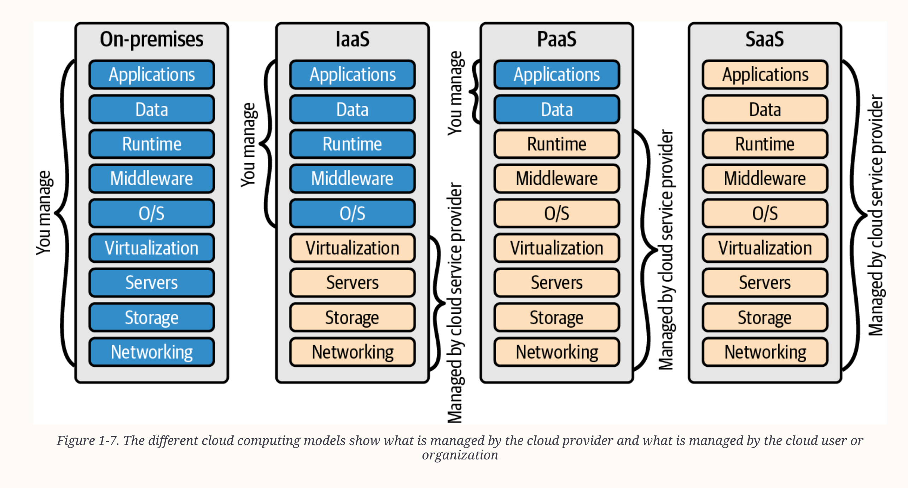
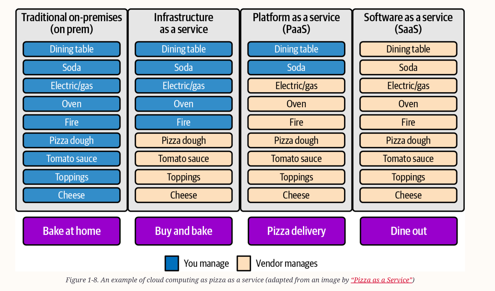
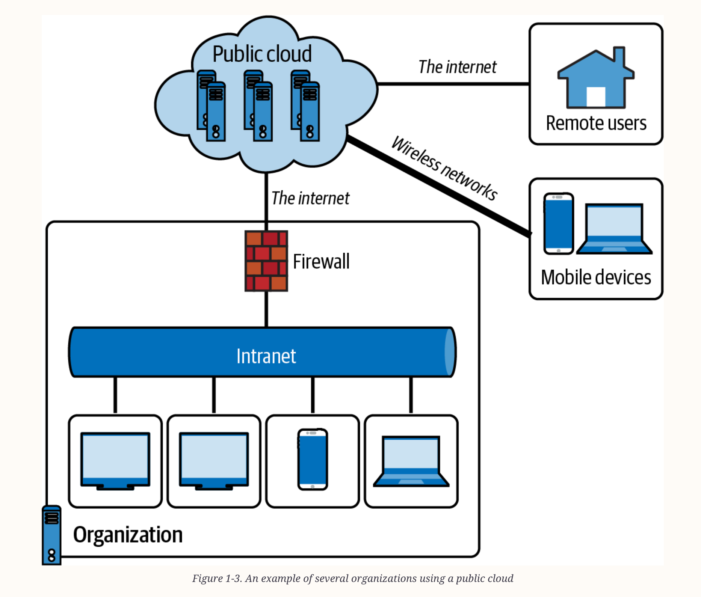
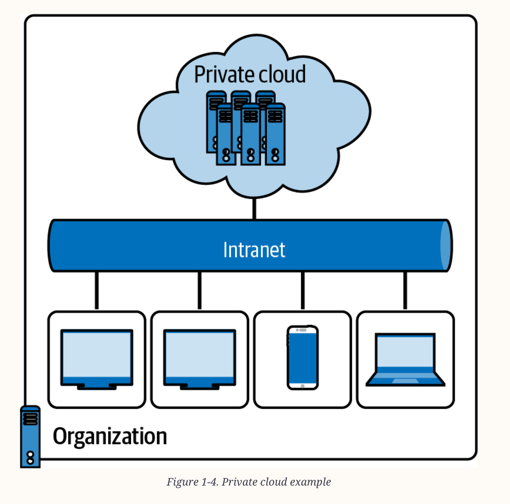
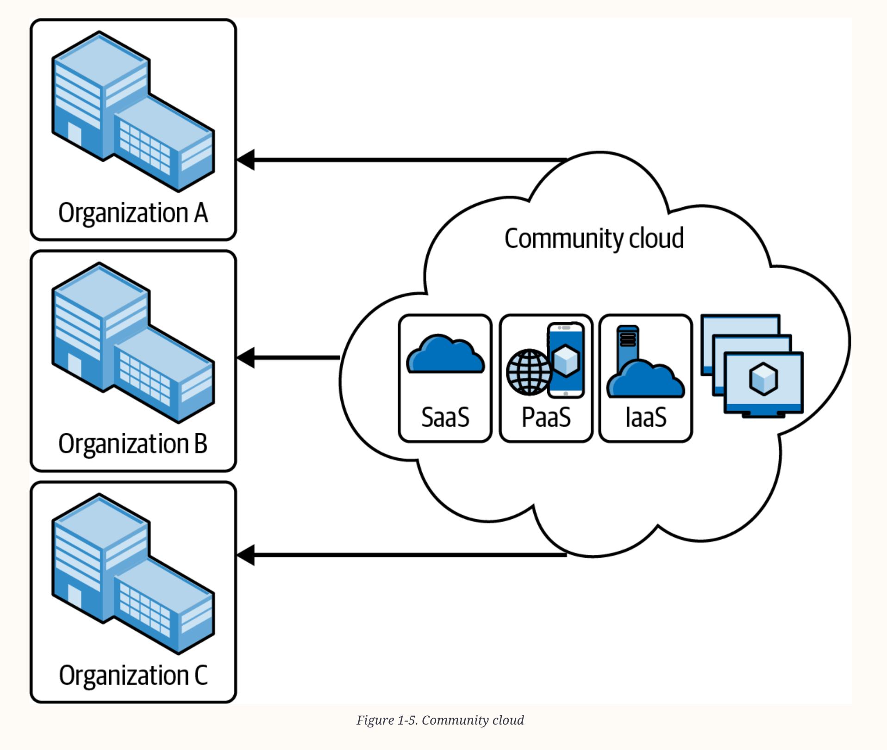
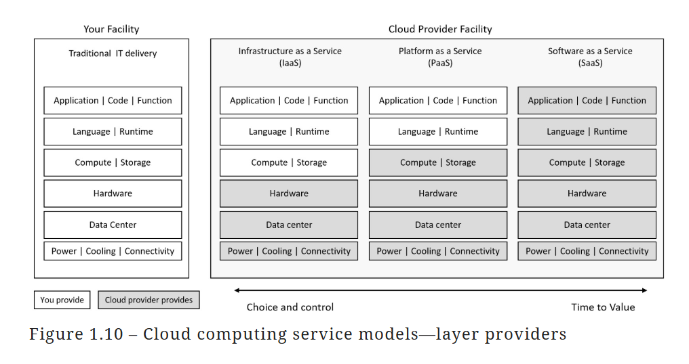
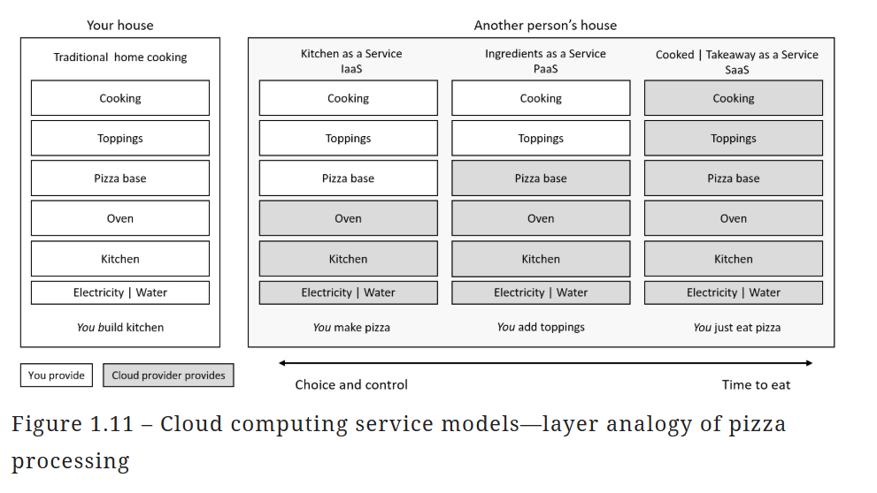

# Index
1. What is Cloud computing
2. Types of computing
3. The shared responsibility model
4. Cloud deployment models - public, private, and hybrid
5. Cloud service models - Infrastructure as a Service (IaaS), Platform as a Service (PaaS), Software as a Service (SaaS)
-------------------------------------------------------------------------------------------------------------------------------------------------------------------------------------------------------------------------------------------------------------------------------------------------------
# I. What is Cloud computing ?
 - Multi-tenant
 - Cloud computing is a model for enabling ubiquitous, convenient, on-demand network access to a shared pool of configurable computing resources (e.g., networks, servers, storage, applications, and services) that can be rapidly provisioned and released with
   minimal management effort or service provider interaction
 - Businesses can ensure its time is more effectively spent at the top, innovating, and not at the bottom, maintaining
 - Cloud computing helps in saving resources, time, and money by accelerating innovation, collaboration, modernization, and productivity in different teams within the organization
 - The goal is to move to a “flexible” and “agile” operations model, consuming only what is required from each layer down to deliver the business need and value-driven outcome
 - Essential characteristics of cloud model:
    a. Scale - highly scalable (Horizontal scaling & Vertical scaling) - Vertical scaling(Scaling up & Scaling down) - Horizontal scaling(Scaling out & Scaling in)
    b. Speed - Quicker time to market and value
    c. Resilience
    d. Secure
    e. High availability - reliability, fault tolerance, and redundancy(replication & replication factor) - SLA (95%, 99%, 99.9%, 99.99%, 99.9999% etc.)
       Note: An SLA in cloud computing is a legal document that specifies the terms of service, including performance expectations, availability, and support commitments between a cloud provider and its customers
    f. Cost effective - Economies of scale, resource pooling, measured service(consumption-based billing) or pay-as-you-go 
    g. Easy to access - on-demand self-service management through a web browser or a command-line interface
    h. Broad network access - available anywhere, typically via the internet and a privately managed network(such as Azure ExpressRoute)
    i. Access to a wide range of IT services/tools - Data access management and portability
    j. Elasticity - rapid on-demand auto-scaling for performance (automated provisioning and de-provisioning of compute resources as required)
    k. Agility
    l. Convenient backup and disaster recovery solutions - for business continuity
    m. Easier & smooth migration tools - enabled by the Virtualization & Containerization
    n. 
   

## Cloud platform providers
 - Microsoft, Amazon, Alibaba, and Google 
 - The value of a cloud provider platform is as an enabler of digital transformation and innovation
    
-------------------------------------------------------------------------------------------------------------------------------------------------------------------------------------------------------------------------------------------------------------------------------------------------------
# II. Types of computing
## Evolution of Cloud computing architectures

1. Mainframe computing (big iron)
   - Physical Servers - performance & security is key, but costly affair & time consuming - utilizes large, high-performance computers
   - Uses a single unit of hardware like a huge mainframe box with several processors, centralized storage, and a large amount of memory
   - IBM was the pioneer of mainframe computers

2. Cluster Computing 
   - It consists of tightly coupled computers (also known as nodes) that work together to reach a single goal and purpose: to execute tasks
   - Like search engines, earthquake simulation, and weather systems
   - They share the computation tasks like a distributed system

3. Grid Computing
   - It is a subset of parallel and distributed computing in which clusters of computers and other loosely coupled computers perform a large task
   - They are geographically spread out in different locations or in several computing clusters that form the grid
   - Data is processed quickly because the data is stored on all computers in the data grid

2. Virtualization & VMs
    - Virtualization technology simulates resources and environments from a single physical hardware system
    - Uses a software called a hypervisor, which has the capability to distribute a system into secure and distinct environments known as virtual machines (VMs)
    - Types of Hypervisors: Type 1(Bare metal), Type 2(Hosted)
    - VMs are emulations of computers running on top of a hypervisor
   
3. Containerisation
    - one of the better alternatives to VMs
    - It is a lightweight, portable, and isolated software unit that enables us to run multiple containers on a single host machine
      
4. Serverless Computing
    - Where the business logic layer is the new scale unit
   
5. Public cloud computing
    - Based on a “centralized” data collection, processing, and analysis approach
    - Microsoft uses a native hypervisor on Azure called Azure Hypervisor
    - Fifth-generation computing

6. Edge Computing
    - Generally with IoT
    - Uses a “distributed” computing model approach, where the data is collected, processed, and analyzed locally
    - Low latency
    - Also for those organizations concerned with or mandated on data locality, where compliance may place strict controls on where data is stored and processed

7. Hybrid computing
    - Provide a balance of computing resources and services available anywhere, anytime
    - It gives businesses options and the power of choice as to the most suitable technology platform and data location for any given workload, business initiative, or scenario
      that needs to be supported

8. Quantum computing
-------------------------------------------------------------------------------------------------------------------------------------------------------------------------------------------------------------------------------------------------------------------------------------------------------
# III. The shared responsibility model
 - Division or separation of responsibilities between the consumer of the cloud resources and the cloud service provider
 - The responsibility changes depending on the cloud service model, such as IaaS, PaaS, and SaaS

## (CapEx) Capital Expenditure & (OpEx) Operational Expenditure
 - With the adoption of cloud computing, businesses can reduce their CapEx and shift toward OpEx

-------------------------------------------------------------------------------------------------------------------------------------------------------------------------------------------------------------------------------------------------------------------------------------------------------
# IV. Cloud deployment/delivery models

1. Public Cloud
 - A shared entity (multi-tenant) computing model
 - Ex. Microsoft Azure, Amazon Web Services, Alibaba Cloud, Google Cloud Platform, Oracle Cloud
 - Priority: Scale & performance
 - The public cloud operating model implements hardware and software at the cloud platform provider’s facilities, from which they create compute, storage, network, and other resources and services
 - An OpEx expenditure model
 - These are made available to all tenants on the platform, who use their portion of the shared resources and services and are billed only for what they use (or consume)
 - The users of these multi-tenant (shared) computing platforms benefit through economies of scale, that is, cost reductions that can be passed on due to efficiencies in the scale of operation
 - The expenditure model shifts from that of Capital Expenditure (CapEx) of hardware (buying upfront before you can use resources) to Operating Expenditure (OpEx) and paying as you use (consume) resources

2. Private Cloud
 - A dedicated entity (single-tenant) computing model
 - Priority: Compliance & Control, we remain in complete control of security and governance
 - Resources are only available within the capacity provisioned
 - A CapEx expenditure model
 - It is required to provide systems and data availability, fault tolerance, scalability, security, protection, update management, maintenance, and support
 - A private cloud might be:
    a. Hardware that you own in your facility
    b. A third-party hosting provider, or
    c. A colocation data center facilities provider
    d. Public cloud provider providing the hardware they dedicate to you, such as traditional dedicated server hosting i.e. some cloud providers allow physical hardware to be dedicated for an organization’s use
 - Ex. Azure Government Regions used by USA Govt agencies 
 - We are also entirely responsible for purchasing, implementing, maintaining, and supporting the hardware and computing resources you provide from the private cloud platform
 - Ex. Azure Stack, Red Hat OpenShift, VMware vCloud Suite
 - Advantages of using a private cloud include:
    a. Enhanced privacy and security since resources are not shared with others
    b. Increased control over the infrastructure and owned resources
    c. Compliance with business-critical security and regulatory compliance requirements   
    d. Flexibility to customize the environments based on the on-demand requirements of the organization or business

3. Hybrid Cloud
 - Many of these public cloud providers now offer hybrid cloud solutions
 - Priority: Agility & Flexibility
 - We get the greatest flexibility of the expenditure model, that is, the ability to choose CapEx or OpEx
 - Meaning the hardware, software, services, and resources can also now sit in the customer’s locations, or even a third-party provider’s locations, with a control plane that operates over a network from the cloud provider’s platform locations
 - We can create some computing resources on the service provider’s public cloud computing platform, and other resources are created on your on-premises private cloud platform
 - These resources are connected via the internet or a private managed network such as Microsoft’s ExpressRoute service 
 - Your compute resources and data may remain on-premises, and you may use the “cloud” for the control and operations plane
 - You may consider “Manage from” the cloud instead of “Move to” the cloud
 - Traditional Windows Server Active Directory can provide access to computing resources as the primary identity and authentication layer
 - And Microsoft Entra ID (formerly named Azure AD) can also be utilized when connecting to public cloud computing resources through a hybrid model by using directory synchronization as the link between the two identity providers for a consistent, common, or single sign-on experience.
 - Microsoft’s examples of this are Azure Stack and Azure Arc
 - Cloud bursting is common in hybrid cloud scenarios
    a. It is an application deployment in which an application runs in an on-premises data center or private cloud
    b. Then it can burst into a public cloud if the workload or computing capacity demands increase, thus granting access to more computing resources when needed

4. Community cloud (Collaborative cloud)
 - A community cloud is an extended form of the private cloud
 - These multi-tenant platforms enable different organizations to work on a shared platform
 - Ex. Amazon AWS offers Cloud Computing for Federal Government
       Microsoft has Azure Government for US government agencies and their partners
 - Clouds for the government sector are community clouds meant explicitly for the government since they have legal, security, and privacy regulations, processes, and services that require constant communication and data transactions between different departments
 - They all operate on the same infrastructure, with benefits and shared resources
 - The infrastructure of the community cloud supports a specific community with shared missions, compliance, security, jurisdictions, etc.

 
5. Multi-cloud 
 - An organization uses services from multiple providers, such as Amazon Web Services (AWS), Microsoft Azure, Google Cloud Platform (GCP), or IBM Cloud
 - It can help organizations achieve better performance & security by leveraging different providers’ strengths and using the right provider for the right workload
 - It is a strategy that enables organizations to use multiple cloud providers’ strengths to meet their business needs while improving flexibility, cost optimization, security, and performance
   
-------------------------------------------------------------------------------------------------------------------------------------------------------------------------------------------------------------------------------------------------------------------------------------------------------
# V. Cloud Computing Service models
 - Every cloud computing resource will fit into one of these categories: each model has its place, depending on your needs
    a. IaaS
    b. PaaS
    c. SaaS (FaaS)   
 - A solution will comprise one or more resources from each of these categories
 - Cloud computing is all about abstraction
 - This abstraction model approach removes layers that you no longer need to care about; the layer still exists, but it is being handled by somebody else and frees up resources to concentrate on other, more valuable layers
 - Clearly define what layer of access and control the cloud service provider is responsible for and what the consumer of the cloud resources is responsible for

1. (IaaS) Infrastructure as a Service
     - IaaS is a delivery of IT infrastructure resources like web servers, database servers, compute storage, networking, computing data centers, and other compute resources available as a service and on demand

2. (PaaS) Platform as a Service
     - It is a cloud model where users, organizations, or developers can create, build, and deploy applications on the cloud without worrying about the IT infrastructure behind it
     - In this cloud model, typically, Azure is responsible for taking care of the physical infrastructures, data centers, hardware, operating system, middleware, and other resources required to run and manage the application
     - The developer is only responsible for writing and deploying the application code on the platform.

3. (SaaS) Software as a Service
     - Users can access the applications through a web browser or other client software and typically pay for the service on a subscription basis
     - SaaS applications can be used for various purposes, including productivity tools, customer relationship management, and enterprise resource planning
     - Ex. Salesforce, Microsoft 365, Dropbox, OneDrive, Google Workspace and other applications offered as services
     - The SaaS model enables users to access and use applications online with sync capabilities
     - The cloud service providers give the users access to a fully developed application explicitly created for distribution
     - The software updates are rolled out for all users, and organizations can use their tools with vendor-provided application programming interfaces (APIs)

4. (FaaS) Function as a Service
     - Serverless computing (or) Backend as a Service
     - Serverless is a method of computing where backend services are provided by a cloud service provider
     - In serverless computing, a third-party provider manages the infrastructure and automatically provisions and scales resources as needed, allowing developers to focus solely on writing code for their applications
     - 

-------------------------------------------------------------------------------------------------------------------------------------------------------------------------------------------------------------------------------------------------------------------------------------------------------
Access to computing resources can be provided by Microsoft Entra ID (formerly named Azure AD) as the “cloud-native“ identity and authentication layer and traditional Windows Server Active Directory when you synchronize the identity provider directories.
