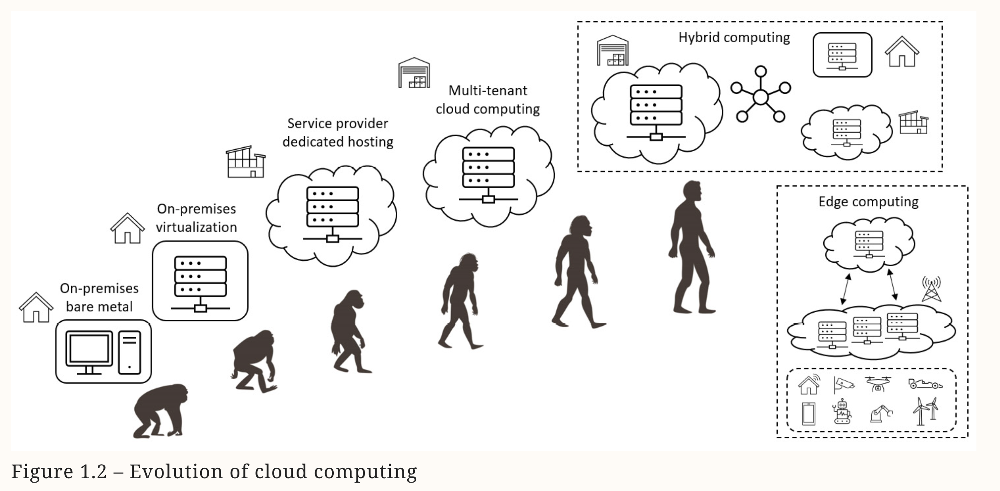
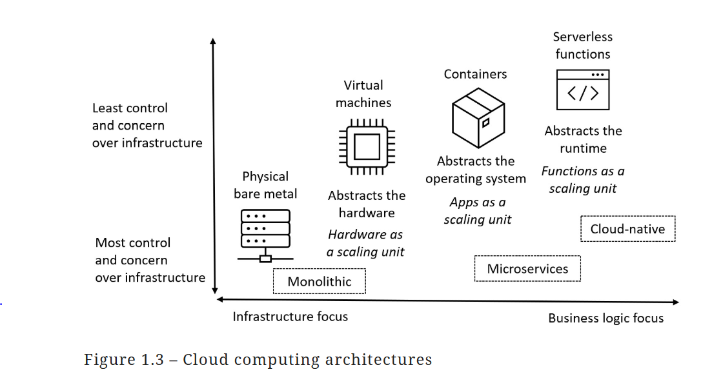
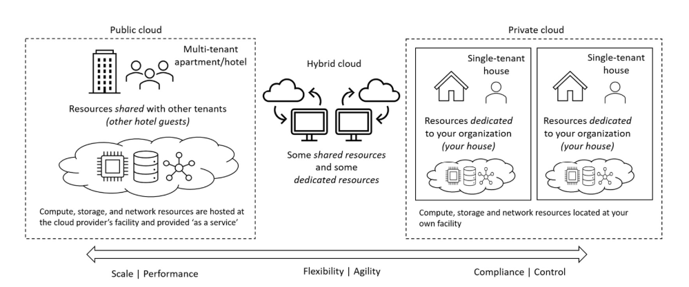

# Index
1. What is Cloud computing
2. Types of computing
3. The shared responsibility model
4. Cloud deployment models - public, private, and hybrid
5. Cloud service models - Infrastructure as a Service (IaaS), Platform as a Service (PaaS), Software as a Service (SaaS)
-------------------------------------------------------------------------------------------------------------------------------------------------------------------------------------------------------------------------------------------------------------------------------------------------------
# I. What is Cloud computing ?
 - It is a technology platform, that can benefit many audiences, addressing a need to access self-service, on-demand computing resources and services that are secure, governed, automated, elastic, and scalable, allowing the platform to cater to demand
 - Multi-tenant
 - Cloud computing is a model for enabling ubiquitous, convenient, on-demand network access to a shared pool of configurable computing resources (e.g., networks, servers, storage, applications, and services) that can be rapidly provisioned and released with
   minimal management effort or service provider interaction
 - Businesses can ensure its time is more effectively spent at the top, innovating, and not at the bottom, maintaining
 - The goal is to move to a “flexible” and “agile” operations model, consuming only what is required from each layer down to deliver the business need and value-driven outcome
 - Essential characteristics of cloud model:
    a. On-demand self-service management -  through a web browser or a command-line interface
    b. Broad network access - available anywhere, typically via the internet and a privately managed network, such as ExpressRoute
    c. Resource pooling
    d. Rapid elasticity
    e. Measured service

## Cloud platform providers
 - Microsoft, Amazon, Alibaba, and Google 
 - The value of a cloud provider platform is as an enabler of digital transformation and innovation
 - It provides :
    a. Quicker time to market and value
    b. Economies of scale
    c. With an operating model that is governed, elastic, agile, and combined with a flexible cost model
    d. Consumption & Cost model - metered pricing, consumption-based billing, and pay-as-you-go monthly usage costs, you only pay for the resources you use, allowing effective cost control
    e. Scale & Speed - Almost unlimited resources are available
    f. Drive innovation
    g. High availability - reliability, fault tolerance, and redundancy
    h. Elasticity -  rapid, on-demand, and automated provisioning and de-provisioning of compute resources as required.
    i. Agility
    j. Disaster recovery & business continuity
-------------------------------------------------------------------------------------------------------------------------------------------------------------------------------------------------------------------------------------------------------------------------------------------------------
# II. Types of computing
## Evolution of Cloud computing architectures

1. Physical Servers
2. Virtualization & VMs
3. Containerisation
4. Serverless Computing
 - Where the business logic layer is the new scale unit
   
5. Public cloud computing
 - Based on a “centralized” data collection, processing, and analysis approach. 

6. Edge Computing
 - Uses a “distributed” computing model approach, where the data is collected, processed, and analyzed locally
 - Low latency
 - Also for those organizations concerned with or mandated on data locality, where compliance may place strict controls on where data is stored and processed

7. Hybrid computing
 - Provide a balance of computing resources and services available anywhere, anytime
 - It gives businesses options and the power of choice as to the most suitable technology platform and data location for any given workload, business initiative, or scenario
   that needs to be supported
-------------------------------------------------------------------------------------------------------------------------------------------------------------------------------------------------------------------------------------------------------------------------------------------------------
# III. The shared responsibility model
 - Division or separation of responsibilities between the consumer of the cloud resources and the cloud service provider
 - The responsibility changes depending on the cloud service model, such as IaaS, PaaS, and SaaS
 - 
-------------------------------------------------------------------------------------------------------------------------------------------------------------------------------------------------------------------------------------------------------------------------------------------------------
# IV. Cloud deployment/delivery models

1. Public Cloud
 - A shared entity (multi-tenant) computing model
 - Ex. Microsoft Azure, Amazon Web Services, Alibaba Cloud, Google Cloud Platform
 - Priority: Scale & performance
 - The public cloud operating model implements hardware and software at the cloud platform provider’s facilities, from which they create compute, storage, network, and other resources and services
 - An OpEx expenditure model
 - These are made available to all tenants on the platform, who use their portion of the shared resources and services and are billed only for what they use (or consume)
 - The users of these multi-tenant (shared) computing platforms benefit through economies of scale, that is, cost reductions that can be passed on due to efficiencies in the scale of operation
 - The expenditure model shifts from that of Capital Expenditure (CapEx) of hardware (buying upfront before you can use resources) to Operating Expenditure (OpEx) and paying as you use (consume) resources

2. Private Cloud
 - A dedicated entity (single-tenant) computing model
 - Priority: Compliance & Control, we remain in complete control of security and governance
 - Resources are only available within the capacity provisioned
 - A CapEx expenditure model
 - It is required to provide systems and data availability, fault tolerance, scalability, security, protection, update management, maintenance, and support
 - A private cloud might be:
    a. Hardware that you own in your facility
    b. A third-party hosting provider, or
    c. A colocation data center facilities provider
    d. Public cloud provider providing the hardware they dedicate to you, such as traditional dedicated server hosting i.e. some cloud providers allow physical hardware to be dedicated for an organization’s use.
 - We are also entirely responsible for purchasing, implementing, maintaining, and supporting the hardware and computing resources you provide from the private cloud platform
 - Ex. Azure Stack, Red Hat OpenShift, VMware vCloud Suite
   

3. Hybrid Cloud
 - Many of these public cloud providers now offer hybrid cloud solutions
 - Priority: Agility & Flexibility
 - We get the greatest flexibility of the expenditure model, that is, the ability to choose CapEx or OpEx
 - Meaning the hardware, software, services, and resources can also now sit in the customer’s locations, or even a third-party provider’s locations, with a control plane that operates over a network from the cloud provider’s platform locations
 - We can create some computing resources on the service provider’s public cloud computing platform, and other resources are created on your on-premises private cloud platform
 - These resources are connected via the internet or a private managed network such as Microsoft’s ExpressRoute service.
 
 - Your compute resources and data may remain on-premises, and you may use the “cloud” for the control and operations plane
 - You may consider “Manage from” the cloud instead of “Move to” the cloud
 - Traditional Windows Server Active Directory can provide access to computing resources as the primary identity and authentication layer
 - And Microsoft Entra ID (formerly named Azure AD) can also be utilized when connecting to public cloud computing resources through a hybrid model by using directory synchronization as the link between the two identity providers for a consistent, common, or single sign-on experience.
 - Microsoft’s examples of this are Azure Stack and Azure Arc
-------------------------------------------------------------------------------------------------------------------------------------------------------------------------------------------------------------------------------------------------------------------------------------------------------
# V. Cloud service models
 - 

-------------------------------------------------------------------------------------------------------------------------------------------------------------------------------------------------------------------------------------------------------------------------------------------------------
Access to computing resources can be provided by Microsoft Entra ID (formerly named Azure AD) as the “cloud-native“ identity and authentication layer and traditional Windows Server Active Directory when you synchronize the identity provider directories.
