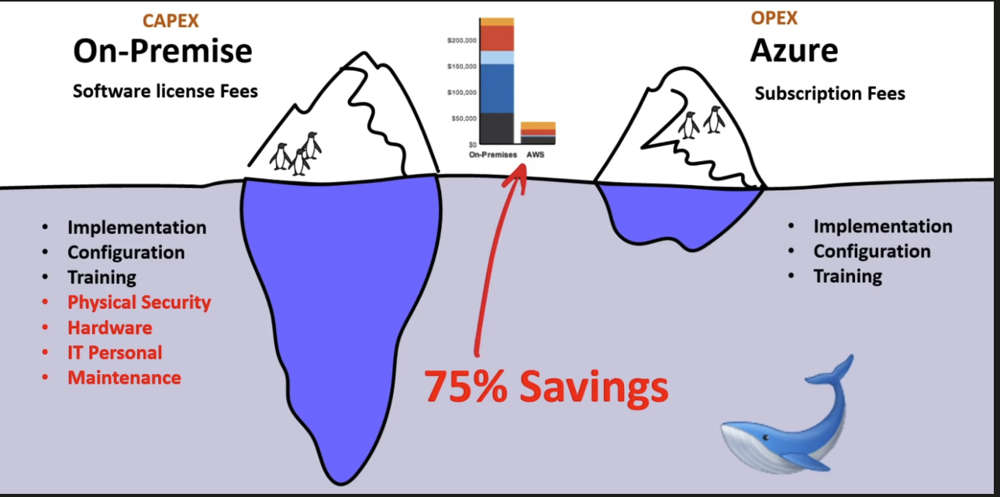
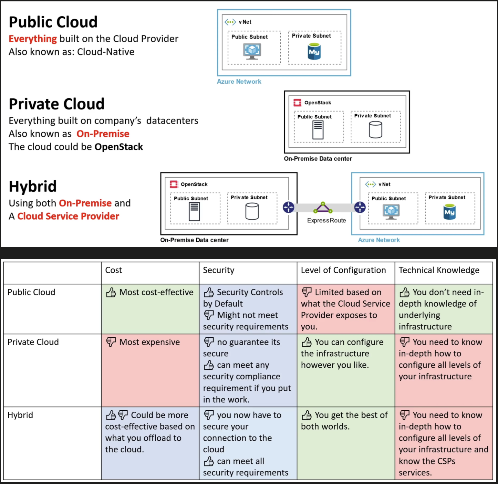
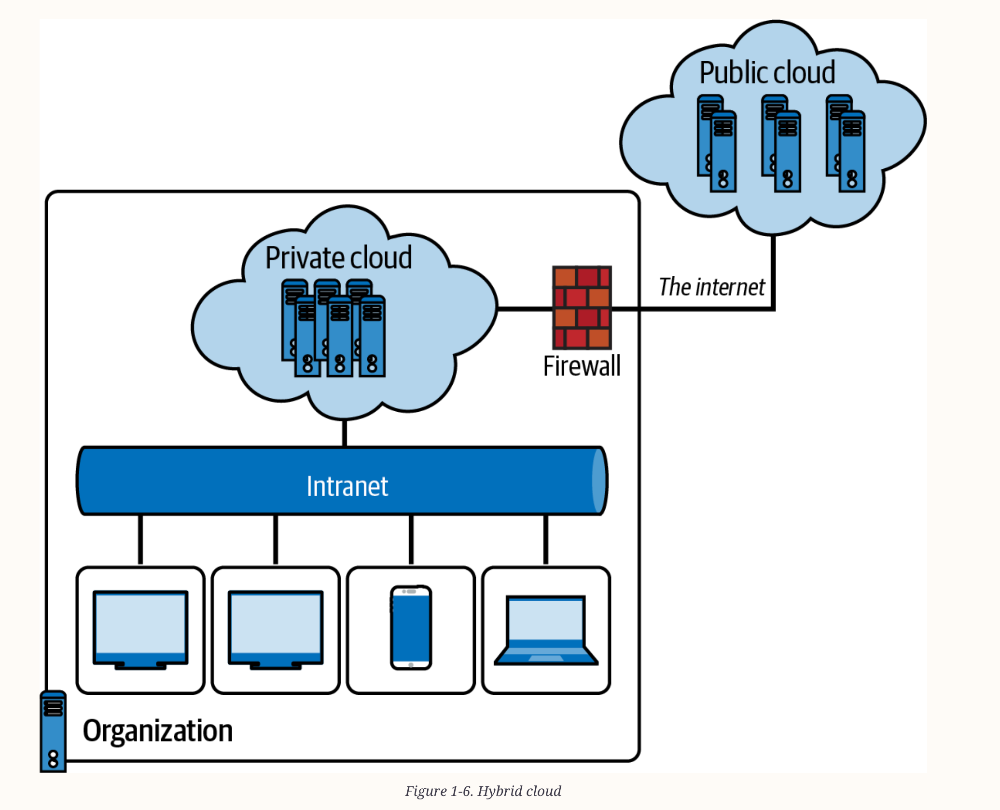

# Index
1. Introduction
2. What is a typical organization ?
3. What is Cloud computing
4. Types of computing
5. Evolution of Cloud Hosting
6. Cloud deployment models - public, private, hybrid, community, multi-cloud
7. The shared responsibility model
8. Cloud service models - Infrastructure as a Service (IaaS), Platform as a Service (PaaS), Software as a Service (SaaS)
-------------------------------------------------------------------------------------------------------------------------------------------------------------------------------------------------------------------------------------------------------------------------------------------------------
# I. Introduction 
 - Provides an introduction to the essential concepts of cloud computing, how it works, the different types of deployment models, understanding the types of cloud, what CapEx and OpEx are in cloud computing, and the benefits of utilizing cloud computing in businesses, IT organizations,
   society, and software engineering

-------------------------------------------------------------------------------------------------------------------------------------------------------------------------------------------------------------------------------------------------------------------------------------------------------
# II. What is a typical organization ?
 - An organization is a company/business
 - May have multiple departments : 
     a. Development
     b. Admin
     c. Operations
     d. Sales
     e. Marketing
     f. Management etc.
 - Organizations have :  customer use cases and business requirements.
 - Organization has infrastructure : Hardware, software 
 - Resource(s) : used in software development projects 
     a. Compute in terms of CPUs & cores
     b. Storage - primary & secondary
     c. Networking components

## (TCO) Total Cost of Ownership
 - TCO  = (CapEx) Capital Expenditure + (OpEx) Operational Expenditure
    1. CapEx : one-time, up-front expenditure to purchase or secure tangible resources
    2. OpEx  : spending money on services or products over time 
 - With the adoption of cloud computing, businesses can reduce their CapEx and shift toward OpEx
 - Cloud computing falls under OpEx because cloud computing operates on a consumption-based model
    a. Plan and manage your operating costs
    b. Run your infrastructure more efficiently
    c. Scale as your business needs change

-------------------------------------------------------------------------------------------------------------------------------------------------------------------------------------------------------------------------------------------------------------------------------------------------------
# III. What is Cloud computing/Cloud Technology ?
 - Multi-tenant
 - A practice of using a network of remote servers hosted on the Internet to store, manage and process data, rather than a local server or a personal computer
 - Cloud computing is a model for enabling ubiquitous, convenient, on-demand network access to a shared pool of configurable computing resources (e.g., networks, servers, storage, applications, and services) that can be rapidly provisioned and released with
   minimal management effort or service provider interaction
 - Businesses can ensure its time is more effectively spent at the top, innovating, and not at the bottom, maintaining
 - Cloud computing helps in saving resources, time, and money by accelerating innovation, collaboration, modernization, and productivity in different teams within the organization
 - The goal is to move to a “flexible” and “agile” operations model, consuming only what is required from each layer down to deliver the business need and value-driven outcome
 - Essential characteristics of cloud model:
    a. Scalable & go global in minutes - highly scalable (Horizontal scaling & Vertical scaling) - Vertical scaling(Scaling up & Scaling down) - Horizontal scaling(Scaling out & Scaling in) - quick provisioning and deprovisioning
    b. Speed - Quicker time to market and value
    c. Resilience/Reliability/Fault tolerant - the system or application hosted functions correctly even in the face of adversity (hardware or software faults, and even human error)
   
    d. Security - , data security
          i. Physical security - security with biometric scanners, multi-level authentication and more
         ii. Logical(Data) security  - i.e. Platform security is advanced using AI/ML in products like Azure firewall, protected with advanced encryption technologies
              Ex. Azure : Azure Firewall, Azure Active directory are tools provided to secure apps
                          Identity protection is key i.e. username & password
              Ex. Azure provides basic DDoS protection for free 
                  DDoS attack - Distributed denial of Service is when a server is overwhelmed by bombarding with so much traffic that no other legitimate customer can get to that serve

    e. High availability (Uptime)- reliability, fault tolerance, and redundancy(replication & replication factor) - SLA (95%, 99%, 99.9%, 99.99%, 99.9999% etc.)
       Note: An SLA in cloud computing is a legal document that specifies the terms of service, including performance expectations, availability, and support commitments between a cloud provider and its customers
    f. Cost effective - Economies of scale, resource pooling, measured/metered service(consumption-based billing) or pay-as-you-go
       Note: Pay per use basis, Itemized bill
       Note: There are provisions for Fixed term contracts as well to get big cost savings
    g. Predictability (performance predictability & cost predictability) : 
          i. Performance predictability is supported by autoscaling, load balancing and high availability
         ii. Cost predictability is supported by cloud spend tracking using tools like TCO or pricing calculator, advanced cloud analytics and information dashboards
    h. Flexibile & Easy to access - on-demand self-service management through a web browser or a command-line interface
    i. Broad network access - available anywhere, typically via the internet and a privately managed network(such as Azure ExpressRoute)
    j. Access to a wide range of IT services/tools - Data access management and portability, leading to continuous innovation 
    k. Elasticity - rapid on-demand auto-scaling for performance (automated provisioning and de-provisioning of compute resources as required)
    l. Agility - React, innovate & adapt to changing needs of the market 
    m. Convenient backup and disaster recovery solutions - for business continuity
    n. Easier & smooth migration tools - enabled by the Virtualization & Containerization
    o. Data compliances & Governance : Rules and regulations set by ourselves, Governments & regulatory bodies
        Ex. Data governance - EU has (GDPR) General Data Protection Regulation which governs how data has to be handled 
        Ex. Azure provide tools like Azure Policy & Blueprints which provides pre-defined policies and also allow us to custom write our own policies and apply them 
    p. Easy Manageability : Web portal like Azure Portal, CLI like Azure CloudShell (Bash or PS), APIs etc. 
    q. Easy Monitoring :  raise alerts when something needs to be done 
       Ex. Azure provides Azure monitor service 
       Automation to act on events being monitored without human intervention
    r. Tools for backup and site recovery 
    s. Tools for testing application failures i.e. simulate failures like network, DB failure and
        Check out how our application is responding to these failures
        Ex. Azure provides a tool called "Chaos Studio"   
    t. Locality - Because of geo-distribution you can deploy apps and data to regional data centers around the globe, thereby ensuring that your customers always have the best performance in their region

   
## Key aspects of On premise (Traditional IT System)
 - Take all risk in Data Center Management, which is complex : You own servers, cooling systems , power, networking systems
 - Own servers / On premise servers / Traditional Corporate Data center
 - Capital intensive expenditure (CAPEX)
 - Depreciation 
 - Tax deductible over depreciation lifetime
 - Own servers + Networking + Software licensing of OS, security softwares
 - Hire IT admins, staff, training, IT Engineers, Facility Engineers (Power & Cooling Mgmt) etc. : build, secure, operate and manage infrastructure
 - Buy/lease Real estate : maintaining the physical space
 - Security : building, physical network, physical computer, data
 - Internet connectivity + VPN & Remote access 
 - Power : Physical Security, backup and cooling systems
 - Prone to Natural disasters : poor availability, poor redundancy, & less resilient 
 - Underutilization & wastage of resources  
 - Maintenance : 1. Planned (hardware & software upgradation)
                 2. Unplanned (security patches & rebooting)
 - Updates : hardware, software like OS patches, network & firewall settings
 - Need to estimate future needs : possibility of over estimation & under estimation
 - Overall :  Greater responsibility & Greater control & compliance

   
## Gartner Magic Quadrant for Cloud
1. Leaders -  AWS, Azure, GCP
2. Visionaries - Alibaba Cloud
3. Challengers
4. Niche Players - Oracle, IBM, Tencent Cloud

## (CSP) Cloud Service Providers / Cloud Providers / Cloud Vendors @ Cloud Industry
- The value of a cloud provider platform is as an enabler of digital transformation and innovation
 Tier - I    :  Top tier, early to market, wide offering, strong synergies between services
                Well recognized in industry like AWS, Azure, GCP, Alibaba Cloud
 Tier - II   :  Mid tier, backed by well known tech companies 
                Ex. IBM Cloud, Oracle Cloud, Rackspace (OpenStack)
 Tier - III  :  Light tier, Virtual Private Server providers turned to offer core IaaS offerings
                Ex. Vultr, Digital Ocean, Linode

 Cloud Platforms : Fewer service offerings than CSPs 
                   Ex. Twilio, HashiCorp, Databricks

## Cloud Pricing models
1. Consumption-based model has many benefits, including: 
    a. No upfront costs
    b. No need to purchase and manage costly infrastructure that users might not use to its fullest potential 
    c. The ability to pay for more resources when they're needed. 
    d. The ability to stop paying for resources that are no longer needed

Usually any service is priced by 2 or 3 metrics combined

Example 1 : Cosmos DB
Charged fees for : 
 1. Operations  =  400 RU/s : $23.36
 2. Consumed Storage  = 100 GB = $25.00
 3. Optional Dedicated Gateway  = $277.40
 4. Backup Storage = 7 backups : $60.00

-------------------------------------------------------------------------------------------------------------------------------------------------------------------------------------------------------------------------------------------------------------------------------------------------------
# IV. Types of computing
## Evolution of Cloud computing architectures

1. Mainframe computing (big iron)
   - Physical Servers - performance & security is key, but costly affair & time consuming - utilizes large, high-performance computers
   - Uses a single unit of hardware like a huge mainframe box with several processors, centralized storage, and a large amount of memory
   - IBM was the pioneer of mainframe computers

2. Cluster Computing 
   - It consists of tightly coupled computers (also known as nodes) that work together to reach a single goal and purpose: to execute tasks
   - Like search engines, earthquake simulation, and weather systems
   - They share the computation tasks like a distributed system

3. Grid Computing
   - It is a subset of parallel and distributed computing in which clusters of computers and other loosely coupled computers perform a large task
   - They are geographically spread out in different locations or in several computing clusters that form the grid
   - Data is processed quickly because the data is stored on all computers in the data grid

2. Virtualization & VMs
    - Virtualization technology simulates resources and environments from a single physical hardware system
    - Uses a software called a hypervisor, which has the capability to distribute a system into secure and distinct environments known as virtual machines (VMs)
    - Types of Hypervisors: Type 1(Bare metal), Type 2(Hosted)
    - VMs are emulations of computers running on top of a hypervisor
   
3. Containerisation
    - one of the better alternatives to VMs
    - It is a lightweight, portable, and isolated software unit that enables us to run multiple containers on a single host machine
      
4. Serverless Computing
    - Where the business logic layer is the new scale unit
   
5. Public cloud computing
    - Based on a “centralized” data collection, processing, and analysis approach
    - Microsoft uses a native hypervisor on Azure called Azure Hypervisor
    - Fifth-generation computing

6. Edge Computing
    - Generally with IoT
    - Uses a “distributed” computing model approach, where the data is collected, processed, and analyzed locally
    - Low latency
    - Also for those organizations concerned with or mandated on data locality, where compliance may place strict controls on where data is stored and processed

7. Hybrid computing
    - Provide a balance of computing resources and services available anywhere, anytime
    - It gives businesses options and the power of choice as to the most suitable technology platform and data location for any given workload, business initiative, or scenario
      that needs to be supported

8. Quantum computing

-------------------------------------------------------------------------------------------------------------------------------------------------------------------------------------------------------------------------------------------------------------------------------------------------------
## V. Evolution of Cloud Hosting
1. Dedicated Server
    a. 
    b. Very expensive & high maintenance but very secure
2. Virtual Private Server (VPS)
    a. One physical machine dedicated to a single business (Running a single web app) i.e. Single tenant
    b. Same as dedicated server but the physical machine is virtualized into sub-machines to run multiple apps
    b. Multi tenant - Better utilization & isolation of resources
3. Shared hosting
    a. One physical machine shared by multiple businesses with own folders
    b. Relies on most tenants under-utilizing their resources
    c. Economical but limited functionality & poor isolation
4. Cloud hosting
    a. Multiple physical machines that act as one system (Distributed computing)
    b. Flexible, scalable, secure, cost effective, high configurability

-------------------------------------------------------------------------------------------------------------------------------------------------------------------------------------------------------------------------------------------------------------------------------------------------------
# VII. Cloud deployment/delivery models

1. Public Cloud
 - A shared entity (multi-tenant) computing model
 - Ex. Microsoft Azure, Amazon Web Services, Alibaba Cloud, Google Cloud Platform, Oracle Cloud
 - Priority: Scale & performance
 - The public cloud operating model implements hardware and software at the cloud platform provider’s facilities, from which they create compute, storage, network, and other resources and services
 - Cloud native, Cloud first - Using CSP's infrastructure from beginning
 - An OpEx expenditure model
 - These are made available to all tenants on the platform, who use their portion of the shared resources and services and are billed only for what they use (or consume)
 - The users of these multi-tenant (shared) computing platforms benefit through economies of scale, that is, cost reductions that can be passed on due to efficiencies in the scale of operation
 - The expenditure model shifts from that of Capital Expenditure (CapEx) of hardware (buying upfront before you can use resources) to Operating Expenditure (OpEx) and paying as you use (consume) resources

2. Private Cloud
 - A dedicated entity (single-tenant) computing model
 - Priority: Compliance & Control, we remain in complete control of security and governance
 - Resources are only available within the capacity provisioned
 - A CapEx expenditure model
 - It is required to provide systems and data availability, fault tolerance, scalability, security, protection, update management, maintenance, and support
 - A private cloud might be:
    a. Hardware that you own in your facility
       Ex. Virtualization Softwares : VMware, Hyper-V, OpenStack 
       Ex. Can use OpenStack software (Cloud management software layer) - Adds software capabilities like Self service portal, Multi tenancy controller, Automation & Configuration management, billing and reporting)
    b. A third-party hosting provider, or
    c. A colocation data center facilities provider
    d. Public cloud provider providing the hardware they dedicate to you, such as traditional dedicated server hosting i.e. some cloud providers allow physical hardware to be dedicated for an organization’s use
 - Ex. Azure Government Regions used by USA Govt agencies 
 - We are also entirely responsible for purchasing, implementing, maintaining, and supporting the hardware and computing resources you provide from the private cloud platform
 - Ex. Azure Stack, Red Hat OpenShift, VMware vCloud Suite
 - Advantages of using a private cloud include:
    a. Enhanced privacy and security since resources are not shared with others
    b. Increased control over the infrastructure and owned resources
    c. Compliance with business-critical security and regulatory compliance requirements   
    d. Flexibility to customize the environments based on the on-demand requirements of the organization or business

3. Hybrid Cloud
 - Using both CSP & On-premise datacenters - Connected using a VPN, direct
 - Many of these public cloud providers now offer hybrid cloud solutions
 - Priority: Agility & Flexibility
 - We get the greatest flexibility of the expenditure model, that is, the ability to choose CapEx or OpEx
 - Meaning the hardware, software, services, and resources can also now sit in the customer’s locations, or even a third-party provider’s locations, with a control plane that operates over a network from the cloud provider’s platform locations
 - We can create some computing resources on the service provider’s public cloud computing platform, and other resources are created on your on-premises private cloud platform
 - These resources are connected via the internet or a private managed network such as Microsoft’s ExpressRoute service 
 - Your compute resources and data may remain on-premises, and you may use the “cloud” for the control and operations plane
 - You may consider “Manage from” the cloud instead of “Move to” the cloud
 - Traditional Windows Server Active Directory can provide access to computing resources as the primary identity and authentication layer
 - And Microsoft Entra ID (formerly named Azure AD) can also be utilized when connecting to public cloud computing resources through a hybrid model by using directory synchronization as the link between the two identity providers for a consistent, common, or single sign-on experience.
 - Microsoft’s examples of this are Azure Stack and Azure Arc
 - Cloud bursting is common in hybrid cloud scenarios
    a. It is an application deployment in which an application runs in an on-premises data center or private cloud
    b. Then it can burst into a public cloud if the workload or computing capacity demands increase, thus granting access to more computing resources when needed

4. Community cloud (Collaborative cloud)
 - A community cloud is an extended form of the private cloud
 - These multi-tenant platforms enable different organizations to work on a shared platform
 - Ex. Amazon AWS offers Cloud Computing for Federal Government
       Microsoft has Azure Government for US government agencies and their partners
 - Clouds for the government sector are community clouds meant explicitly for the government since they have legal, security, and privacy regulations, processes, and services that require constant communication and data transactions between different departments
 - They all operate on the same infrastructure, with benefits and shared resources
 - The infrastructure of the community cloud supports a specific community with shared missions, compliance, security, jurisdictions, etc.

 
5. Multi-cloud (or) Multiple cloud (or) Cross-cloud 
 - An organization uses services from multiple providers, such as Amazon Web Services (AWS), Microsoft Azure, Google Cloud Platform (GCP), or IBM Cloud
 - It can help organizations achieve better performance & security by leveraging different providers’ strengths and using the right provider for the right workload
 - It is a strategy that enables organizations to use multiple cloud providers’ strengths to meet their business needs while improving flexibility, cost optimization, security, and performance

------------------------------------------------------------------------------------------------------------------------------------------------------------------------------------------------------------------------------------------------------------------------------------------------------
# VI. The shared responsibility model
 - Division or separation of responsibilities between the consumer of the cloud resources and the cloud service provider
 - The responsibility changes depending on the cloud service model, such as IaaS, PaaS, and SaaS

1. Cloud Customer  i.e. User of Cloud services : always responsible for 
    a. The information and data stored in the cloud 
    b. Devices that are allowed to connect to your cloud (cell phones, computers, and so on) 
    c. The accounts and identities of the people, services, and devices within your organization
2. Cloud Vendor (CSP) i.e.  Azure, AWS, GCP is always responsible for : 
    a. The physical datacenter
    b. The physical network
    c. The physical hosts
       

  
-------------------------------------------------------------------------------------------------------------------------------------------------------------------------------------------------------------------------------------------------------------------------------------------------------
# VIII. Cloud Computing Service models
 - Every cloud computing resource will fit into one of these categories: each model has its place, depending on your needs
    a. IaaS
    b. PaaS
    c. SaaS (FaaS)   
 - A solution will comprise one or more resources from each of these categories
 - Cloud computing is all about abstraction
 - This abstraction model approach removes layers that you no longer need to care about; the layer still exists, but it is being handled by somebody else and frees up resources to concentrate on other, more valuable layers
 - Clearly define what layer of access and control the cloud service provider is responsible for and what the consumer of the cloud resources is responsible for

1. (IaaS) Infrastructure as a Service
     - IaaS is a delivery of IT infrastructure resources like web servers, database servers, compute storage, networking, computing data centers, and other compute resources available as a service and on demand
     - For Admins
     - Ex. AWS EC2, Azure Virtual Machines, Google Compute Engine
       
2. (PaaS) Platform as a Service
     - It is a cloud model where users, organizations, or developers can create, build, and deploy applications on the cloud without worrying about the IT infrastructure behind it
     - In this cloud model, typically, Azure is responsible for taking care of the physical infrastructures, data centers, hardware, operating system, middleware, and other resources required to run and manage the application
     - The developer is only responsible for writing and deploying the application code on the platform
     - For developers
     - Ex. Google Compute App Engine, AWS Elastic Beanstalk, Azure WebApps

3. (SaaS) Software as a Service
     - Users can access the applications through a web browser or other client software and typically pay for the service on a subscription basis
     - SaaS applications can be used for various purposes, including productivity tools, customer relationship management, and enterprise resource planning
     - For End users for direct consumption - Pure subscription & consumption model 
     - Ex. Gamil, Salesforce, Microsoft 365, Dropbox, OneDrive, Google Workspace and other applications offered as services
     - The SaaS model enables users to access and use applications online with sync capabilities
     - The cloud service providers give the users access to a fully developed application explicitly created for distribution
     - The software updates are rolled out for all users, and organizations can use their tools with vendor-provided application programming interfaces (APIs)

4. (FaaS) Function as a Service
     - Serverless computing (or) Backend as a Service
     - Serverless is a method of computing where backend services are provided by a cloud service provider
     - In serverless computing, a third-party provider manages the infrastructure and automatically provisions and scales resources as needed, allowing developers to focus solely on writing code for their applications

-------------------------------------------------------------------------------------------------------------------------------------------------------------------------------------------------------------------------------------------------------------------------------------------------------
